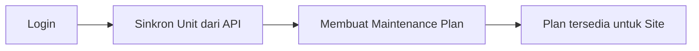
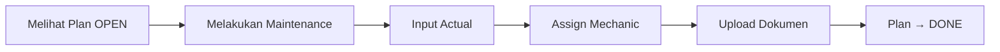
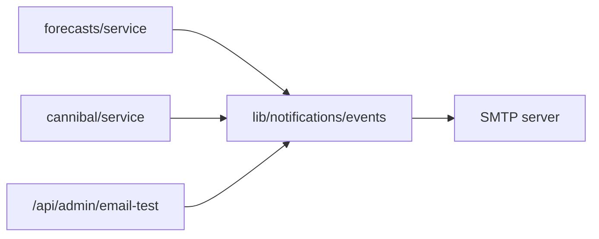
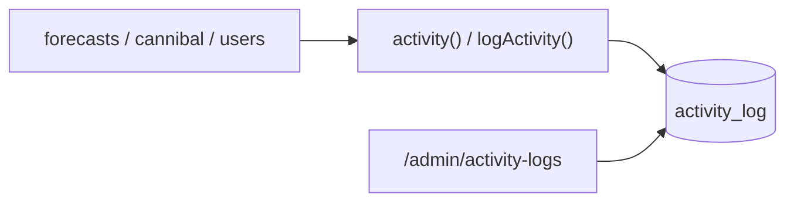
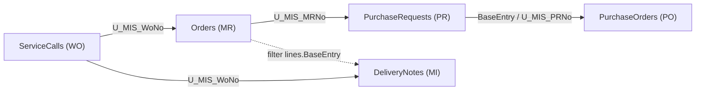

Purpose: Technical reference for ARKA MMS (Maintenance Monitoring System)
Last Updated: 2026-06-02

## Architecture Documentation Guidelines

### Document Purpose

This document describes the CURRENT WORKING STATE of the application architecture. It serves as:

- Technical reference for understanding how the system currently works
- Onboarding guide for new developers
- Design pattern documentation for consistent development
- Schema and data flow documentation reflecting actual implementation

### What TO Include

- **Current Technology Stack**: Technologies actually in use
- **Working Components**: Components that are implemented and functional
- **File and Function Descriptions**: Short descriptions of ALL the files and functions in the codebase
- **Actual Database Schema**: Tables, fields, and relationships as they exist
- **Implemented Data Flows**: How data actually moves through the system
- **Working API Endpoints**: Routes that are active and functional
- **Deployment Patterns**: How the system is actually deployed
- **Security Measures**: Security implementations that are active

### What NOT to Include

- **Issues or Bugs**: These belong in `MEMORY.md` with technical debt entries
- **Limitations or Problems**: Document what IS working, not what isn't
- **Future Plans**: Enhancement ideas belong in `backlog.md`
- **Deprecated Features**: Remove outdated information rather than marking as deprecated
- **Wishlist Items**: Planned features that aren't implemented yet

### Update Guidelines

- **Reflect Reality**: Always document the actual current state, not intended state
- **Schema Notes**: When database schema has unused fields, note them factually
- **Cross-Reference**: Link to other docs when appropriate, but don't duplicate content

### For AI Coding Agents

- **Investigate Before Updating**: Use codebase search to verify current implementation
- **Move Issues to Memory**: If you discover problems, document them in `MEMORY.md`
- **Factual Documentation**: Describe what exists, not what should exist

---

# ARKA MMS - Maintenance Monitoring System Architecture

> **Sumber desain lengkap**: `docs/maintenance-monitoring-system.md` — Referensi utama untuk domain, model data, business rules, dan alur proses.
>
> **User Manual (pengguna akhir)**: [`docs/user-manual/ARKA-PCR-User-Manual.md`](user-manual/ARKA-PCR-User-Manual.md) — panduan operasional ARKA PCR v2.0 (27 Agu 2026, Bahasa Indonesia) beserta screenshot di `docs/user-manual/images/`. Ulangi capture: `node scripts/capture-user-manual-screenshots.mjs`.

## Project Overview

**ARKA MMS** adalah sistem monitoring maintenance fundamental unit alat berat pertambangan secara terpusat, terstruktur, dan dapat diaudit.

### Tujuan Sistem

- Perencanaan maintenance (HO)
- Pelaporan actual maintenance (Site)
- Monitoring compliance
- Penyimpanan dokumen maintenance
- Reporting bulanan dan tahunan

### Jenis Maintenance

Inspection, Washing, Greasing, Track Cleaning, PPU/CTS

## Technology Stack

### Frontend + Backend

- **Framework**: Next.js (App Router, Fullstack)

### Database

- **Database**: MySQL (Laragon), database `arka_mms`
- **ORM**: Prisma — schema di `prisma/schema.prisma`, terhubung via `DATABASE_URL` di `.env`
- **Status**: Schema diterapkan (`prisma db push`), seed `maintenance_types` (5 jenis) sudah dijalankan. Attachment dipodel polymorphic (`entity_type` + `entity_id`), tanpa relasi Prisma ke Plan/Actual; query di aplikasi pakai filter. Relasi Plan–Actual one-to-one: `maintenance_actuals.plan_id` @unique.

### Storage Dokumen

- **Storage**: MinIO (S3 compatible, on-prem friendly)

### Optional Infrastructure

- **Redis**: Cache / queue (belum dipakai untuk email)
- **Worker Node**: Cron job & scheduler (OS cron / Task Scheduler — script `tsx`)
- **Email**: Nodemailer SMTP (`lib/notifications/*`) — approval + due/overdue + admin trial
- **Deployment**: Docker Compose (Debian production stack `/home/skyone/stack`)

### Production Deployment (Docker Compose — Debian)

- **Target**: Server Debian + Docker Engine + Docker Compose (`/home/skyone/stack`).
- **Aplikasi**: Next.js container sendiri (`arka-pcr`), **bukan** PHP-FPM. Pola sama dengan Next.js lain (mis. `apps/app81/arka-fms`).
- **DB**: hostname service `mysql` di network `appnet` — `DATABASE_URL=mysql://…@mysql:3306/arka_pcr_new`.
- **Proxy**: Nginx `conf.d/arka-pcr.conf` → `arka-pcr:3000`.
- **Artefak**: `Dockerfile`, `docker/entrypoint.sh`, `deploy/*`, panduan `docs/deployment-docker-debian.md`, checklist akses `docs/deployment-access-checklist.md`.
- **Legacy note**: panduan Windows/XAMPP digantikan oleh Docker Debian di atas (Laragon tetap untuk development lokal).

### Production Deployment (Windows + XAMPP) — legacy / local only

- **Target**: Workstation Windows, XAMPP (MySQL), IP internal (mis. 192.168.32.37) — **development**, bukan target production stack Docker.
- **Aplikasi**: Next.js dijalankan dengan `next start` (Node.js).
- Merujuk pada [Next.js Production Checklist](https://nextjs.org/docs/app/building-your-application/deploying/production-checklist) dan [Self-Hosting](https://nextjs.org/docs/app/guides/self-hosting).

## Role Pengguna

| Role           | Capability                                                                    |
| -------------- | ----------------------------------------------------------------------------- |
| **ADMIN_HO**   | Membuat maintenance plan, melihat seluruh report, akses global, **CRUD User** |
| **ADMIN_SITE** | Input maintenance actual, melihat plan site                                   |
| **MECHANIC**   | Input maintenance actual, ditugaskan sebagai pelaksana                        |

## Authentication & Access Control

- **Auth flow**: Login (`POST /api/auth/login`) → JWT (payload: `id`, `role`) → disimpan di `localStorage`/`sessionStorage` dan cookie `accessToken` (HttpOnly) untuk middleware. Cookie di production default pakai **Secure** (hanya HTTPS); deployment HTTP (mis. Docker tanpa TLS) wajib set env **`JWT_COOKIE_SECURE=false`** agar middleware dapat membaca cookie (hindari redirect loop login).
- **Next.js Middleware** (`src/middleware.js`): Berjalan di Edge sebelum route; memverifikasi cookie `accessToken` dengan **jose**; route `/apps/*` dan `/dashboards/*` dilindungi; `/apps/user/*` hanya untuk role **ADMIN_HO**; tidak ada token/token invalid → redirect `/login`; token valid tapi role tidak sesuai → redirect `/401`. Proteksi berbasis **role** (bukan permission DB) karena middleware Edge tidak mengakses DB. Ref: [Next.js Middleware](https://nextjs.org/docs/advanced-features/middleware).
- **Role & Permission (Spatie-like)**:
  - **Tabel**: `permissions` (id, name e.g. `plan.create`, `user.manage`), `roles` (id, name: ADMIN_HO/ADMIN_SITE/MECHANIC), `role_permissions`, `user_roles`. User bisa punya banyak role lewat `user_roles`; saat ini disinkron dengan `users.role` (satu role per user).
  - **Lib** (`src/lib/permissions.js`): `getPermissionsForUser(userId)` — load permission names dari DB; `buildAbilityFromPermissions(permissions)` — build CASL Ability; `getAbilityForUser(userId, roleLegacy)` — untuk pengecekan server-side (API).
  - **Auth response**: `GET /api/auth/me` dan response login mengembalikan `userData.permissions` (array string) agar client bisa build ability tanpa request tambahan.
- **ACL (CASL)** (`src/configs/acl.js`): `buildAbilityFor(user, subject)` — jika `user.permissions` ada, build dari permissions (DB); else fallback rules berdasarkan `user.role`. Halaman dan menu di-filter oleh `AclGuard` dan `CanViewNavLink`; subject `user-list` hanya boleh `manage`/`read` oleh yang punya permission (ADMIN_HO).
- **API guard**: `GET/POST /api/users` dan `GET/PATCH/DELETE /api/users/[id]` memeriksa `Authorization: Bearer <token>` dan mengembalikan 403 jika `payload.role !== 'ADMIN_HO'`. Untuk pengecekan granular bisa pakai `getAbilityForUser(decoded.id, decoded.role)` lalu `ability.can('manage', 'user-list')`.
- **Logout**: `POST /api/auth/logout` menghapus cookie; client membersihkan storage dan redirect ke `/login`.

## Core Domain Models

Lihat `docs/maintenance-monitoring-system.md` §5 untuk ERD lengkap. Ringkasan:

- **units** — Cache dari API eksternal (id, code, model, project_id, project_name)
- **maintenance_types** — Inspection, Washing, Greasing, dll.
- **users** — username (unique), name, email (opsional), role (enum), project_scope; relasi `user_roles` → roles
- **permissions** — name (e.g. plan.create, user.manage); **roles** — name (ADMIN_HO, ADMIN_SITE, MECHANIC); **role_permissions**, **user_roles** — many-to-many
- **maintenance_plans** — unit_id, maintenance_type_id, planned_date, status (OPEN/DONE/MISSED)
- **maintenance_actuals** — plan_id (nullable), unit_id, maintenance_date, hour_meter
- **maintenance_actual_mechanics** — Assignment mechanic ke actual
- **attachments** — entity_type (MAINTENANCE_PLAN \| MAINTENANCE_ACTUAL), entity_id, storage_path
- **monthly_reports** / **yearly_reports** — (schema ada; fitur report dihapus dari aplikasi)

### Fleet cache naming convention (2026-06)

- Internal Prisma/domain naming now uses **unit** semantics: model `FleetUnitCache`, scalar key `fleetUnitId`, and relation field `unit`.
- Database compatibility is preserved using existing column/table mappings (`@map("fleet_equipment_id")` and `@@map("fleet_equipment_cache")`).
- External route contracts remain unchanged where already public, including `/fleet/equipments` and Fleet source path `/equipments`.

### Fleet model cache (2026-06)

- **`fleet_model_cache`** — master model ARKFleet (`fleet_model_id`, `model_name`, `manufacture`, `plant_group`); di-sync via `syncFleetModelCache()` (dipanggil dari `POST /api/fleet/sync` sebelum upsert unit).
- **`legacy_model_mapping`** — mapping `legacy_model_id` (db `arka_pcr.model`) → `fleet_model_id`; diisi dari `data/migration/model-mapping.csv` (`npm run migrate:model-mapping`).
- **`commod.id_model`** — FK ke `fleet_model_cache.fleet_model_id` (bukan id legacy). Re-import: `npm run migrate:import-commod` setelah mapping diperbarui.
- Matching legacy ↔ fleet: prioritas nama model (`model_no` ↔ `model_name`), fallback via unit mapping (`npm run migrate:generate-mappings`).

## Business Flow

### Flow HO



### Flow Site



### Scheduler

- Plan lewat tanggal tanpa actual → **MISSED**
- Sinkron unit dari API eksternal

## API Endpoints (Konseptual)

| Area        | Endpoints                                                                                                                                                            |
| ----------- | -------------------------------------------------------------------------------------------------------------------------------------------------------------------- |
| Maintenance | POST/GET `/api/maintenances`                                                                                                                                         |
| Plan        | POST/GET `/api/plans`                                                                                                                                                |
| Attachment  | POST/GET `/api/attachments`                                                                                                                                          |
| Unit        | GET `/api/units`, POST `/api/units/sync`                                                                                                                             |
| Dashboard   | GET `/api/dashboard/stats?year=`; GET `/api/dashboard/achievement?year=`; GET `/api/dashboard/cannibal-stats?year=`; GET `/api/dashboard/cannibal-achievement?year=` |

## Dashboard (Implementasi PCR)

- **Route**: `/dashboard` — halaman utama setelah login (`getHomeRoute` → `/dashboard`; `/` redirect). Alias `/dashboards/maintenance` re-export halaman yang sama.
- **API**:
  - `GET /api/dashboard/stats?year=` — equipment, open forecasts/WO, pending PCR+BA approvals, forecast by quarter, critical components.
  - `GET /api/dashboard/achievement?year=` — Achievement PCR tahunan: `pcr_forecast` groupBy `projectCode` × `planPeriod` × `forecastStatus`; Ach% = Close/Total; Grand Total weighted ΣClose/ΣTotal.
- **Halaman**: `src/pages/dashboard/index.js` — year selector, 6 KPI, ApexCharts (trend Ach + Volume), tabel Achievement PCR, panel operasional, quick links.
- **Widgets**: `src/views/pcr/dashboard/*` (`DashboardKpiRow`, `AchTrendChart`, `KebutuhanCloseOpenChart`, `AchievementPcrTable`, `DashboardOperationalPanels`).
- **Warna Ach**: ≥80% success, 50–79% warning, &lt;50% error (`achievementColor.js`).
- **Nav**: Menu Dashboard → PCR (`auth: false`) + Cannibal (`cannibals.access`).
- **Logic**: `lib/dashboard/stats.ts`, `lib/dashboard/achievement.ts`.

## Dashboard (Implementasi Cannibal)

- **Route**: `/dashboard/cannibal` — ACL `cannibals.access`.
- **API**:
  - `GET /api/dashboard/cannibal-stats?year=` — pipeline counts (Draft / Logistics / In Approval / Approved / Closed), pending by PS→OD, status mix, recent active BA. Scoped by `postingDate` year + project filter.
  - `GET /api/dashboard/cannibal-achievement?year=` — Achievement Cannibal: `ba` groupBy `projectCode` × `postingDate` × `statusBa`; Close=`CLOSED`; Open=non-closed; CANCELLED excluded; Ach% = Close/Total.
- **Halaman**: `src/pages/dashboard/cannibal/index.js` — KPI, status donut, Ach trend, volume chart, achievement table, approval backlog, recent BA.
- **Widgets**: `src/views/pcr/dashboard/cannibal/*`.
- **Logic**: `lib/dashboard/cannibal-stats.ts`, `lib/dashboard/cannibal-achievement.ts`.

## Business Rules (Ringkasan)

- Hour meter tidak boleh lebih kecil dari histori sebelumnya
- Actual yang sesuai plan → status plan menjadi DONE
- Maintenance status: OPEN, DONE, MISSED, UNPLANNED
- Attachment: optional, multi file, cascade delete

## Status Implementasi

Desain sistem lengkap. **Sistem siap memasuki tahap implementasi.** Lihat `docs/todo.md` untuk task implementasi.

---

## Quick Reference

### Key File Locations (Vuexy Next.js – Pages Router)

- **Template**: Vuexy Next.js Admin Template v1.2.0 (JavaScript, MUI, Pages Router).
- **Pages & API**: `src/pages/` (routing), `src/pages/api/` (API routes).
- **Core (jangan diubah)**: `src/@core/` — layouts, theme, components, hooks.
- **Menu (data)**: `src/navigation/menuConfig.js` (sumber bersama); `src/navigation/vertical/index.js` dan `src/navigation/horizontal/index.js` mengimpor config yang sama (horizontal memfilter `sectionTitle`).
- **Custom layout/ACL**: `src/layouts/components/acl/getHomeRoute.js`.
- **Auth & RBAC**: NextAuth (`lib/auth-options.ts`) — session berisi `projectCodes`, `roles`, `permissions`; helper `hasPermission` / `hasAnyPermission` di `lib/utils/api-auth.ts`; seed & role template di `lib/rbac/`; client `src/hooks/useCan.js` + `src/context/AuthContext.js`; API routes memakai `requirePermissionOrForbidden`. Nav & page guard: `src/configs/acl.js` (`buildAbilityFromPermissions`), `src/navigation/menuConfig.js`, `src/navigation/route-permissions.js`, `AclGuard.js`. Legacy kolom `user.level`, `project_code`, `sign`, `pcr_sign` dihapus (migration `20260603180000_drop_user_legacy_rbac`).
- **Views**: `src/views/` — komponen halaman (apps/user, unit, invoice, dll.).
- **Config**: `src/configs/` (themeConfig, acl, auth, APIs).
- **Prisma**: `prisma/schema.prisma`, client: `src/lib/prisma.js`.
- **Perbandingan dengan Vuexy terbaru**: `docs/vuexy-folder-structure-comparison.md`.

### UI / Layout (Vuexy MUI)

Dashboard menggunakan Vuexy (MUI, vertical/horizontal layout):

- **Layout**: `src/@core/layouts/` — VerticalLayout, HorizontalLayout, BlankLayout.
- **Sidebar/Nav**: Komponen di `@core/layouts/components/vertical` / `horizontal`.
- **Theme**: MUI + `@core/theme` (ThemeOptions, overrides, palette). Default mode **semi-dark**: navigasi (sidebar vertical, **top app bar**, app bar + menu horizontal) memakai palet gelap via `NavThemeProvider`; area konten (`layout-page-content`) tetap light. Toggle mode di app bar: semi-dark ↔ dark.
- **User dropdown**: `@core/layouts/components/shared-components/UserDropdown.js` — Change Password (dialog → `POST /api/auth/change-password`) + Sign Out.
- **Searchable selects**: PCR filters and form dropdowns use `src/@core/components/mui/searchable-select` (`SearchableSelect`). `onChange` matches CustomTextField select (`e.target.value`). Vuexy demo pages keep MUI `select` + `MenuItem`. Lookup catalogs (`GET /api/components`, fleet units) must be fetched **without** `page`/`pageSize` — those params activate `MAX_PAGE_SIZE` (100) via `parseOptionalPageFromSearchParams`.

### Common Commands

```bash
# Development
npm run dev

# Database (Prisma)
npm run db:generate   # generate Prisma Client
npm run db:push       # sync schema ke MySQL (tanpa migration file)
npm run db:migrate    # prisma migrate dev
npm run db:studio     # buka Prisma Studio
npm run db:seed       # seed maintenance_types

# Build
npm run build
```

### Environment Variables

```env
DATABASE_URL="mysql://root:@localhost:3306/arka_mms"
MINIO_ENDPOINT="..."
NEXT_PUBLIC_APP_URL="http://localhost:3000"
```

---

## PCR Forecast Module (2026-06-19)

Alur **Forecasting → BA PCR → Approval → Realisasi** memakai tiga entitas utama:

| Tabel                   | Peran                                                                                                                                              |
| ----------------------- | -------------------------------------------------------------------------------------------------------------------------------------------------- |
| `pcr_forecast`          | Rencana: snapshot HM/life/CBM, `forecast_status`, `is_warranty` (rantai BA pendek bila true), `id_rep` (nullable — history WO atau hasil convert), `converted_at` |
| `ba_pcr`                | Dokumen BA: multi-row per forecast (`is_active`); resubmit = nomor baru; row reject tetap + approval lengkap; `rejection_history` (JSON, opsional) |
| `pcr_forecast_approval` | Level mengikuti chain forecast: normal 6 (PS → PM/PLM → OD/FD/PD); warranty 3 (PS → PM → PLM). FK `id_ba_pcr` |
| `replacement`           | WO actual; kolom tambahan `mr_no`, `pr_no`, `po_no`, `return_oldcore_date`, `spb_ba_return_oldcore`                                                |

**Warranty BA**: eligible saat `lifePercent < 100`; Fully Approved setelah PLM; print subject/intro “Pergantian Warranty”. Helper: `getForecastApprovalChain` / `lib/forecasts/warranty.ts`.

**Close forecast**: otomatis saat close WO pada replacement ter-link dengan `po_no` terisi.

**Layanan**: `lib/forecasts/service.ts`, `lib/forecasts/ba-pcr-number.ts`, `lib/replacement/service.ts`.

---

## Email Notifications (Nodemailer SMTP) — 2026-08-12

Outbound email memakai **Nodemailer** via SMTP. Modul: `lib/notifications/` (`mailer`, `recipients`, `templates`, `events`, `log`).



| Trigger | Penerima |
|---------|----------|
| Submit BA PCR / cannibal approval | Approver level pending (RBAC; PS/PM project-scoped + HO `000H`) |
| Approve (bukan final) / reject / revoke | Submitter (+ next pending) |
| Fully approved (level terakhir) | Submitter — **satu** email `fully_approved` (tanpa `approval_decision` ganda) |
| Cannibal plant→requestor | User `requested_by` (jabatan Request By) |
| Cannibal requestor confirm | Plant submitter / creator + logistics handoff |
| Cannibal requestor reject | Plant submitter / creator |
| Cannibal → logistics (setelah requestor) | `cannibals.update.logistic` |
| Logistics confirmed | Plant submitter / creator |

**Env**: `MAIL_ENABLED`, `MAIL_FROM`, `SMTP_HOST`, `SMTP_PORT`, `SMTP_SECURE`, `SMTP_USER`, `SMTP_PASS` (deep link pakai `AUTH_URL`).  
**Runtime toggle**: admin dapat On/Off `MAIL_ENABLED` di `/admin/email-notifications` tanpa restart (`PATCH /api/admin/email-test`, persist `data/runtime-settings.json`; override env).  
**Dev**: Mailpit/smtp4dev `127.0.0.1:1025`. **Prod**: corporate SMTP (e.g. `mail.arka.co.id`).  
**Fail-soft**: error SMTP di-log ke `notification_log`, tidak membatalkan transaksi approval.  
**Admin trial**: `/admin/email-notifications` + `GET|POST|PATCH /api/admin/email-test` (`system.admin`).  
**Tidak ada cron due/overdue** — dihapus 2026-08-26 (risiko spam broadcast harian).

---

## Activity Log (Spatie-style) — 2026-08-13

Audit trail user actions, setara [spatie/laravel-activitylog](https://spatie.be/docs/laravel-activitylog/v5/introduction). Prisma tidak punya Eloquent model events, jadi logging **eksplisit** di service (bukan auto-hook semua `create`/`update`).



| Konsep Spatie | ARKA PCR |
|---------------|----------|
| `activity()->log()` | `activity().log()` / `logActivity()` |
| `causedBy($user)` | `.causedBy(session)` |
| `performedOn($model)` | `.performedOn('PcrForecast', id)` |
| `withProperties()` | `.withProperties({ ... })` |
| `attribute_changes` old/new | `attributeChanges(old, next)` |
| `activitylog:clean` | `npm run activitylog:clean` |

**Env**: `ACTIVITYLOG_ENABLED` (default on), `ACTIVITYLOG_CLEAN_AFTER_DAYS` (default 365).  
**Fail-soft**: gagal tulis log tidak membatalkan CRUD.  
**Admin**: `/admin/activity-logs` + `GET /api/admin/activity-logs` (`system.admin`).

Hook saat ini:
- **users**: create/update/delete
- **forecasts**: CRUD + submit/approve/reject BA PCR
- **cannibals**: create/delete, edit plant/logistic/execution/planning, handoff `TO_LOGISTICS` / `STATEMENT_CONFIRMED`, submit/approve/reject
- **replacements**: create/update/delete/close/reopen + upload/delete report
- **sos / inspections**: create/update/delete
- **hour-meters**: create/update/delete; import Excel = 1 ringkasan (bukan per baris)
- **conditions**: recompute unit (`POST /api/conditions`) — condition tidak punya CRUD langsung (dihitung dari SOS/inspection)

---

## SAP B1 Integration (2026-07-16)

Integrasi ke SAP Business One Service Layer bersifat **read-only lookup** — PCR tidak pernah menulis balik ke SAP. Dipakai untuk P/N lookup (Cannibal), lookup dokumen WO/MR/PR/PO/MI, dan (baru) reliability monitoring.

### Service Layer client

- **Sesi**: `lib/sap-b1/session.ts` + `lib/sap-b1/cookie-jar.ts` — login sekali, cookie `B1SESSION`/`ROUTEID` disimpan in-memory per proses Node (bukan store terpusat — deployment saat ini single Node process; lihat ADR di bawah). Auto re-login saat sesi invalid/expired.
- **Config**: `lib/sap-b1/config.ts` — env `SAP_B1_*` (`SAP_B1_ENABLED`, `SAP_B1_BASE_URL`, `SAP_B1_COMPANY_DB`, `SAP_B1_USER/PASSWORD`, `SAP_B1_ITEM_GROUP_CODES`, `SAP_B1_TIMEOUT_MS`).
- **Cache TTL** (`lib/sap-b1/cache.ts`, SAP #2): module-level `Map` + TTL default 45s, key `doc:<entity>:<docNum>` / `summary:<type>:<docNum>`. Diterapkan di `fetchDocumentByDocNum` dan `getSummaryForDoc` (`lib/sap-b1/documents-service.ts`) — mengurangi GET berulang untuk dokumen yang sama dalam satu chain-build atau antar-request berdekatan. TTL expiry saja sebagai invalidasi (read-only, eventual consistency dapat diterima).
- **Entity yang dipakai**: `Items` (+ `ItemGroups`), `ServiceCalls` (WO), `Orders` (MR), `PurchaseRequests` (PR), `PurchaseOrders` (PO), `DeliveryNotes` (MI), `DistributionRules`, `SalesPersons`.
- **Stok**: field `QuantityOnStock` (dan `QuantityOrderedFromVendors`/`QuantityOrderedByCustomers`) langsung pada `Items` — **`$expand=ItemWarehouseInfoCollection` TIDAK didukung** di instance SAP ini (diverifikasi `scripts/debug-sap-item-stock.ts`, SAP #6). Jangan asumsikan sub-collection warehouse tersedia tanpa verifikasi ulang bila ganti instance SAP.

### Endpoint `/api/sap/*`

| Route                                         | Fungsi                                                             |
| --------------------------------------------- | ------------------------------------------------------------------ |
| `GET /api/sap/materials`                      | Autocomplete P/N (Cannibal) — `searchMaterials`, termasuk `onHand` |
| `GET /api/sap/documents`, `/documents/search` | Lookup & search dokumen WO/MR/PR/PO/MI                             |
| `GET /api/sap/documents/chain`                | Chain WO→MR→PR→PO→MI penuh (`buildSapDocumentChain`)               |
| `GET /api/sap/health`                         | Ping SAP on-demand (`npm run sap:ping`)                            |

### Komponen UI

- `SapMaterialAutocomplete.js` (Cannibal transfer form) — tampilkan `onHand` di option, warna hijau/merah.
- `src/views/pcr/sap/*` — `SapDocumentBadge`, `SapDocumentChain`, `SapDocumentPicker`, `SapDocumentDetailDrawer`.

### Reliability (SAP #1, #5) — opsional, UI dihapus 2026-08-12

Tabel `sap_health_check_log` dan `sap_reconciliation_log` tetap di schema (migration historis). Script terjadwal, banner in-app, halaman `/admin/sap-integration`, dan API `health-status` / `reconciliation` **dihapus** karena jarang dipakai. Health check manual: `npm run sap:ping` → `GET /api/sap/health`.

### Chain building (WO → MR → PR → PO → MI)



Sejak SAP #3 (kurangi N+1), `buildLaneForWo` fetch daftar kandidat MI **sekali per WO** (bukan sekali per MR) lalu dibagi ke semua MR pada WO tersebut; `buildPathsForMr` fetch `getPosForMr` **sekali per MR** (bukan sekali per PR di dalam loop). Lihat `tests/lib/sap-b1/documents-service.test.ts` untuk verifikasi jumlah call SAP.

---

## RUL by AI — regresi statistik (tidak ditampilkan)

Helper `lib/calculations/rul.ts` dan kolom DB `pcr_forecast.rul_*` masih ada, tapi **tidak dipakai di UI**. Kolom/tile "RUL Estimate (AI)" dihapus 2026-08-19 (list forecast, detail forecast, riwayat replacement). Snapshot forecast dan detail replacement tidak lagi menghitung RUL.

Capture lead-time SAP (`scripts/capture-sap-lead-time.ts`, `sap_lead_time_sample`) tetap jalan; rekomendasi PR dari RUL tidak lagi ditampilkan.

---

**Last Updated**: 2026-08-19
