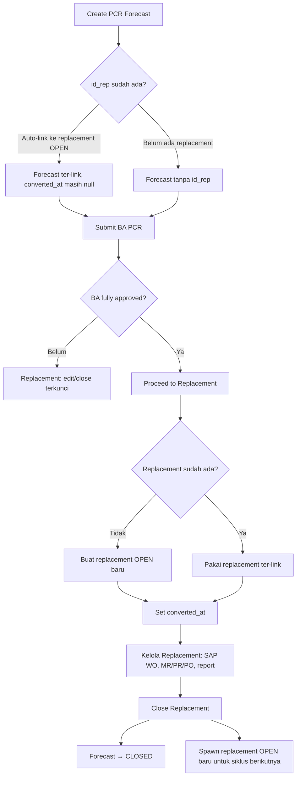

# Hubungan PCR Forecast dan Replacement

Dokumen ini menjelaskan hubungan antara modul **PCR Forecast** (rencana) dan **Replacement / PCR Actual** (realisasi) di sistem ARKA PCR. Merupakan perluasan bagian *PCR Forecast Module* pada [`docs/architecture.md`](./architecture.md).

---

## Dua entitas, satu alur PCR

Sistem memisahkan **rencana** dan **realisasi** sebagai dua record berbeda:

| | **PCR Forecast** | **Replacement (PCR Actual)** |
|---|---|---|
| Peran | Rencana pergantian komponen + dokumen **BA PCR** | Record eksekusi pergantian di lapangan |
| Tabel | `pcr_forecast` | `replacement` |
| Status utama | `forecast_status`: OPEN / CLOSED | `wo_status`: OPEN / CLOSE *(status siklus replacement, bukan dokumen SAP)* |
| Dokumen approval | BA PCR (rantai approval) | MR, PR, PO, oldcore, installation report |
| Dokumen SAP WO | — | **`wo_no`** = nomor Work Order SAP (diisi di Edit Replacement) |

**WO** di UI/API hanya merujuk ke **nomor dokumen Work Order SAP** (`woNo`) yang dipilih lewat SAP Document Picker di detail replacement — **bukan** nama untuk replacement itu sendiri.

---

## Hubungan data: `id_rep`

Keduanya dihubungkan lewat kolom **`pcr_forecast.id_rep`** → **`replacement.id_rep`**:

- Satu forecast aktif paling banyak **terhubung ke satu** replacement.
- Satu replacement paling banyak **punya satu** forecast ter-link.
- Relasi ini **unique** — tidak bisa dua forecast menempel ke replacement yang sama.

Field pendukung di forecast:

| Field | Arti |
|---|---|
| `id_rep` | Replacement mana yang terkait (boleh terisi sejak create, belum tentu sudah di-proceed) |
| `converted_at` | Kapan forecast **resmi dilanjutkan** ke replacement (Proceed to Replacement) |
| `is_warranty` | Forecast warranty → aturan approval & close replacement berbeda |
| `forecast_status` | OPEN selama rencana masih hidup; CLOSED saat siklus selesai |

---

## Alur end-to-end



---

## Tahap demi tahap

### 1. Pembuatan forecast

Saat forecast dibuat untuk **unit + komponen**:

- Sistem snapshot HM, life %, SOS, harga, periode rencana.
- Hanya boleh **satu forecast OPEN** per unit + komponen.
- Bisa jadi **forecast warranty** (`is_warranty`) jika life masih under policy.

**Link ke replacement** (opsional, sering otomatis):

- Jika sudah ada **replacement OPEN** untuk unit + komponen yang sama, forecast bisa langsung **`id_rep`-nya terisi**.
- Bisa juga dipilih manual saat create.
- Link ini **belum** berarti sudah di-proceed — `converted_at` masih kosong.

### 2. BA PCR (di sisi forecast)

Semua approval ada di forecast:

- Submit BA PCR → rantai approval (normal: panjang; warranty: PS → PM → PLM).
- Nomor BA, status, timeline approval — semua milik forecast.

**Replacement menunggu forecast:**

Selama replacement OPEN **belum punya forecast**, atau forecast **BA belum fully approved**:

- Edit / close replacement **diblokir**.
- UI menampilkan hint: *Create forecast first* atau *Awaiting BA approval*.

Ini gate satu arah: **forecast mengizinkan**, replacement **menunggu**.

### 3. Proceed to Replacement

Langkah resmi dari rencana → eksekusi. Syarat:

- Forecast **OPEN**
- BA PCR **APPROVED**
- Belum pernah di-proceed (`converted_at` null)
- User: Planner PF (`forecasts.submit`), pengaju BA, atau admin

Yang terjadi:

1. Jika belum ada replacement → **buat replacement OPEN** baru.
2. Jika sudah ter-link → **validasi** replacement masih OPEN.
3. Set **`converted_at`** pada forecast.

Setelah proceed, tab baru membuka **Replacement Detail** (`/units/{unit}/replacements/{idMod}`).

**Proceed vs View Replacement:**

| Tombol | Kapan muncul | Fungsi |
|---|---|---|
| **Proceed to Replacement** | Siap proceed, belum `converted_at` | Aksi: lanjutkan forecast → replacement |
| **View Replacement** | Sudah ada `id_rep`, **dan** Proceed tidak tampil | Aksi: buka halaman replacement (navigasi saja) |

Keduanya **tidak pernah tampil bersamaan**.

### 4. Pengelolaan replacement (PCR Actual)

Setelah BA approved (dan idealnya setelah proceed), replacement menjadi record operasional:

**Field SAP / procurement** (di Edit atau saat Close):

- **`wo_no`** — nomor **Work Order SAP** *(ini yang dimaksud WO)*
- `wo_date`, `wo_end_date` — tanggal jadwal/selesai terkait dokumen WO SAP
- MR No, PR No, PO No — dokumen SAP procurement
- Return Oldcore Date, SPB/BA Return Oldcore
- **Installation Report** (PDF) — wajib untuk komponen **MAJOR** saat close

**Status siklus replacement** (`wo_status`):

- **OPEN** — pergantian sedang / akan dikerjakan
- **CLOSE** — siklus ini selesai; sistem otomatis **spawn replacement OPEN baru** untuk siklus berikutnya (tanpa forecast — perlu forecast baru nanti)

### 5. Close replacement → close forecast

Saat replacement di-**close**, forecast ter-link ikut ditutup (`forecast_status = CLOSED`) dengan aturan:

| Tipe forecast | Syarat close replacement | Forecast ikut CLOSED |
|---|---|---|
| **Normal** | MR + PR + PO + oldcore + installation report *(MAJOR saja)* | Ya, saat PO terisi |
| **Warranty** | Installation report *(MAJOR saja)*; MR/PR/PO **tidak** wajib | Ya, langsung saat replacement close |

Forecast **tidak** ditutup manual oleh user biasa lewat tombol Close di forecast — path normal adalah **close replacement**.

*(Admin dapat cancel forecast via API `closeForecast` tanpa menutup replacement — path khusus; tombol ini disembunyikan di UI.)*

---

## Arah keterkaitan di UI

```
Forecast Detail                    Replacement Detail
─────────────────                  ──────────────────
BA PCR, approval timeline    ←→    Kolom "PCR Forecast" (link ke forecast)
Proceed / View Replacement  →     Halaman replacement per komponen
Info "Linked Replacement"   →     id_rep / data replacement
                                   SAP WO No, MR/PR/PO, report, close
```

Dari **replacement list/detail**:

- Kolom **PCR Forecast** → link ke forecast + chip status BA.
- Jika replacement OPEN tanpa forecast → aksi **Create Forecast** (preset unit + komponen).

---

## Peristiwa yang memengaruhi link

| Peristiwa | Dampak pada hubungan |
|---|---|
| **Delete forecast** (sebelum BA submit) | `id_rep` forecast di-null; replacement tidak punya forecast lagi |
| **Proceed to Replacement** | `id_rep` terisi/dikonfirmasi + `converted_at` di-set |
| **Close replacement** | Forecast → CLOSED; replacement lama tetap ter-link; replacement OPEN baru **tanpa** forecast |
| **Soft-delete forecast** lama | `id_rep` dibebaskan agar bisa dipakai forecast/replacement lain |

---

## Perbedaan forecast normal vs warranty (terhadap replacement)

| Aspek | Normal | Warranty |
|---|---|---|
| Rantai BA PCR | Panjang (sampai Direksi) | Pendek (PS → PM → PLM) |
| Syarat close replacement | MR + PR + PO + oldcore (+ report jika MAJOR) | Hanya report jika MAJOR |
| Forecast CLOSED saat | Replacement close + PO terisi | Replacement close (tanpa PO) |

---

## Ringkasan konsep

1. **Forecast** = rencana + BA PCR + approval.
2. **Replacement** = record eksekusi PCR Actual per unit + komponen.
3. **`id_rep`** = tali hubung; bisa ada sejak create, baru “resmi” setelah **Proceed** (`converted_at`).
4. **BA approved** membuka kunci aksi replacement; **Proceed** menandai handoff rencana → eksekusi.
5. **Close replacement** menutup siklus dan (normalnya) menutup forecast; WO SAP (`wo_no`) diisi terpisah sebagai referensi dokumen SAP di detail replacement.
6. Setelah close, replacement OPEN baru muncul untuk siklus berikut — **forecast baru** perlu dibuat lagi jika rencana PCR berikutnya diperlukan.

---

## Referensi kode

| Area | File |
|---|---|
| Forecast service (convert, close) | `lib/forecasts/service.ts` |
| Replacement service (close, report) | `lib/replacement/service.ts` |
| Link forecast ↔ replacement | `lib/replacement/forecast-link.ts` |
| Syarat close (normal vs warranty) | `lib/replacement/close-requirements.ts` |
| Convert auth (PF / pengaju) | `lib/forecasts/convert-auth.ts` |

---

*Dokumen ini selaras dengan `docs/architecture.md` § PCR Forecast Module (2026-06-19) dan keputusan di `docs/decisions.md` (split `ba_pcr`, procurement di `replacement`).*
