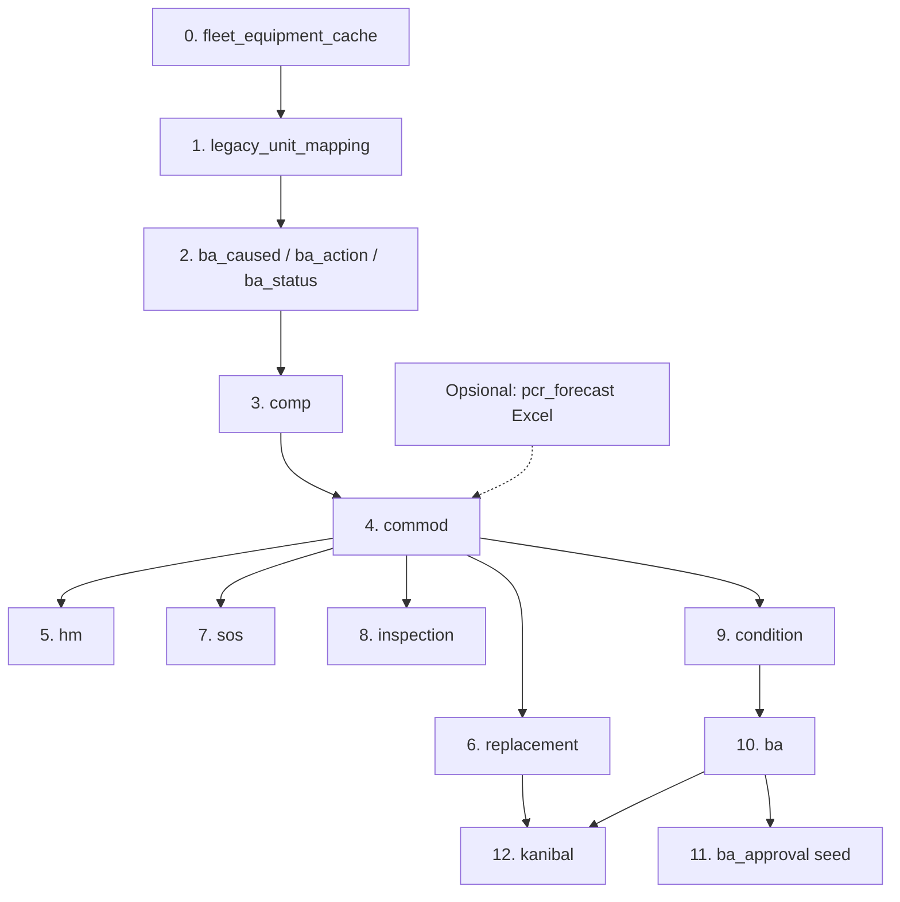

# Rancangan Migrasi Data — ARKA PCR (Legacy → v2)

**Status:** Selesai di staging (`arka_pcr_new`) — 4 Juni 2026  
**Sumber dump:** `db_arka_pcr.sql` (database aplikasi lama)  
**Target schema:** `prisma/schema.prisma` + `docs/UPGRADE_PLAN.md` §14  
**Di luar scope:** tabel `user` (dan turunannya RBAC: `user_role`, `user_project` dari legacy)

---

## 1. Ringkasan eksekutif

Migrasi memindahkan data operasional PCR dari MySQL legacy (CodeIgniter) ke database baru (Next.js + Prisma). Perubahan arsitektur utama:

| Aspek legacy                     | Database baru                                                       |
| -------------------------------- | ------------------------------------------------------------------- |
| `unit` + `id_unit` di transaksi  | `fleet_equipment_cache` + `legacy_unit_mapping`                     |
| `project.id_project` (INT)       | `project_code` (VARCHAR, dari Fleet API / `kode_project`)           |
| `model.id_model` lokal           | `commod.id_model` = `fleet_model_id` dari Fleet API                 |
| Tabel `unit`, `model`, `project` | Tidak disimpan sebagai master; hanya lookup saat transform          |
| `pcr_forecast`                   | **Tidak ada** di dump — modul baru, impor terpisah (Excel/opsional) |
| RBAC (`role`, `permission`, …)   | Seed terpisah, bukan dari dump                                      |

Proyek sudah memiliki **staging DB legacy** (`LEGACY_DATABASE_URL`) dan skrip impor parsial di `scripts/migration/`. Rancangan ini menyelaraskan dump `db_arka_pcr.sql` dengan urutan, mapping, dan gap implementasi.

---

## 2. Inventaris tabel legacy (dari `db_arka_pcr.sql`)

| Tabel         | Perkiraan baris (AUTO_INCREMENT) | Dimigrasi?   | Catatan                                          |
| ------------- | -------------------------------- | ------------ | ------------------------------------------------ |
| `comp`        | ~412                             | Ya           | + kolom `created_at`, `updated_at`, `deleted_at` |
| `commod`      | ~4.409                           | Ya           | `id_model` → `fleet_model_id` via mapping        |
| `ba_caused`   | 6                                | Ya           | Lookup identik                                   |
| `ba_action`   | 4                                | Ya           | Lookup identik                                   |
| `ba_status`   | 4                                | Ya           | Lookup identik                                   |
| `ba`          | ~2.545                           | Ya           | Transform project + approval                     |
| `kanibal`     | ~5.090                           | Ya           | Setelah `ba` + `replacement`                     |
| `replacement` | ~15.002                          | Ya           | FK unit → fleet                                  |
| `hm`          | **~493.457**                     | Ya           | Volume besar; batch + dedupe tanggal             |
| `sos`         | ~9.732                           | Ya           | Schema legacy lebih sempit dari v2               |
| `inspection`  | ~2.732                           | Ya           | Rating enum A/B/C/X                              |
| `condition`   | ~1.319                           | Ya           | Bisa impor + `recompute-conditions`              |
| `unit`        | ~714                             | Mapping saja | → `legacy_unit_mapping` CSV                      |
| `model`       | ~205                             | Mapping saja | → `model-mapping.csv`                            |
| `project`     | 19                               | Lookup saja  | `id_project` → `kode_project`                    |
| `user`        | ~57                              | **Tidak**    | Sesuai permintaan                                |

**Tidak ada di dump:** `pcr_forecast`, `pcr_forecast_approval`, `ba_approval`, `fleet_equipment_cache`, `legacy_unit_mapping`.

---

## 3. Prasyarat sebelum migrasi data

### 3.1 Lingkungan

1. Database target sudah di-`prisma migrate` (schema v2 kosong atau staging khusus migrasi).
2. Database staging legacy: `mysql://…/arka_pcr_legacy` (default di `scripts/migration/config.ts`).
3. Salin dump: `db_arka_pcr.sql` → `data/migration/legacy.sql` (atau set `LEGACY_SQL_PATH`).
4. Fleet API dapat diakses untuk sync cache (`FLEET_API_ENABLED=true`, `npm run fleet:sync`).

### 3.2 Artefak manual (wajib untuk transaksi ber-unit)

| Artefak       | Path                               | Isi                                                      |
| ------------- | ---------------------------------- | -------------------------------------------------------- |
| Unit mapping  | `data/migration/unit-mapping.csv`  | `legacy_unit_id`, `fleet_equipment_id`, `legacy_unit_no` |
| Model mapping | `data/migration/model-mapping.csv` | `legacy_model_id`, `fleet_model_id` (dari Fleet API)     |

**Cara menghasilkan unit mapping:**

```sql
-- Di DB staging legacy (setelah import SQL)
SELECT u.id_unit, u.unit_no, u.id_model, p.kode_project
FROM unit u
LEFT JOIN project p ON p.id_project = u.id_project
ORDER BY u.unit_no;
```

Cocokkan `unit_no` dengan `GET /ark-fleet/api/equipments` (normalisasi trim + case). Unit tanpa match Fleet → catat di laporan `unmapped-units.csv`, jangan paksa insert transaksi.

**Cara menghasilkan model mapping:**

```sql
SELECT id_model, model_no, manufacture, description FROM model ORDER BY id_model;
```

Cocokkan ke `model_id` / nama model Fleet. Duplikat `id_model` + `id_comp` di `commod` legacy harus didedupe **sebelum** impor jika Fleet hanya punya satu `fleet_model_id` per pasangan.

### 3.3 Lookup project (INT → kode)

| id_project | kode_project | nama (ringkas)         |
| ---------- | ------------ | ---------------------- |
| 1          | 000H         | Head Office Balikpapan |
| 2          | 001H         | Branch Office Jakarta  |
| 3          | 011C         | Embalut                |
| 4          | 015C         | Penajam                |
| 5          | 016C         | Sanga-sanga            |
| 7          | 017C         | Malinau                |
| 8          | 018C         | CV. Bukit Uhud         |
| 9          | 004W         | Workshop Kariangau     |
| 11         | 008C         | Senoni                 |
| 12         | 005P         | Pratasaba              |
| 13         | APS          | Kariangau APS          |
| 14         | 019C         | Sesayap                |
| 15         | 021C         | Bogor                  |
| 16         | 022C         | Melak GPK              |
| 17         | 023C         | Muara Lawa             |
| 18         | 025C         | Cilacap                |
| 19         | 026C         | Melak CEP              |

Implementasi: tabel sementara atau `Map<number, string>` di skrip impor `ba` (saat ini perlu perbaikan — lihat §7).

---

## 4. Urutan migrasi (tanpa `user`)

Urutan ini menghindari pelanggaran FK dan memastikan mapping unit/model sudah ada.



| Step | Target Prisma                                   | Sumber legacy            | Skrip / status                                |
| ---- | ----------------------------------------------- | ------------------------ | --------------------------------------------- |
| 0    | `fleet_equipment_cache`                         | Fleet API                | `npm run fleet:sync` / `migrate:prepare-live` |
| 1    | `legacy_unit_mapping`                           | CSV + validasi `unit`    | `migrate:unit-mapping` ✅                     |
| 2    | `ba_caused`, `ba_action`, `ba_component_status` | `ba_*` lookup            | **Belum ada** `import-ba-lookup`              |
| 3    | `comp`                                          | `comp`                   | **Belum ada** `import-comp`                   |
| 4    | `commod`                                        | `commod` + model mapping | **Belum ada** `import-commod`                 |
| 5    | `hm`                                            | `hm`                     | `migrate:import-hm` ✅                        |
| 6    | `replacement`                                   | `replacement`            | `migrate:import-replacements` ✅              |
| 7    | `sos`                                           | `sos`                    | `migrate:import-sos` ✅                       |
| 8    | `inspection`                                    | `inspection`             | `migrate:import-inspections` ✅               |
| 9    | `condition`                                     | `condition` + recompute  | `migrate:recompute-conditions` ✅             |
| 10   | `ba`                                            | `ba`                     | `migrate:import-ba` ✅ (perlu fix project)    |
| 11   | `ba_approval`                                   | derivasi `ba.status_l*`  | `migrate:seed-ba-approval` ✅                 |
| 12   | `kanibal`                                       | `kanibal`                | `migrate:import-kanibal` ✅                   |
| —    | `pcr_forecast`                                  | Excel / tidak ada di SQL | `migrate:import-forecasts` (opsional)         |

**RBAC:** `role`, `permission`, `role_permission` — seed aplikasi (`prisma/seed`); tidak dari dump.

---

## 5. Mapping per tabel (detail)

### 5.1 `comp`

| Legacy                   | Baru                       | Transformasi                     |
| ------------------------ | -------------------------- | -------------------------------- |
| `id_comp`                | `id_comp`                  | Pertahankan ID untuk FK `commod` |
| `comp_desc`, `comp_type` | sama                       |                                  |
| `status` enum            | `status` VARCHAR           | Active/Inactive                  |
| —                        | `created_at`, `updated_at` | `NOW()` saat impor               |
| —                        | `deleted_at`               | NULL                             |

### 5.2 `commod`

| Legacy         | Baru                        | Transformasi                                    |
| -------------- | --------------------------- | ----------------------------------------------- |
| `id_mod`       | `id_mod`                    | **Pertahankan** agar `replacement.id_mod` valid |
| `id_model`     | `id_model` (`fleetModelId`) | Via `model-mapping.csv`                         |
| `id_comp`      | `id_comp`                   | FK `comp`                                       |
| `policy`       | `policy`                    |                                                 |
| `price` bigint | `price` Decimal(15,2)       | Cast                                            |
| —              | `life_type`                 | NULL atau default bisnis                        |

**Unique constraint baru:** `(fleet_model_id, id_comp)`. Jika legacy punya duplikat pasangan yang sama → pilih satu `id_mod` kanonik, buat tabel remap `legacy_id_mod → canonical_id_mod` untuk baris transaksi.

### 5.3 `hm` (~493k baris)

| Legacy              | Baru                      | Transformasi                                               |
| ------------------- | ------------------------- | ---------------------------------------------------------- |
| `id_hm`             | `id_hm`                   | Opsional: pertahankan atau biarkan autoincrement           |
| `id_unit`           | `id_unit` (fleet)         | `legacy_unit_mapping`                                      |
| `hm_unit` float     | `hm_unit` Decimal         |                                                            |
| `wh_day`, `date_hm` | sama                      | Tolak `0000-00-00`                                         |
| —                   | `unit_no`, `project_code` | Dari `fleet_equipment_cache`                               |
| —                   | `is_official`             | Satu resmi per `(fleet_unit_id, date_hm)` — skrip existing |
| —                   | `snapshot_at`, audit      | Default impor                                              |

**Performa:** batch 2.000–5.000 baris, indeks aktif, estimasi 10–30 menit tergantung disk/CPU.

### 5.4 `replacement`

| Legacy                | Baru            | Transformasi                  |
| --------------------- | --------------- | ----------------------------- |
| `id_rep`              | `id_rep`        | Pertahankan                   |
| `id_unit`             | fleet id        | Mapping                       |
| `id_mod`              | `id_mod`        | Setelah remap commod jika ada |
| `wo_no` INT           | `wo_no` VARCHAR | `String(n)`; `0` → NULL       |
| `remarks` varchar(50) | `remarks` TEXT  |                               |
| `report` text         | `report`        |                               |
| `comp_cond` kosong    | default `'A'`   |                               |
| tanggal `0000-00-00`  | NULL atau skip  | Keputusan QA                  |

### 5.5 `sos`

Legacy dump **hanya** kolom: `id_sos`, `id_unit`, `id_mod`, `type`, `lab_name`, `lab_no`, `sample_date`, `oil_type`, `h_oil`, `h_unit`, `eval_code`, `recommendation`, `oil_change`, `oil_added`.

Schema v2 punya kolom elemen lab (Fe, Cu, …) — tetap **NULL** kecuali sumber lain ditambahkan later.

| Field        | Transformasi                                       |
| ------------ | -------------------------------------------------- |
| `oil_change` | `'Yes'/'TRUE'/true` → true; `'No'/'FALSE'` → false |
| `oil_added`  | int → boolean (0 = false)                          |
| `eval_code`  | Map ke rating jika dipakai di condition recompute  |

### 5.6 `inspection`

| Legacy         | Baru                                       |
| -------------- | ------------------------------------------ |
| `ins_hm` float | `ins_hm` Int? (round/truncate)             |
| `type`         | FC, MPS, VI, TA2, ED — varchar(10) di v2   |
| `rating` enum  | A/B/C/X — X mungkin perlu kebijakan bisnis |

### 5.7 `condition`

Legacy: `id_cond`, `id_unit`, `id_mod`, `condition` saja.

Baru: + `sos_rating`, `fc_rating`, `mps_rating`, … — isi via `migrate:recompute-conditions` dari SOS + inspection terbaru per unit/komponen.

**Unique:** `(fleet_unit_id, id_mod)` — jika legacy duplikat, ambil baris terakhir `id_cond`.

### 5.8 `ba`

Perbedaan schema signifikan:

| Legacy                                 | Baru                         | Catatan                                                        |
| -------------------------------------- | ---------------------------- | -------------------------------------------------------------- |
| `id_project` INT                       | `project_code` VARCHAR       | **Wajib** lookup `project.kode_project`                        |
| `mr_no`, `pr_no`, `po_no` INT          | VARCHAR(30)                  | Cast; 0 → NULL                                                 |
| `user_l1/l2/l3` INT                    | `user_l1/l2/l3` VARCHAR(100) | Simpan username legacy atau label; **bukan** FK ke `user` baru |
| Kolom LPL/LGM/LOD, remark*l\*, date*\* | —                            | **Tidak** di schema v2; buang atau arsip JSON opsional         |
| `status_ba` enum                       | VARCHAR                      | DRAFT/OPEN/CLOSE/CANCEL/REJECTED                               |

Setelah impor header: `migrate:seed-ba-approval` → `ba_approval` level L1/L2/L3 dari `status_l*`.

### 5.9 `kanibal`

| Legacy              | Baru                              |
| ------------------- | --------------------------------- |
| `id_rep = 0`        | `id_rep = NULL`                   |
| `wo_no_kanibal` INT | VARCHAR(30)                       |
| `id_unit`           | fleet id + `unit_no` snapshot     |
| FK `no_ba`          | Harus ada di `ba` terlebih dahulu |

---

## 6. Tabel yang tidak dimigrasi dari SQL

| Entitas        | Penanganan                                    |
| -------------- | --------------------------------------------- |
| `user`         | Di luar scope; auth/RBAC terpisah             |
| `unit`         | Hanya untuk CSV mapping                       |
| `model`        | Hanya untuk CSV mapping                       |
| `project`      | Lookup in-memory / skrip                      |
| `pcr_forecast` | Impor Excel terpisah jika diperlukan historis |

---

## 7. Gap implementasi (vs skrip existing)

| Kebutuhan                            | Status                                                                        |
| ------------------------------------ | ----------------------------------------------------------------------------- |
| Import SQL ke staging                | `migrate:import-legacy-sql` ✅                                                |
| Audit schema                         | `migrate:audit-legacy` ✅ (perbaiki query sample: kolom `id_unit` bukan `id`) |
| Import `comp`                        | ❌ perlu `import-comp.ts`                                                     |
| Import lookup BA                     | ❌ perlu `import-ba-lookup.ts`                                                |
| Import `commod` + dedupe + model map | ❌ perlu `import-commod.ts`                                                   |
| `import-ba`: `project_code`          | ⚠️ Saat ini memakai `id_project` mentah — **harus** map ke `kode_project`     |
| Import `comp` sebelum `replacement`  | Urutan npm scripts perlu diperbarui di `package.json` / `status.ts`           |

---

## 8. Strategi eksekusi & validasi

### 8.1 Mode migrasi

1. **Dry-run / staging:** DB target `arka_pcr_staging`, truncate + full import.
2. **Produksi:** Maintenance window, backup full, import sekali, read-only legacy.

### 8.2 Validasi pasca-migrasi (contoh query)

```sql
-- Count parity (legacy staging vs target)
SELECT 'comp' t, COUNT(*) c FROM comp
UNION SELECT 'commod', COUNT(*) FROM commod
UNION SELECT 'replacement', COUNT(*) FROM replacement
UNION SELECT 'hm', COUNT(*) FROM hm;

-- Unit tanpa mapping yang menyebabkan skip HM
-- (bandingkan COUNT hm legacy vs target)

-- BA tanpa kanibal orphan
SELECT k.no_ba FROM kanibal k
LEFT JOIN ba b ON b.no_ba = k.no_ba WHERE b.id_ba IS NULL;

-- Replacement id_mod yang tidak ada di commod
SELECT r.id_rep FROM replacement r
LEFT JOIN commod c ON c.id_mod = r.id_mod WHERE c.id_mod IS NULL;
```

Gunakan `npm run migrate:status` untuk checklist file.

### 8.3 Risiko utama

| Risiko                       | Mitigasi                                                |
| ---------------------------- | ------------------------------------------------------- |
| Unit tidak match Fleet       | CSV mapping + laporan unmapped; jangan insert transaksi |
| `id_model` legacy ≠ Fleet    | `model-mapping.csv` wajib                               |
| Duplikat `commod`            | Dedupe + remap `id_mod`                                 |
| HM sangat besar              | Batch, matikan autocommit besar, monitor disk           |
| Tanggal invalid `0000-00-00` | Filter di skrip impor                                   |
| BA `id_project` salah        | Fix lookup sebelum run produksi                         |
| Password / user              | Sengaja di luar scope                                   |

### 8.4 Rollback

- Restore snapshot MySQL target sebelum migrasi.
- Legacy DB staging tetap utuh (read-only).
- Tidak ada rollback otomatis per tabel — desain impor **idempotent** (`skip if exists` pada beberapa skrip) untuk re-run parsial.

---

## 9. Checklist eksekusi (untuk instruksi berikutnya)

Jalankan **hanya setelah** disetujui:

- [ ] Backup DB production / staging target
- [ ] `cp db_arka_pcr.sql data/migration/legacy.sql`
- [ ] `npm run migrate:import-legacy-sql`
- [ ] `npm run migrate:audit-legacy`
- [ ] `npm run fleet:sync` (atau `migrate:prepare-live`)
- [ ] Generate & review `unit-mapping.csv`, `model-mapping.csv`
- [ ] `npm run migrate:unit-mapping`
- [ ] Implementasi + run: `import-ba-lookup`, `import-comp`, `import-commod`
- [ ] `npm run migrate:import-hm`
- [ ] `npm run migrate:import-replacements`
- [ ] `npm run migrate:import-sos`
- [ ] `npm run migrate:import-inspections`
- [ ] `npm run migrate:recompute-conditions`
- [ ] `npm run migrate:import-ba` (dengan fix project_code)
- [ ] `npm run migrate:seed-ba-approval`
- [ ] `npm run migrate:import-kanibal`
- [ ] Validasi count & spot-check UI
- [ ] (Opsional) `migrate:import-forecasts` dari Excel

**Tidak dijalankan:** migrasi `user`, `migrate:passwords` untuk user legacy (kecuali kebijakan terpisah).

---

## 10. Hasil staging (4 Juni 2026)

| Tabel target | Baris | Catatan |
|--------------|------:|---------|
| `fleet_equipment_cache` | 984 | Fleet sync |
| `legacy_unit_mapping` | 531 | 2 unmapped → `data/migration/unmapped-units.csv` |
| `comp` | 404 | |
| `commod` | 4177 | 48 `id_mod` remap → `commod-id-remap.json` |
| `hm` | 243944 | banyak skip: unit tanpa mapping |
| `replacement` | 12521 | `id_rep` dipertahankan |
| `sos` | 8882 | |
| `inspection` | 2620 | |
| `condition` | 1152 | recompute |
| `ba` | 2495 | `project_code` lookup |
| `ba_approval` | 4019 | |
| `kanibal` | 4771 | |

**Legacy DB:** `arka_pcr` (dump memakai `USE arka_pcr`).

---

## 11. Referensi

- Dump: [`db_arka_pcr.sql`](../db_arka_pcr.sql)
- Schema: [`prisma/schema.prisma`](../prisma/schema.prisma)
- Mapping field: [`docs/UPGRADE_PLAN.md`](UPGRADE_PLAN.md) §14
- Skrip: [`scripts/migration/`](../scripts/migration/)
- Contoh CSV: [`data/migration/unit-mapping.csv.example`](../data/migration/unit-mapping.csv.example)

---

_Dibuat: 4 Juni 2026 — dieksekusi ke staging 4 Juni 2026._
