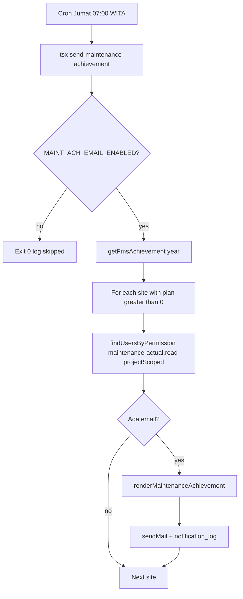

# Rancangan — Email ketercapaian Maintenance per site

**Status**: Draft desain (belum implementasi kirim email)  
**Tanggal**: 2026-09-22  
**Tujuan**: Tim plant tiap site menerima ringkasan **berapa % ketercapaian maintenance** (plan vs actual), memakai infrastruktur notifikasi yang sudah ada (`lib/notifications/*`), tanpa broadcast spam seperti cron due/overdue yang pernah dihapus.

**Batasan sesi ini**: rancangan body/subject/penerima/jadwal saja. **Tidak ada email yang dikirim** ke SMTP. Sample HTML mock ada di `.tmp/email-samples/maintenance_achievement.html` (buka di browser).

---

## 1. Ringkasan produk

| Item | Usulan |
|------|--------|
| Event baru | `maintenance_achievement` |
| Jenis | Digest terjadwal per **project/site** (bukan workflow dokumen) |
| Frekuensi default | **Setiap Jumat** (mingguan) — bukan harian |
| Penerima | **TO** plant site (`maintenance-actual.read` + project); **CC** HO `000H` |
| Deep link | `/dashboards/maintenance?year={Y}&projectId={SITE}` (via `getAppBaseUrl` + basePath) |
| Admin | Preview + trial di `/admin/email-notifications` (event `maintenance_achievement`) |

---

## 2. Sumber data (sudah ada)

Reuse `getFmsAchievement(year, projectId)` di `lib/fms/dashboard/achievement.ts`:

- `siteTotals[]` → `totalPlan`, `totalActual`, `ach` (**% YTD** per site)
- `programRows[]` → per tipe maintenance (Washing, dll.) plan/actual/ach + breakdown 12 bulan
- Rumus ACH: `round((actual/plan)*1000)/10` ; `null` jika plan 0

Untuk **MTD**, ambil bulan kalender saat job jalan: dari `programRows[].months[monthIndex]` agregat plan/actual per site (atau filter `maintenancePlan.month` + count actuals — sama logika dashboard).

Tidak perlu query baru untuk fase 1; bungkus helper:

```ts
// usulan (belum di-code)
getMaintenanceAchievementDigest({ year, month, projectId })
  → { site, mtd, ytd, byType: [...], dashboardUrl }
```

---

## 3. Penerima & scope

### 3.1 Resolver

Pola sama `findUsersByPermission` (`lib/notifications/recipients.ts`):

```
permission: 'maintenance-actual.read'   // primary
fallback opsional: 'reports.access'
projectCode: siteId (project_id plan FMS, biasanya kode site)
+ HO (000H) jika ingin Plant HO ikut lihat semua site
```

### 3.2 Satu email per site

- Job loop `sites` dari achievement year (Jumat).
- Skip site jika `totalPlan === 0`.
- Skip jika tidak ada recipient TO.
- **TO**: plant site (permission + `userProjects` = site).
- **CC**: user HO (`000H`) dengan email — tidak digandakan jika sudah di TO.
- Idempotency: `maintenance_achievement/{yyyy}-W{ww}/{siteId}/{email}`.

### 3.3 Siapa tidak ikut

- Logistics-only / tanpa project site
- User tanpa email
- Role tanpa permission maintenance/reports

---

## 4. Subject & tone

**Subject (contoh):**

```
[ARKA PCR] Maintenance ACH — BLT — Sep 2026: MTD 72.5% · YTD 68.0%
```

Pola: `[ARKA PCR] Maintenance ACH — {SITE} — {Mon YYYY}: MTD {x}% · YTD {y}%`

Jika MTD/YTD `null` (plan 0): tampilkan `n/a`.

**Badge / theme** (reuse `EMAIL_THEMES`):

| Kondisi MTD ACH | Theme key (baru / reuse) | Badge |
|-----------------|--------------------------|--------|
| ≥ 90% | `complete` (biru) atau theme baru `ach_good` hijau | On track |
| 70–89% | `pending` (amber) | Perlu perhatian |
| < 70% | `due` / `overdue` | Di bawah target |
| null | `ping` | Tidak ada plan |

Threshold final bisa dikonfigurasi nanti (`MAINT_ACH_WARN=90`, `MAINT_ACH_CRIT=70`).

---

## 5. Body email — wireframe

Layout: `emailShell` existing (header ARKA PCR, accent bar, CTA).

### 5.1 Headline / subheadline

- Headline: `Ketercapaian Maintenance — {SITE}`
- Subheadline: `Ringkasan MTD & YTD {Mon YYYY}. Data dari plan vs actual maintenance.`

### 5.2 Blok KPI (infoGrid / 2 kartu)

| Label | Value |
|-------|--------|
| Site | `BLT` |
| Periode MTD | `1–22 Sep 2026` (tanggal job) |
| Plan MTD | `40` |
| Actual MTD | `29` |
| **ACH MTD** | **72.5%** |
| Plan YTD | `320` |
| Actual YTD | `218` |
| **ACH YTD** | **68.0%** |

### 5.3 Tabel per tipe maintenance (utama untuk plant)

Kolom:

| Program / Type | Plan MTD | Act MTD | ACH MTD | Plan YTD | Act YTD | ACH YTD |
|----------------|----------|---------|---------|----------|---------|---------|

Baris = `maintenance_types` yang punya plan > 0 di site itu. Sort: ACH MTD ascending (yang jelek di atas) agar actionable.

Warna ACH di cell (inline): hijau / amber / merah sesuai threshold.

### 5.4 Opsional (fase 2) — “gap bulan ini”

Teks singkat:

> 3 program di bawah 70% MTD: *Washing* (55%), *Greasing* (62%), …

Max 5 item supaya email tetap pendek.

### 5.5 CTA

- Label: `Buka dashboard Maintenance`
- URL: `{APP}/dashboards/maintenance?year=2026&projectId=BLT`

### 5.6 Plain-text fallback

```
Ketercapaian Maintenance — BLT
MTD Sep 2026: Plan 40 / Actual 29 / ACH 72.5%
YTD 2026: Plan 320 / Actual 218 / ACH 68.0%

Per tipe:
- Washing: MTD 55% (11/20), YTD 61%
...

Dashboard: https://.../arka-pcr/dashboards/maintenance?year=2026&projectId=BLT
```

---

## 6. Contoh subject + body (mock copy)

**Subject:** `[ARKA PCR] Maintenance ACH — BLT — Sep 2026: MTD 72.5% · YTD 68.0%`

**Body (narasi untuk plant):**

> Tim Plant **BLT**,  
> Berikut ringkasan ketercapaian maintenance site Anda.  
>  
> **Bulan berjalan (Sep 2026):** 29 dari 40 rencana terlaksana → **72.5%**.  
> **Tahun berjalan:** 218 dari 320 → **68.0%**.  
>  
> Program yang perlu perhatian bulan ini (ACH MTD &lt; 70%): Washing 55%, Greasing 62%.  
> Silakan buka dashboard untuk detail per bulan dan input actual yang tertunda.

HTML mock visual: [`.tmp/email-samples/maintenance_achievement.html`](../.tmp/email-samples/maintenance_achievement.html) — **static file, tidak dikirim SMTP**.

---

## 7. Integrasi teknis (fase implementasi nanti)

### 7.1 File yang akan disentuh

| Area | Perubahan |
|------|-----------|
| `lib/notifications/types.ts` | Event `maintenance_achievement` + payload |
| `lib/notifications/templates.ts` | `renderMaintenanceAchievement` |
| `lib/notifications/email-layout.ts` | Theme `ach_good` (opsional) + helper tabel ACH |
| `lib/notifications/events.ts` | `notifyMaintenanceAchievementDigest(...)` |
| `lib/notifications/sample-data.ts` | Payload preview admin |
| `lib/fms/dashboard/achievement-digest.ts` | Helper MTD+YTD per site |
| `scripts/notifications/send-maintenance-achievement.ts` | Job CLI (tools image) |
| Admin email page | Event di dropdown + preview |
| Cron host / Compose | Jadwal mingguan → `docker compose --profile tools run ...` |

### 7.2 Payload (usulan)

```ts
type MaintenanceAchievementPayload = {
  event: 'maintenance_achievement'
  siteId: string
  siteName: string
  year: number
  month: number // 1–12
  periodLabel: string // "Sep 2026"
  mtd: { plan: number; actual: number; ach: number | null }
  ytd: { plan: number; actual: number; ach: number | null }
  byType: Array<{
    typeName: string
    mtd: { plan: number; actual: number; ach: number | null }
    ytd: { plan: number; actual: number; ach: number | null }
  }>
  dashboardUrl: string
}
```

### 7.3 Keamanan spam (wajib)

Selaras keputusan hapus due/overdue cron:

1. Default **mingguan**, bukan harian.  
2. Satu email **per site** (bukan satu email all-site ke semua orang).  
3. Skip site tanpa plan.  
4. Hormati `MAIL_ENABLED` runtime.  
5. Idempotency + `notification_log`.  
6. Admin preview dulu sebelum cron production on.  
7. Feature flag env: `MAINT_ACH_EMAIL_ENABLED=false` sampai disetujui.

---

## 8. Alur (mermaid)



---

## 9. Keputusan (locked 2026-09-22)

| Topik | Keputusan |
|-------|-----------|
| Frekuensi | **Setiap Jumat** (digest mingguan) |
| Penerima | **TO** Plant site (`maintenance-actual.read` + project scope); **CC** Head Office (`000H`) saja |
| Threshold warna | ≥90% on track · 70–89% perhatian · &lt;70% kritis |
| Preview | `/admin/email-notifications/` — event `maintenance_achievement` |

Cron production + SMTP job **belum** diaktifkan; template + preview admin sudah tersedia.

---

## 10. Fase pengerjaan (setelah desain disetujui)

| Fase | Isi | Kirim email? |
|------|-----|--------------|
| **A — Desain** | Doc + keputusan Frekuensi/penerima/threshold | Tidak |
| **B — Template + preview** | Event, render, digest helper, admin `/admin/email-notifications` | Preview saja; Trial hanya jika admin klik | 
| **C — Job dry-run** | Script list recipients + `--dry-run` | Tidak |
| **D — Production cron Jumat** | Enable flag + cron tools + CC HO | Ya |

---

## 11. Referensi kode

- Achievement: `lib/fms/dashboard/achievement.ts`, UI `/dashboards/maintenance`
- Email stack: `lib/notifications/{types,templates,events,recipients,mailer,email-layout}.ts`
- Admin trial/preview: `/admin/email-notifications`
- Keputusan anti-spam digest harian: `docs/decisions.md` (Email Nodemailer, 2026-08-26)
