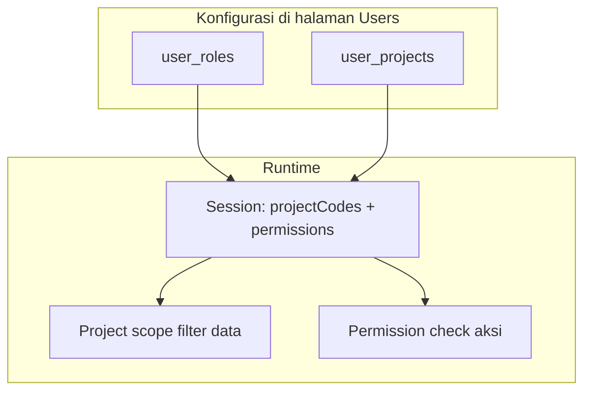

# Draft Migrasi RBAC — Menggantikan `level`, `project_code`, `sign`, `pcr_sign`

**Status**: Implemented (2026-06-03), **Simplified** (2026-06-22)  
**Last Updated**: 2026-06-22  
**Tujuan**: Fitur **Roles** + **Permissions** pada modul **Users** menjadi satu-satunya cara mengatur akses.

---

## RBAC Simplification (2026-06-22)

### 9 role jabatan (seed templates)

| Role | Label | Cannibal approve | Forecast approve | Scope |
|------|-------|------------------|------------------|-------|
| `administrator` | Administrator | all | all | all |
| `plant_foreman` | Plant Foreman / Supervisor | — | submit | assigned projects |
| `plant_superintendent` | Plant Superintendent / Dept Head | PS | PS | assigned projects |
| `project_manager` | Project Manager | PM | PM | assigned projects |
| `plant_manager` | Plant Manager | PLM | PLM | 000H |
| `operational_gm` | Operational GM | OGM | — | 000H |
| `operational_director` | Operational Director | OD | OD | 000H |
| `commercial_treasury_director` | Commercial & Treasury Director | — | FD (CTD label) | 000H |
| `president_director` | President Director | — | PD | 000H |

Legacy roles (`admin`, `super_user`, `viewer`, `planner_pf`, `approver_*`, `cannibal_l*`) di-deactivate.

### Cannibal approval workflow (5 level)

Sequential: **PS → PM → PLM → OGM → OD** (bukan L1/L2/L3).

Permissions: `cannibals.approve.PS`, `.PM`, `.PLM`, `.OGM`, `.OD`

PS & PM: project-scoped via `canAccessProject`. PLM/OGM/OD: all projects (user wajib `000H`).

### Migrasi

```bash
npm run db:migrate                    # ba_approval.level VARCHAR(5)
npm run rbac:seed                       # sync permission + role template (manual, bukan saat login)
npm run rbac:migrate-job-roles        # remap user_role legacy → job roles
npm run rbac:migrate-cannibal-approvals  # L1/L2/L3 → PLM/OGM/OD + reseed in-flight BA
```

**Catatan:** RBAC seed **tidak** dijalankan otomatis saat login. Jalankan `rbac:seed` setelah deploy atau ubah katalog permission/role template di kode.

File inti: `lib/rbac/permission-catalog.ts`, `lib/rbac/role-templates.ts`, `lib/cannibal/approval-workflow.ts`.

---

## 1. Tujuan & kriteria sukses

### Tujuan bisnis

| Sebelum (legacy)                         | Sesudah (target)                                                   |
| ---------------------------------------- | ------------------------------------------------------------------ |
| `user.level` = ADMIN / SUPER USER / User | Role + permission (mis. role `admin`, `operator`)                  |
| `user.project_code` (satu proyek)        | Hanya `user_projects` + multi-select di drawer User                |
| `user.sign` = L1/L2/L3                   | Permission `cannibal.approve.L1` … `L3` (atau role yang memuatnya) |
| `user.pcr_sign` = PF/PS/PM/…             | Permission `forecast.approve.PF` … `PD` + `forecast.submit`        |

### Kriteria sukses (wajib sebelum drop kolom)

1. **Form User** hanya: akun, password, nama, **roles** (checkbox/multi), **projects** (multi), status aktif — **tanpa** level / sign / pcrSign.
2. **Session/JWT** tidak lagi menulis `level`, `sign`, `pcrSign`, `projectCode` dari kolom `user` (hanya `projectCodes` dari pivot).
3. Semua `isAdmin(session)` / `isSuperUserOrAdmin(session)` diganti `hasPermission` / `hasAnyPermission`.
4. Workflow Cannibal & Forecast approval memakai **permission**, bukan field user.
5. Script migrasi: user lama dapat role setara perilaku lama (lihat §6).
6. ACL (`ACL_ENABLE=true`) menjadi sumber kebenaran; tanpa ACL tetap permissive untuk dev (seperti sekarang).

### Prinsip desain



- **Project scope** = _di data mana user boleh bekerja_ (bukan permission).
- **Permission** = _apa yang user boleh lakukan_ (baca, tulis, approve, export, …).
- **Role** = bundel permission agar assignment di User sederhana.

---

## 2. Model data User (target akhir)

### Tetap di `user`

| Field                                        | Keterangan        |
| -------------------------------------------- | ----------------- |
| `idUser`, `username`, `password`, `fullName` | Identitas & login |
| `isActive`, `lastLogin`, timestamps          | Status            |
| `deletedAt`                                  | Soft delete       |

### Tetap di pivot (bukan kolom user)

| Tabel           | Fungsi                                               |
| --------------- | ---------------------------------------------------- |
| `user_roles`    | Many-to-many ke `roles`                              |
| `user_projects` | Many-to-many kode proyek Fleet (`000H` = semua site) |

### Dihapus dari `user` (setelah fase 4)

| Field          | Diganti oleh                                      |
| -------------- | ------------------------------------------------- |
| `level`        | Role `admin` + permission `system.*` / `*.manage` |
| `project_code` | `user_projects` saja                              |
| `sign`         | `cannibal.approve.L1` … `L3`                      |
| `pcr_sign`     | `forecast.approve.*` + `forecast.submit`          |

### UI Users — drawer target

```
Add/Edit User
├── Username, Password, Full name
├── Projects (multi-select, termasuk 000H)
├── Roles (checkbox per role — permission tersembunyi di role)
├── Active switch
└── (opsional read-only) Effective permissions — chip dari union role
```

Kolom **Level**, **Sign**, **PCR Sign** di grid list User **dihapus**; diganti kolom **Roles** (chip nama role).

---

## 3. Katalog permission (konvensi `modul.aksi`)

Format: `{module}.{action}` — selaras dengan grouping di UI Roles (`PermissionCheckboxGroups`).

### 3.1 System & administrasi

| Code                 | Deskripsi                                   | Menggantikan             |
| -------------------- | ------------------------------------------- | ------------------------ |
| `users.access`       | Kelola halaman Users                        | Sudah ada                |
| `roles.access`       | Kelola Roles                                | Sudah ada                |
| `permissions.access` | Kelola Permissions                          | Sudah ada                |
| `units.access`       | Daftar unit / fleet                         | Sudah ada                |
| `system.admin`       | Bypass approval workflow + semua aksi admin | `level === 'ADMIN'`      |
| `system.super`       | Edit operasional PCR (non-approval admin)   | `level === 'SUPER USER'` |

> **Catatan**: `system.admin` implisit memiliki semua permission (implementasi di `hasPermission`). `system.super` = SUPER USER lama tanpa otomatis approve semua level.

### 3.2 Master data

| Code                      | Deskripsi                 |
| ------------------------- | ------------------------- |
| `components.access`       | Lihat master component    |
| `components.create`       | Tambah / import component |
| `components.update`       | Edit component            |
| `components.delete`       | Hapus component           |
| `model-components.access` | Lihat model–component     |
| `model-components.create` | Tambah                    |
| `model-components.update` | Edit                      |
| `model-components.delete` | Hapus                     |

### 3.3 Unit & transaksi unit

| Code                                                     | Deskripsi                                                                |
| -------------------------------------------------------- | ------------------------------------------------------------------------ |
| `hour-meters.access`                                     | Lihat HM                                                                 |
| `hour-meters.create`                                     | Input HM                                                                 |
| `hour-meters.update`                                     | Edit HM                                                                  |
| `hour-meters.delete`                                     | Hapus HM                                                                 |
| `hour-meters.import`                                     | Import HM (khusus admin dulu) → `hour-meters.import` atau `system.admin` |
| `replacements.access`                                    | Lihat replacement                                                        |
| `replacements.create`                                    | Buat replacement                                                         |
| `replacements.update`                                    | Edit / report                                                            |
| `replacements.close`                                     | Close WO                                                                 |
| `sos.access` / `.create` / `.update` / `.delete`         | SOS per unit                                                             |
| `inspections.access` / `.create` / `.update` / `.delete` | Inspection                                                               |
| `conditions.access` / `.create`                          | Condition monitoring                                                     |

### 3.4 Forecast PCR

| Code                    | Deskripsi               | Legacy               |
| ----------------------- | ----------------------- | -------------------- |
| `forecasts.access`      | Lihat forecast          | —                    |
| `forecasts.create`      | Generate / refresh      | SUPER USER           |
| `forecasts.update`      | Edit / close            | SUPER USER           |
| `forecasts.convert`     | Convert ke replacement  | SUPER USER           |
| `forecasts.export`      | Export                  | —                    |
| `forecasts.submit`      | Submit BA PCR (Planner) | `pcr_sign === 'PF'`  |
| `forecasts.approve.PS`  | Approve tahap PS        | `pcr_sign === 'PS'`  |
| `forecasts.approve.PM`  | Approve PM              | `pcr_sign === 'PM'`  |
| `forecasts.approve.PLM` | Approve PLM             | `pcr_sign === 'PLM'` |
| `forecasts.approve.OD`  | Approve OD              | `pcr_sign === 'OD'`  |
| `forecasts.approve.FD`  | Approve FD              | `pcr_sign === 'FD'`  |
| `forecasts.approve.PD`  | Approve PD              | `pcr_sign === 'PD'`  |

### 3.5 Cannibal (BA)

| Code                   | Deskripsi         | Legacy          |
| ---------------------- | ----------------- | --------------- |
| `cannibals.access`     | Lihat BA          | —               |
| `cannibals.create`     | Buat / edit draft | SUPER USER      |
| `cannibals.update`     | Update BA         | SUPER USER      |
| `cannibals.submit`     | Submit BA         | SUPER USER      |
| `cannibals.close`      | Close BA          | SUPER USER      |
| `cannibals.cancel`     | Cancel            | SUPER USER      |
| `cannibals.approve.L1` | Approve level 1   | `sign === 'L1'` |
| `cannibals.approve.L2` | Approve level 2   | `sign === 'L2'` |
| `cannibals.approve.L3` | Approve level 3   | `sign === 'L3'` |

### 3.6 Laporan & export

| Code                  | Deskripsi          |
| --------------------- | ------------------ |
| `reports.access`      | Akses menu reports |
| `exports.conditions`  | Export conditions  |
| `exports.forecasts`   | Export forecasts   |
| `exports.sos`         | Export SOS         |
| `exports.pcr`         | Export PCR         |
| `exports.inspections` | Export inspections |
| `exports.cannibal`    | Export cannibal    |

---

## 4. Role template (seed)

Role = paket untuk assignment di User. Admin bisa kustomisasi lewat halaman Roles.

| Role `name`         | Permission inti                                                           | Setara legacy                   |
| ------------------- | ------------------------------------------------------------------------- | ------------------------------- |
| `admin`             | Semua (via `system.admin` atau assign all)                                | `ADMIN`                         |
| `super_user`        | `system.super` + master + unit transaksi + cannibal CRUD + forecasts CRUD | `SUPER USER`                    |
| `viewer`            | `*.access` tanpa `.create/.update/.delete`                                | User read-only                  |
| `planner_pf`        | `forecasts.*` + `forecast.submit`                                         | `pcr_sign = PF`                 |
| `approver_ps`       | `forecasts.access` + `forecast.approve.PS`                                | `pcr_sign = PS`                 |
| `approver_pm`       | + `forecast.approve.PM`                                                   | `PM`                            |
| `approver_plm`      | + `forecast.approve.PLM`                                                  | `PLM`                           |
| `approver_director` | + `forecast.approve.OD`, `.FD`, `.PD`                                     | OD/FD/PD (bisa 3 role terpisah) |
| `cannibal_l1`       | `cannibal.access` + `cannibal.approve.L1`                                 | `sign = L1`                     |
| `cannibal_l2`       | + `cannibal.approve.L2`                                                   | `L2`                            |
| `cannibal_l3`       | + `cannibal.approve.L3`                                                   | `L3`                            |

User boleh punya **beberapa role** (union permission), mis. `super_user` + `approver_pm` + `cannibal_l2`.

---

## 5. Perubahan kode inti

### 5.1 `lib/utils/api-auth.ts` (target)

```typescript
// Pseudocode — implementasi nyata di fase 2
export function hasPermission(session, code: string): boolean {
  if (!isAclEnabled()) return true
  const perms = session.user.permissions ?? []
  if (perms.includes('system.admin')) return true
  return perms.includes(code)
}

export function hasAnyPermission(session, codes: string[]): boolean {
  return codes.some(code => hasPermission(session, code))
}

// Deprecated → hapus setelah refactor
// isAdmin() → hasPermission(session, 'system.admin')
// isSuperUserOrAdmin() → hasAnyPermission(session, ['system.admin', 'system.super'])
```

`requirePermissionOrForbidden` tetap; **hapus** bypass `isAdmin(session)` berbasis `level`.

### 5.2 Workflow approval

**Cannibal** — `lib/cannibal/approval-workflow.ts`:

```typescript
// Ganti userSign + isAdmin dengan:
canActOnBaApproval(ba, level, session) {
  if (hasPermission(session, 'system.admin')) return true
  return hasPermission(session, `cannibal.approve.${level}`)
}
```

**Forecast** — `lib/forecasts/approval-workflow.ts` & `service.ts`:

```typescript
// submit: hasPermission(session, 'forecast.submit') || system.admin
// approve level X: hasPermission(session, `forecast.approve.${level}`)
// list queue: filter by permissions user punya, bukan session.user.pcrSign
```

### 5.3 Session / auth

`lib/auth-options.ts`:

- JWT: `projectCodes` dari `getUserProjectCodes` only.
- **Stop** load `level`, `sign`, `pcrSign` dari DB ke token (fase 3).
- Tetap `roles`, `permissions` dari `getUserRolesAndPermissions`.

`src/context/AuthContext.js`:

- Hapus `level`, `sign`, `pcrSign`, `projectCode` dari `userData` (atau deprecated sementara).
- Tambah helper: `can(permissionCode)` → `permissions.includes(code) || system.admin`.

### 5.4 Client UI pattern

Ganti di semua halaman:

```javascript
// Lama
const canEdit = auth.user?.level === 'ADMIN' || auth.user?.level === 'SUPER USER'

// Baru
const canEdit = can('system.super') || can('components.update') // sesuai modul
```

| Area file                               | Permission contoh                     |
| --------------------------------------- | ------------------------------------- | ------------ | ------------------------------------------------------ |
| `src/pages/components/index.js`         | `components.update`                   |
| `src/pages/cannibal/index.js`           | `cannibal.create`                     |
| `src/pages/forecasts/index.js`          | `forecasts.update`, `forecast.submit` |
| `src/pages/approvals/index.js`          | union `forecast.approve.*`            |
| `src/pages/cannibal-approvals/index.js` | union `cannibal.approve.*`            |
| `src/pages/users                        | roles                                 | permissions` | `users.access` / `roles.access` / `permissions.access` |

### 5.5 API routes

Setiap route yang memanggil `isSuperUserOrAdmin` → permission spesifik (lihat §3).  
Contoh: `POST /api/components` → `requirePermissionOrForbidden(session, 'components.create')`.

### 5.7 Error handling — toast (HTTP)

Semua request lewat `arkaApi` menampilkan **react-hot-toast** untuk error global:

| Status | Toast | Aksi tambahan |
|--------|-------|----------------|
| **401** | Session expired message | Redirect ke `/login` (sign out) |
| **403** | Access denied message | — |
| **404** | Not found message | — |
| **5xx** | Server error message | — |
| Network | Connection error | — |
| **400 / 409 / 422** | Tidak (toast lokal di form) | Validasi / conflict |

Implementasi:

- `src/utils/api-error-alert.js` — `showApiErrorToast`, `notifyApiError` (dedupe via `error.toastShown`)
- `src/utils/arka-api.js` — response interceptor memanggil toast
- Catch block: `notifyApiError(error, fallback)` agar tidak double toast

---

`lib/rbac/defaults.ts`:

- Expand `BASIC_PERMISSION_CODES` → `ALL_PERMISSION_CODES` (atau seed dari array di `lib/rbac/permission-catalog.ts`).
- Upsert semua permission + role template §4.
- Assign role `admin` ke user `username: admin` **dan** stop query `level: 'ADMIN'`.

File baru disarankan:

| File                               | Isi                                            |
| ---------------------------------- | ---------------------------------------------- |
| `lib/rbac/permission-catalog.ts`   | Array metadata `{ code, description, module }` |
| `lib/rbac/role-templates.ts`       | Map roleName → permission codes                |
| `lib/rbac/migrate-legacy-users.ts` | Script mapping §6                              |

---

## 6. Mapping migrasi user lama → roles

Jalankan sekali (seed script / admin CLI):

| Kondisi DB lama               | Role yang di-assign                          |
| ----------------------------- | -------------------------------------------- |
| `level = 'ADMIN'`             | `admin`                                      |
| `level = 'SUPER USER'`        | `super_user`                                 |
| `level = 'User'` (default)    | `viewer` (+ tambahan dari sign/pcr di bawah) |
| `sign = 'L1'`                 | `cannibal_l1`                                |
| `sign = 'L2'`                 | `cannibal_l2`                                |
| `sign = 'L3'`                 | `cannibal_l3`                                |
| `pcr_sign = 'PF'`             | `planner_pf`                                 |
| `pcr_sign = 'PS'`             | `approver_ps`                                |
| … PM, PLM, OD, FD, PD         | role approver sesuai §4                      |
| `project_code` / pivot kosong | `syncUserProjects` dari legacy (sudah ada)   |

**Project**: tidak perlu role — tetap `user_projects` only.

---

## 7. Fase implementasi

### Fase 1 — Foundation (1–2 hari)

- [ ] `lib/rbac/permission-catalog.ts` + seed semua permission §3
- [ ] Role template seed §4
- [ ] `hasPermission` + `system.admin` bypass; deprecate `isAdmin` internal
- [ ] `migrate-legacy-users.ts` + dokumentasi runbook
- [ ] Expand UI Roles: permission groups otomatis dari katalog

### Fase 2 — API enforcement (2–3 hari)

- [ ] Ganti semua `isSuperUserOrAdmin` / `isAdmin` di `src/app/api/**` dan `lib/**/service.ts`
- [ ] Forecast & Cannibal workflow pakai permission (§5.2)
- [ ] `GET /api/forecast-approvals` filter by user permissions, bukan query `pcrSign`

### Fase 3 — UI Users & client (1–2 hari)

- [ ] `AddUserDrawer`: hapus level, sign, pcrSign; perkuat UI roles (grouped by role template)
- [ ] `users/index.js`: kolom Roles, hapus Level/Sign/PCR Sign
- [ ] `src/hooks/useCan.js` atau extend `useAuth` dengan `can(code)`
- [ ] Refactor semua `canEdit` di halaman §5.4
- [ ] Hapus `src/views/pcr/users/UserDialog.js` jika tidak terpakai

### Fase 4 — Drop legacy columns (0.5 hari)

- [x] Stop write `user.projectCode`, `level`, `sign`, `pcrSign` di API validation
- [x] Prisma migration: drop columns + indexes `user_project_code_sign_idx`, dll.
- [x] Auth JWT/session: remove fields
- [x] Update `docs/architecture.md`

### Fase 5 — ACL menu & navigation (opsional)

- [x] Navigation filter by `*.access` permission (CASL `action`/`subject` di `menuConfig.js` + `buildAbilityFromPermissions`)
- [x] Hapus sisa referensi `auth.user.level` di AclGuard — pakai `permissions` + `route-permissions.js`

---

## 8. Checklist file prioritas

### Backend

- `lib/utils/api-auth.ts`
- `lib/auth-options.ts`
- `lib/rbac/defaults.ts` (+ catalog, templates, migrate)
- `lib/cannibal/approval-workflow.ts`, `lib/cannibal/service.ts`
- `lib/forecasts/approval-workflow.ts`, `lib/forecasts/service.ts`
- `lib/validations/user.ts`
- `lib/rbac/user-projects.ts` (hapus sync ke `user.projectCode`)
- `src/app/api/users/route.ts`, `src/app/api/users/[id]/route.ts`
- Semua API dengan `isSuperUserOrAdmin` (grep)

### Frontend

- `src/views/apps/user/list/AddUserDrawer.js`
- `src/pages/users/index.js`
- `src/context/AuthContext.js`
- `src/pages/forecasts/index.js`, `src/pages/approvals/index.js`
- `src/pages/cannibal/index.js`, `src/pages/cannibal-approvals/index.js`
- `src/pages/components/index.js`, `src/pages/model-components/index.js`
- Unit detail pages under `src/pages/units/[fleetId]/`

### Schema

- `prisma/schema.prisma` — model `User`
- Migration SQL fase 4

---

## 9. Risiko & mitigasi

| Risiko                                | Mitigasi                                                                                   |
| ------------------------------------- | ------------------------------------------------------------------------------------------ |
| User kehilangan akses setelah migrasi | Jalankan `migrate-legacy-users` di staging; bandingkan permission efektif vs perilaku lama |
| Satu user multi-tahap approval        | Multi-role (sudah didukung `user_roles`)                                                   |
| ACL belum enabled di prod             | Feature flag `ACL_ENABLE`; fase 2 tetap implement check agar siap flip                     |
| Permission terlalu banyak di UI       | Role template + grouping modul (sudah ada di Roles drawer)                                 |

---

## 10. Ringkasan jawaban “apakah sudah cukup?”

| Legacy         | Cukup diganti RBAC + project scope? | Syarat                                             |
| -------------- | ----------------------------------- | -------------------------------------------------- | --- | --- |
| `project_code` | **Ya** (scope)                      | Hanya `user_projects`; hapus kolom                 |
| `level`        | **Ya** (aksi)                       | `system.admin` + `system.super` + permission modul |
| `sign`         | **Ya** (workflow)                   | `cannibal.approve.L1                               | L2  | L3` |
| `pcr_sign`     | **Ya** (workflow)                   | `forecast.submit` + `forecast.approve.*`           |

**Kesimpulan**: Migrasi selesai — katalog permission di-seed (`lib/rbac/permission-catalog.ts`, `role-templates.ts`), API/UI memakai `hasPermission` / `useCan`, form User hanya **roles + projects**, kolom legacy di-drop via migration `20260603180000_drop_user_legacy_rbac`. Jalankan `npm run rbac:migrate` saat deploy ke environment yang masih punya user tanpa `user_roles`.

---

## Implementasi (2026-06-03)

| Fase | Status | Catatan |
| ---- | ------ | ------- |
| 1 — Seed katalog & role template | Done | `lib/rbac/defaults.ts`, `npm run rbac:migrate` |
| 2 — API permission checks | Done | `requirePermissionOrForbidden` di ~33 route |
| 3 — UI User + session | Done | `AddUserDrawer`, `useCan`, `AuthContext` |
| 4 — Drop kolom legacy | Done | Migration `20260603180000_drop_user_legacy_rbac` |
| 5 — Menu ACL by `*.access` | Done | `menuConfig.js`, `acl.js`, `AclGuard.js`, `route-permissions.js` |

**Session shape**: `projectCodes`, `roles`, `permissions` (tanpa `level` / `sign` / `pcrSign` / `projectCode`).

**Permission bypass**: `system.admin` = full access di server & client.

---

## Referensi kode saat ini

- User list UI: `src/pages/users/index.js`, `src/views/apps/user/list/AddUserDrawer.js`
- Roles / Permissions UI: `src/pages/roles/index.js`, `src/pages/permissions/index.js`
- Project scope: `lib/utils/project-scope.ts`, `lib/rbac/user-projects.ts`
- RBAC seed: `lib/rbac/defaults.ts`
- Legacy checks: `lib/utils/api-auth.ts` (`level`), cannibal/forecast services (`sign`, `pcrSign`)
