# User Manual — ARKA PCR

**Planned Component Replacement Monitoring System**

Panduan lengkap memakai aplikasi **ARKA PCR**: merencanakan, menyetujui, mengeksekusi, dan memonitor penggantian komponen alat berat secara terjadwal, plus proses **Cannibal BA** (transfer komponen antar unit).

|             |                                                              |
| ----------- | ------------------------------------------------------------ |
| **Dokumen** | User Manual Aplikasi ARKA PCR                                |
| **Versi**   | 2.0                                                          |
| **Tanggal** | 27 Agustus 2026                                              |
| **Bahasa**  | Bahasa Indonesia (istilah teknis tetap dalam bahasa Inggris) |
| **Audiens** | Plant site, requestor, logistics, dan approver |

Screenshot diambil dari aplikasi yang sedang berjalan. Tampilan mengikuti **permission** dan **project** pada akun Anda — menu atau tombol yang tidak muncul biasanya berarti Role Anda tidak punya izin tersebut.

---

## Daftar Isi

1. [Pengenalan Aplikasi](#1-pengenalan-aplikasi)
2. [Istilah Penting (Glossary)](#2-istilah-penting-glossary)
3. [Login & Akun Pengguna](#3-login--akun-pengguna)
4. [Navigasi & Tampilan Umum](#4-navigasi--tampilan-umum)
5. [Dashboard PCR](#5-dashboard-pcr)
6. [Dashboard Cannibal](#6-dashboard-cannibal)
7. [Units](#7-units)
8. [Models & Components](#8-models--components)
9. [Hour Meters](#9-hour-meters)
10. [PCR Forecast & BA PCR](#10-pcr-forecast--ba-pcr)
11. [Approval PCR Request](#11-approval-pcr-request)
12. [PCR Actual (Replacement / WO)](#12-pcr-actual-replacement--wo)
13. [SOS, Inspection & Condition](#13-sos-inspection--condition)
14. [Cannibal BA](#14-cannibal-ba)
15. [Approval Cannibal Request](#15-approval-cannibal-request)
16. [Reports](#16-reports)
17. [Alur Kerja Ringkas](#17-alur-kerja-ringkas)
18. [Tips & Troubleshooting](#18-tips--troubleshooting)
19. [Lampiran: Matriks Role → Fitur Utama](#lampiran-matriks-role--fitur-utama)

---

## 1. Pengenalan Aplikasi

**ARKA PCR** adalah sistem web untuk monitoring **Planned Component Replacement** pada alat berat operasional pertambangan. Aplikasi membantu tim plant:

- mencatat **Hour Meter (HM)**
- merencanakan penggantian berdasarkan **Life %** (**PCR Forecast**)
- mengajukan **BA PCR** dan mendapatkan **Approval**
- mengeksekusi **Work Order (WO / Replacement)**
- memonitor kondisi komponen lewat **SOS**, **Inspection**, dan **Condition**
- mendokumentasikan **Cannibal BA** (REMOVE dari unit sumber, INSTALL ke unit tujuan)

Data unit dan model berasal dari **ARKFleet** (cache lokal). Lookup material (P/N) dan dokumen WO / MR / PR / PO terhubung ke **SAP B1** bila konfigurasi server aktif.

### Siapa yang memakai aplikasi ini?

| Role                               | Fokus penggunaan                                                              |
| ---------------------------------- | ----------------------------------------------------------------------------- |
| **Plant Foreman / Supervisor**     | Operasional harian: Forecast, Replacement, SOS, Inspection, Cannibal, Reports |
| **Supt. Production**               | Konfirmasi **Request By** pada Cannibal BA (bukan approver PS)                |
| **Logistics**                      | Mengisi **Logistic Statement** pada Cannibal BA                               |
| **Plant Superintendent**           | Operasional + master data + approve level **PS**                              |
| **Project Manager (PJO)**          | Approve level **PM** (project-scoped)                                         |
| **Plant Manager**                  | Approve BA PCR **PLM**; Cannibal **PGM** (via project `000H`)                 |
| **Operational GM**                 | Approve Cannibal level **OGM**                                                |
| **Operational Director**           | Approve level **OD**                                                          |
| **Commercial & Treasury Director** | Approve BA PCR level **FD**                                                   |
| **President Director**             | Approve BA PCR & Cannibal level **PD**                                        |

Menu yang Anda lihat mengikuti **permission** dan **project** yang dilampirkan pada akun Anda. Pengelolaan akun, Role, dan Project dilakukan Administrator (tidak dibahas di manual ini).

> **BA PCR ≠ Cannibal BA.** Keduanya dokumen, menu, dan rantai approval yang berbeda. Jangan dicampur.

---

## 2. Istilah Penting (Glossary)

| Istilah                           | Arti singkat                                                                      |
| --------------------------------- | --------------------------------------------------------------------------------- |
| **Unit**                          | Alat berat di site (cache dari ARKFleet)                                          |
| **Project**                       | Kode lokasi/proyek operasi (`project_code`)                                       |
| **`000H`**                        | Kode Head Office — akses ke **semua** project                                     |
| **Model**                         | Tipe/model unit                                                                   |
| **Component**                     | Master kategori komponen                                                          |
| **Commod**                        | Mapping Model ↔ Component + policy (umur) & harga                                 |
| **Policy**                        | Target umur komponen (jam)                                                        |
| **Hour Meter (HM)**               | Jam kerja unit                                                                    |
| **Life %**                        | Persentase umur komponen terhadap Policy                                          |
| **PCR Forecast**                  | Rencana penggantian komponen                                                      |
| **BA PCR**                        | Berita Acara untuk approval rencana PCR                                           |
| **Replacement / PCR Actual / WO** | Work Order aktual penggantian komponen                                            |
| **Convert**                       | Mengubah Forecast yang sudah approved menjadi WO                                  |
| **Cannibal / Kanibal**            | Transfer komponen REMOVE ↔ INSTALL antar unit                                     |
| **BA (Cannibal)**                 | Berita Acara proses cannibal (terpisah dari BA PCR)                               |
| **Plant Statement**               | Justifikasi plant: P1 Unit RFU, Production Requirements, atau Other               |
| **Request By**                    | Jabatan yang menandatangani permintaan kanibal (bukan creator BA)                 |
| **Requestor**                     | User yang dipilih untuk konfirmasi Request By                                     |
| **Logistic Statement**            | Justifikasi logistics: No Stock, Lead Time Part, atau Other                       |
| **SOS**                           | Sample Oil System — hasil analisa oli                                             |
| **Inspection**                    | Hasil inspeksi komponen (tipe FC, MPS, VI, TA2, ED)                               |
| **Condition / CBM**               | Ringkasan kondisi komponen dari SOS + inspeksi                                    |
| **Ach %**                         | Achievement = Close / Total                                                       |
| **SAP B1**                        | Integrasi lookup material (P/N) dan dokumen WO/MR/PR/PO                           |
| **Role / Permission**             | Jabatan dan izin akses modul                                                      |

**Rumus Life % (konsep):**

`Life % ≈ (HM sekarang − HM ganti terakhir + jam komponen terpasang) / Policy × 100`

---

## 3. Login & Akun Pengguna

### Cara membuka

Buka alamat aplikasi di browser. Anda akan diarahkan ke halaman **Login** (`/login`).


_Gambar 1 — Halaman Login: masukkan Username dan Password._

### Langkah login

1. Isi **Username**.
2. Isi **Password**. Gunakan ikon mata untuk menampilkan/menyembunyikan password.
3. Klik **Login**.
4. Jika berhasil, Anda masuk ke **PCR Dashboard**.

### Catatan akun

- Link **Create an account** membuka registrasi. Akun baru biasanya **inactive** sampai diaktifkan Administrator.
- Jika Username/Password salah, muncul pesan error di form.
- Untuk keluar: klik avatar di pojok kanan atas → **Sign Out**.
- Untuk ganti password sendiri: avatar → **Change Password**.

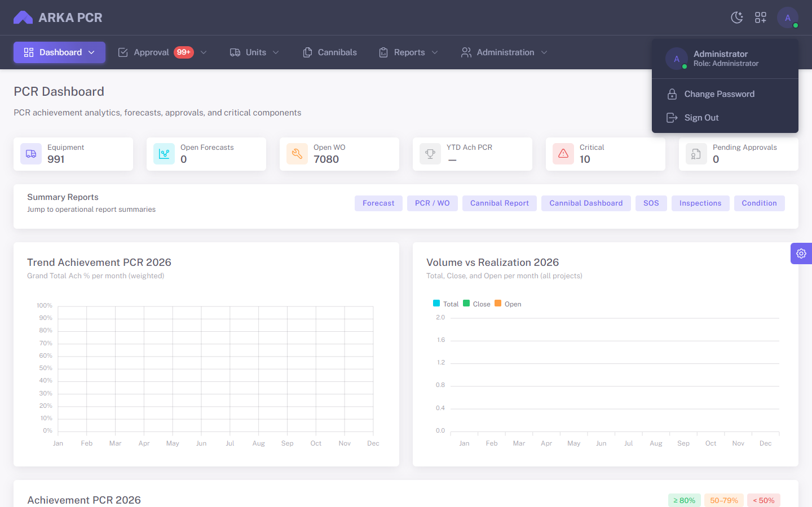

_Gambar 2 — Menu user: Change Password dan Sign Out._


_Gambar 3 — Dialog Change Password: current, new, dan confirm password._

Isi **Current Password**, **New Password**, **Confirm New Password**, lalu **Save**.

---

## 4. Navigasi & Tampilan Umum

Setelah login, layout memakai **menu horizontal** di bagian atas.


_Gambar 4 — Menu utama ARKA PCR di header._

### Struktur menu

```
ARKA PCR
├── Dashboard
│   ├── PCR
│   └── Cannibal
├── Approval
│   ├── PCR Request
│   └── Cannibal Request
├── Units
│   ├── Units
│   ├── Forecast
│   ├── Models
│   ├── Components
│   └── Hour Meters
├── Cannibals
├── Reports
│   ├── Replacements → Forecast / Actual
│   ├── SOS
│   ├── Cannibal
│   ├── Inspection
│   └── Condition
```

- Item menu hanya muncul jika akun punya **permission** terkait.
- Menu **Approval** bisa menampilkan **badge** jumlah antrian.
- Ikon **bulan** di kanan header mengganti light/dark mode.
- Ikon **gear** di tepi kanan layar adalah pengaturan tampilan template (opsional), bukan bagian proses PCR.

**Permission** menentukan *apa* yang boleh dilakukan (submit, approve, export). **Project** menentukan *data site mana* yang terlihat. Kode **`000H`** (Head Office) membuka semua project. Jika permission approve ada tetapi Project tidak sesuai, dokumen site tidak muncul.

---

## 5. Dashboard PCR

**Tujuan:** ringkasan kinerja PCR (KPI, tren Achievement, komponen kritis).

**Menu:** `Dashboard` → `PCR`


_Gambar 5 — PCR Dashboard: KPI, shortcut report, grafik Ach %, dan komponen kritis._

### KPI yang ditampilkan

| Kartu                 | Arti                                              |
| --------------------- | ------------------------------------------------- |
| **Equipment**         | Jumlah unit di cache Fleet                        |
| **Open Forecasts**    | Forecast berstatus OPEN                           |
| **Open WO**           | Work Order yang masih OPEN                        |
| **YTD Ach PCR**       | Achievement year-to-date (Close / Total rencana)  |
| **Critical**          | Komponen dengan Life % ≥ 85%                      |
| **Pending Approvals** | Antrian BA PCR + Cannibal                         |

Filter **Tahun** di kanan atas mengubah seluruh grafik dan tabel Achievement.

### Cara memakai

1. Buka **Dashboard → PCR**.
2. Pilih tahun.
3. Gunakan **Summary Reports** untuk loncat ke report terkait.
4. Cek **Critical Components (Top 10)** untuk prioritas harian.
5. Tabel **Achievement PCR** memakai warna: hijau ≥ 80%, oranye 50–79%, merah < 50%.

Jika belum ada Forecast untuk tahun tersebut, grafik Achievement bisa kosong. Open WO dan Critical tetap terisi dari data Replacement / Life %.

---

## 6. Dashboard Cannibal

**Tujuan:** melihat pipeline Cannibal BA, achievement per project, dan backlog approval.

**Menu:** `Dashboard` → `Cannibal`

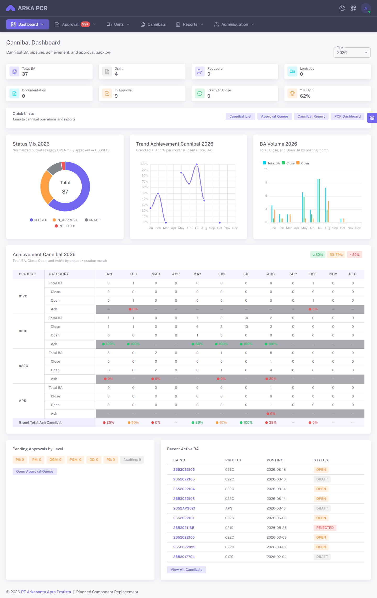

_Gambar 6 — Cannibal Dashboard: KPI pipeline, status mix, achievement per project._

### KPI pipeline

| Kartu               | Arti                                      |
| ------------------- | ----------------------------------------- |
| **Total BA**        | BA aktif di tahun posting yang dipilih    |
| **Draft**           | Masih diisi Plant                         |
| **Requestor**       | Menunggu konfirmasi Request By            |
| **Logistics**       | Menunggu Logistic Statement               |
| **Documentation**   | Menunggu MR/PR + WO                       |
| **In Approval**     | Dalam rantai PS → PD                      |
| **Ready to Close**  | Sudah fully approved                      |
| **YTD Ach**         | Closed / Total                            |

Shortcut: **Cannibal List**, **Approval Queue**, **Cannibal Report**, **PCR Dashboard**.

---

## 7. Units

**Tujuan:** melihat daftar unit alat berat dan membuka hub operasional per unit.

**Menu:** `Units` → `Units`


_Gambar 7 — Daftar Units: filter, Sync from ARKFleet, dan aksi lihat detail._

### Langkah umum

1. Buka **Units**.
2. Filter **Unit No**, **Model**, **Project**, **Manufacture**, **Plant group**, **Status**.
3. Klik ikon mata pada baris, atau klik baris, untuk membuka **Unit Detail**.
4. Administrator dapat **Sync from ARKFleet** agar cache unit/model diperbarui.

> Unit bersifat **read-only** di PCR. Perubahan lokasi di masa depan tidak mengubah snapshot transaksi lama.

### Unit Detail


_Gambar 8 — Unit Detail ADT 021: info unit, HM terakhir, dan tab PCR Forecast._

Header menampilkan nomor unit, status (mis. **ACTIVE**), model, project, dan **Latest HM**.

#### Tab di Unit Detail

| Tab              | Fungsi                                      |
| ---------------- | ------------------------------------------- |
| **PCR Forecast** | Rencana PCR untuk unit ini                  |
| **PCR Actual**   | WO / Replacement per komponen               |
| **Inspection**   | Rating inspeksi terakhir per tipe           |
| **SOS**          | Sample oil terakhir per komponen            |
| **Condition**    | Ringkasan CBM (NORMAL / ATTENTION / CRITICAL) |

Dari tab Forecast Anda bisa **Auto Generate**, **Add Forecast**, atau **Export**. Dari tab Actual, klik baris/komponen untuk membuka **Replacement Detail**.

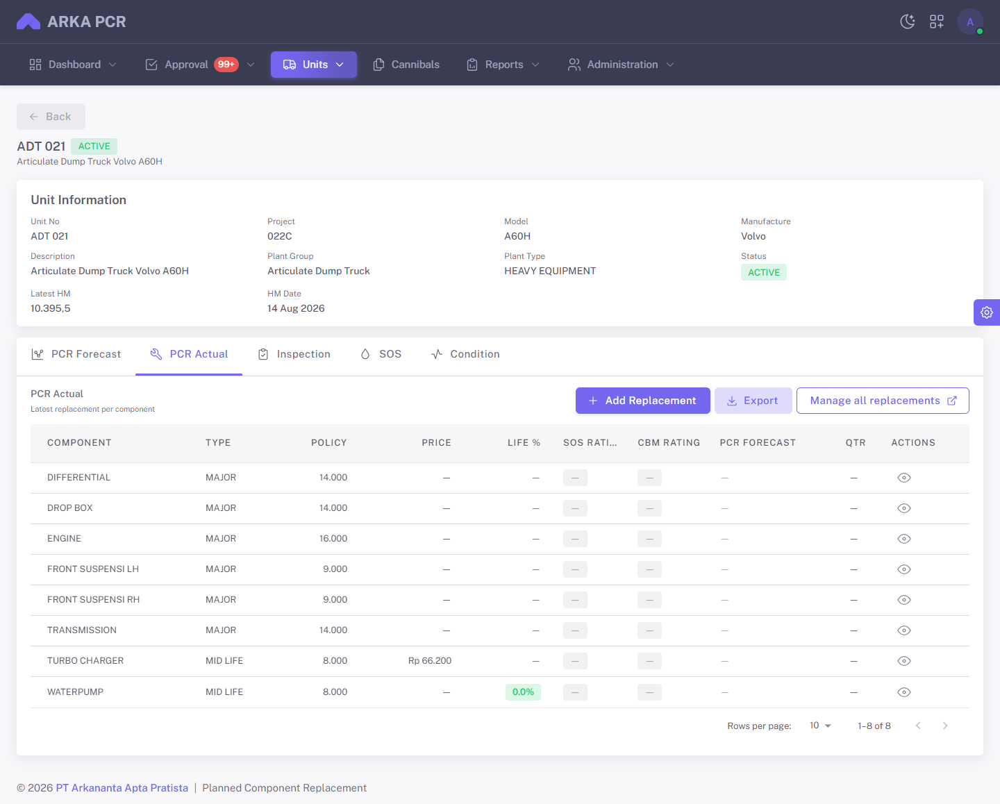

_Gambar 9 — Tab PCR Actual: satu baris per komponen, WO terakhir, SOS/CBM rating._

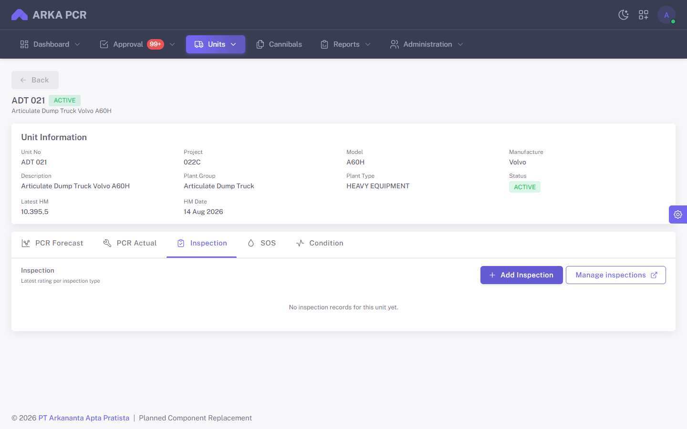

_Gambar 10 — Tab Inspection: rating terakhir FC, MPS, VI, TA2, ED._

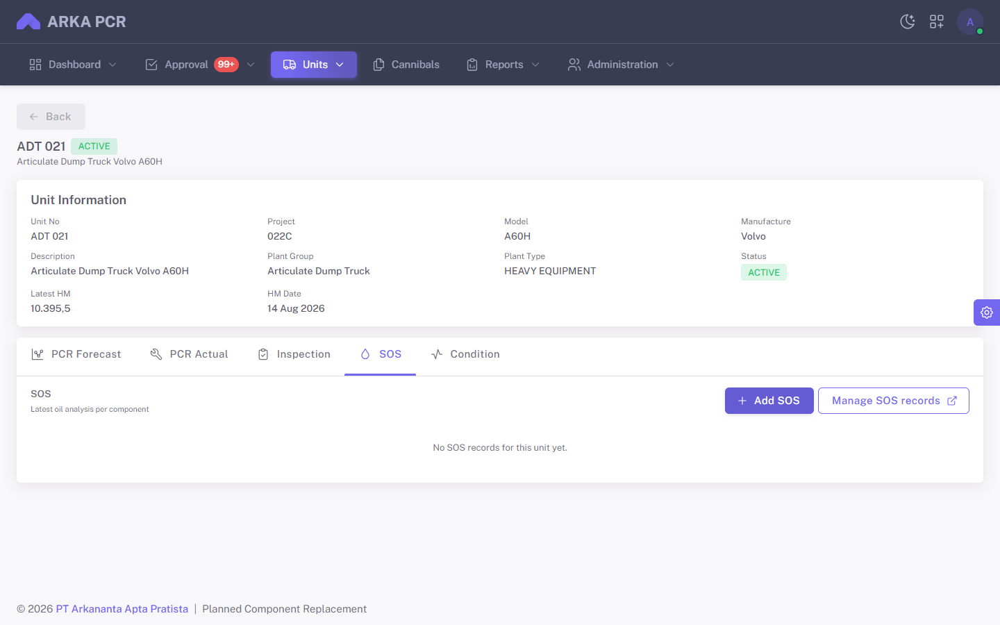

_Gambar 11 — Tab SOS: sample oil terakhir per komponen._

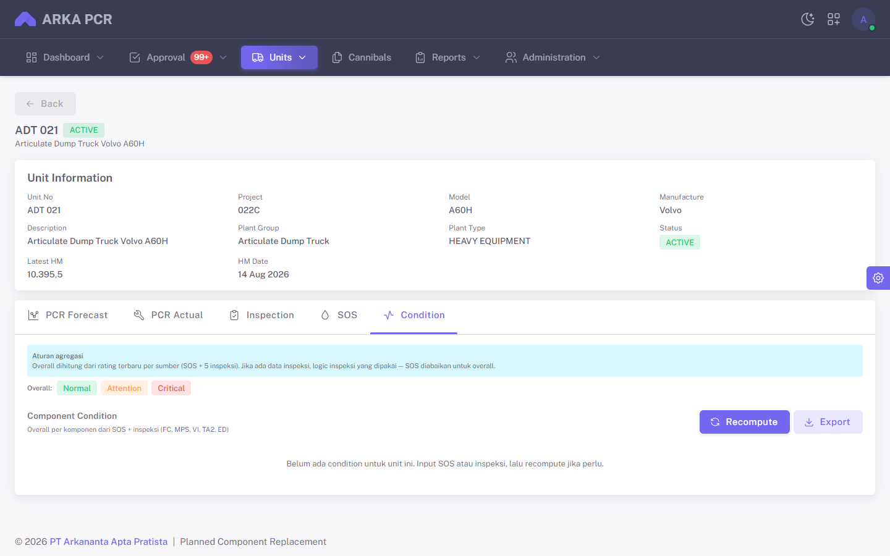

_Gambar 12 — Tab Condition: agregat SOS + inspeksi (NORMAL / ATTENTION / CRITICAL)._

---

## 8. Models & Components

### Models

**Menu:** `Units` → `Models`

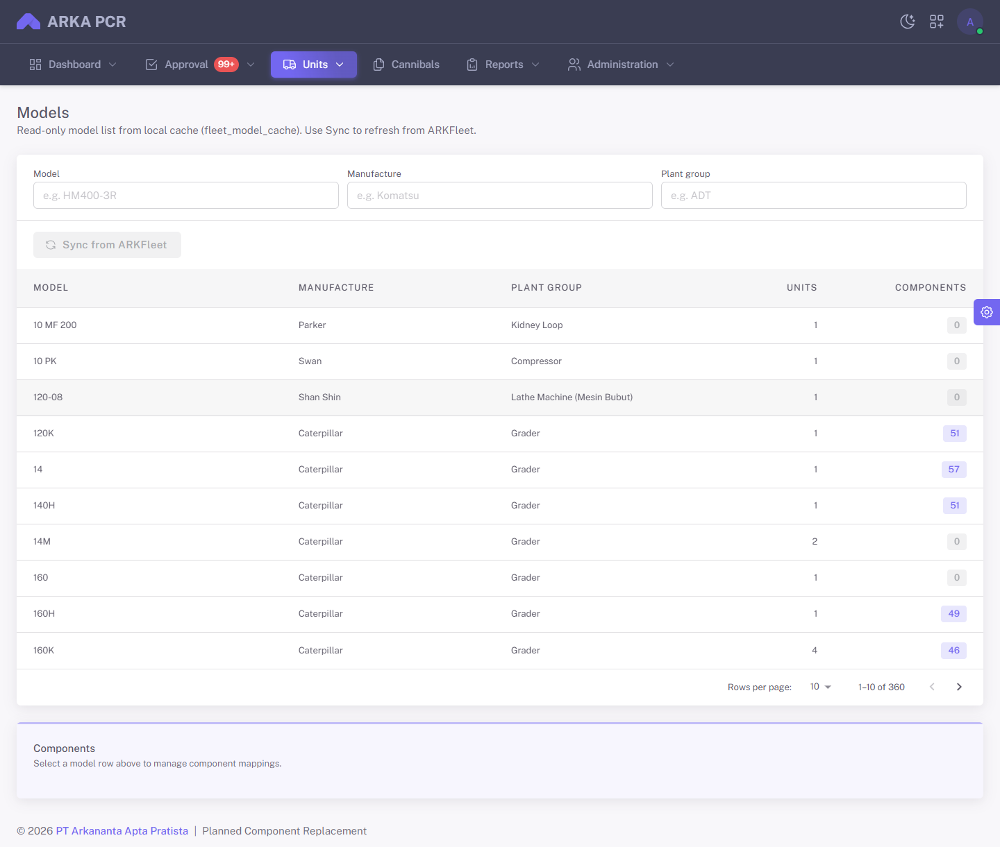

_Gambar 13 — Models dari Fleet cache. Klik model untuk membuka mapping Commod._

- Daftar model **read-only** dari `fleet_model_cache`.
- Klik sebuah model untuk membuka panel **Model–Component (Commod)**: policy jam, harga, dan komponen yang dipetakan.
- Mapping ini menjadi dasar kalkulasi **Life %** dan **Auto Generate Forecast**.
- Administrator dapat **Sync** bersama Units.

### Components

**Menu:** `Units` → `Components`

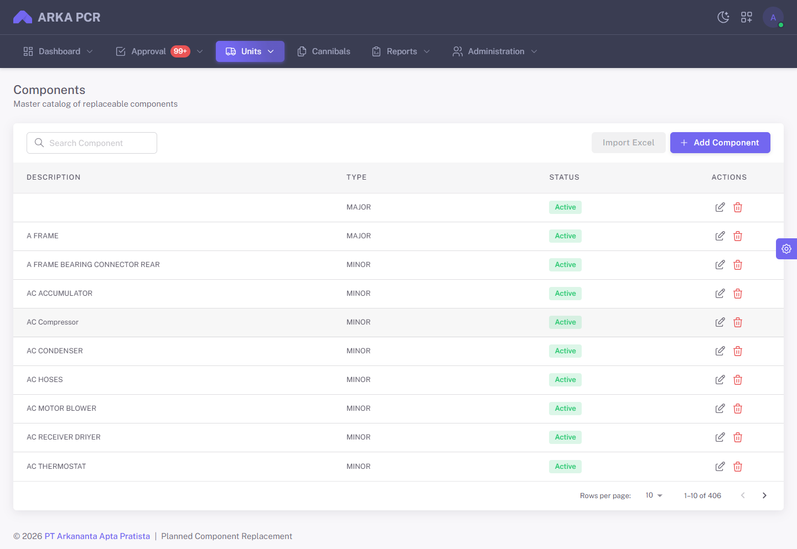

_Gambar 14 — Master Components: cari, tambah, ubah, hapus sesuai permission._

Gunakan **Add** untuk komponen baru. Hati-hati menghapus komponen yang sudah terpakai di Commod / transaksi.

---

## 9. Hour Meters

**Tujuan:** mencatat jam kerja unit — dasar Life % dan Forecast.

**Menu:** `Units` → `Hour Meters`


_Gambar 15 — Hour Meters: filter project/unit/tanggal, Add, Import, Export._

### Input manual

1. Buka **Hour Meters**.
2. Filter Project / Unit / tanggal jika perlu.
3. Klik **Add Hour Meter** (atau Edit pada baris).
4. Isi unit, tanggal, dan nilai HM.
5. Simpan.

### Import / Export Excel

1. **Export Excel** mengunduh data sesuai filter aktif.
2. **Template** mengunduh format kosong.
3. **Import Excel** mengikuti panduan di dialog (baris kosong dilewati; upsert berdasarkan id HM atau kombinasi unit + tanggal).

**Tips:** isi HM rutin agar Life % dan Forecast akurat.

---

## 10. PCR Forecast & BA PCR

**Tujuan:** merencanakan penggantian, lalu mengajukan **BA PCR**.

**Menu:** `Units` → `Forecast`  
(atau tab **PCR Forecast** di Unit Detail)


_Gambar 16 — PCR Forecast: filter Quarter/Status/BA PCR/Project/Plan Period, Auto Generate, Add Forecast._

Jika tabel **No rows**, site belum punya Forecast OPEN. Generate dulu atau **Add Forecast** manual.

### Status Forecast

- **OPEN** — masih aktif; biasanya bisa diedit.
- **CLOSED** — sudah ditutup (umumnya setelah WO terkait closed dengan PO).

### Membuat / generate Forecast

1. Buka **Forecast**.
2. Filter Project / Quarter / Plan Period.
3. Klik **Auto Generate** (butuh Commod + HM yang memadai) atau **Add Forecast**.
4. Tinjau **Life %**, **SOS/CBM rating**, dan **Plan Periode**.
5. **Bulk Refresh** memperbarui kalkulasi baris yang sudah ada.

**Aturan:** umumnya hanya ada **satu Forecast OPEN** per pasangan Unit + Component.

### Submit BA PCR

1. Pada baris Forecast, buka **Actions** → **Submit BA PCR** (permission `forecasts.submit`).
2. Sistem membuat/mengaktifkan dokumen **BA PCR** dan baris approval.
3. Status masuk antrian **Approval → PCR Request**.

Dari **Actions** juga tersedia **View Detail**, **Convert to WO** (setelah BA approved), dan **View Replacement** bila sudah dikonversi.

### Setelah BA approved

- **Convert to WO** membuat Replacement / Work Order.
- Menyetujui BA **tidak** otomatis menutup Forecast.
- Forecast biasanya **CLOSED** ketika WO terkait ditutup dan **PO No** terisi.

### Print BA PCR

Dari detail Forecast, buka print (`/forecasts/[id]/print`) untuk mencetak dokumen BA.

### Reject & Resubmit

1. Riwayat reject tetap tersimpan.
2. Tim plant memperbaiki data lalu **Resubmit**.
3. Resubmit membuat **BA PCR baru** (nomor baru); BA lama tetap sebagai sejarah.

---

## 11. Approval PCR Request

**Tujuan:** approver meninjau dan menyetujui/menolak **BA PCR**.

**Menu:** `Approval` → `PCR Request`


_Gambar 17 — Forecast Approvals: filter Unit/Quarter/Status BA/Approval Stage/Site/Plan Period._

Antrian kosong berarti belum ada BA PCR yang menunggu level Anda (atau Forecast belum di-submit).

### Rantai approval BA PCR

Urutan tahap:

1. **PS** — Plant Superintendent / Dept Head (project-scoped)
2. **PM** dan **PLM** (sejajar)
3. **OD**, **FD**, dan **PD** (sejajar)

| Kode | Jabatan                          |
| ---- | -------------------------------- |
| PS   | Plant Superintendent / Dept Head |
| PM   | Project Manager                  |
| PLM  | Plant Manager                    |
| OD   | Operation Director               |
| FD   | Commercial & Treasury Director   |
| PD   | President Director               |

### Cara approve / reject

1. Buka **Approval → PCR Request**.
2. Filter dokumen yang menjadi tanggung jawab level Anda.
3. Klik **Review**.
4. Baca ringkasan Forecast / BA dan timeline approval.
5. Klik **Approve** atau **Reject** (sertakan catatan jika diminta).

Anda hanya bisa bertindak pada level yang sesuai permission (`forecasts.approve.PS`, `.PM`, `.PLM`, `.OD`, `.FD`, `.PD`).

---

## 12. PCR Actual (Replacement / WO)

**Tujuan:** mencatat eksekusi penggantian komponen di lapangan.

**Cara buka:**

- Tab **PCR Actual** di Unit Detail, atau
- **Actions → Convert to WO** pada Forecast yang sudah approved, atau
- **Replacement Detail** per komponen: `/units/[id]/replacements/[idMod]`


_Gambar 18 — Replacement Detail: info unit & komponen, riwayat WO, status OPEN/CLOSE, tautan SAP WO#._

### Alur umum

1. Buat WO dari **Convert Forecast** atau **Add** di tab Actual.
2. Lengkapi tanggal, HM, komponen, catatan.
3. Hubungkan dokumen pengadaan bila tersedia (**WO / MR / PR / PO** via SAP B1 lookup).
4. Unggah report instalasi jika komponen mewajibkannya.
5. **Close** WO setelah pekerjaan selesai.
6. Koreksi setelah close: **Reopen / Edit Closed** (permission khusus).

### Aturan penting

- Biasanya hanya ada **satu WO OPEN** per Unit–Component pada satu waktu.
- Menutup WO yang terkait Forecast sering mensyaratkan **PO No** terisi.
- Close WO dengan PO dapat ikut menutup Forecast terkait.

---

## 13. SOS, Inspection & Condition

Ketiga modul ini mendukung **condition-based monitoring** sebagai pelengkap perencanaan PCR. Buka dari **tab Unit Detail** atau dari **Reports**.

### SOS (Sample Oil System)

- Dicatat per unit (tab **SOS** atau **Reports → SOS**).
- Berisi sample date, lab no, evaluation/rating.
- Tombol **Add SOS** / **Manage SOS records** sesuai permission.

### Inspection

- Tipe: **FC**, **MPS**, **VI**, **TA2**, **ED**.
- Isi tanggal, HM, komponen, dan rating.
- **Add Inspection** membuka drawer input.

### Condition

- Ringkasan keseluruhan komponen (agregat SOS + inspeksi).
- Chip: **NORMAL**, **ATTENTION**, **CRITICAL**.
- Tampil di grid Forecast/Actual dan **Reports → Condition**.

**Praktik baik:** lengkapi SOS & Inspection berkala agar keputusan Forecast lebih akurat.

---

## 14. Cannibal BA

**Tujuan:** mendokumentasikan transfer komponen antar unit (REMOVE dari unit sumber, INSTALL ke unit tujuan).

**Menu:** `Cannibals`

> **BA Cannibal ≠ BA PCR.**


_Gambar 19 — Daftar Cannibal BA: filter nomor BA, project, unit, P/N, status; Export; Create BA._

Kolom **Approval** menampilkan tahap (Draft, Pending Requestor, Dalam proses approval, dst.). Klik **Actions** pada baris untuk aksi sesuai status.

### Tahapan status (Rev 5)

```
DRAFT / REJECTED
    → PENDING_REQUESTOR     (Request By confirm/reject)
    → PENDING_LOGISTICS
    → PENDING_DOCUMENT      (MR/PR + WO)
    → Approval (PS → PM → OGM → PGM → OD → PD)
    → APPROVED (Ready to Close)
    → CLOSED
```

Status lama **OPEN** pada data migrasi = dalam proses approval (atau sudah L1–L3 di sistem legacy).

### Membuat BA baru

**Menu:** `Cannibals` → **Create BA** (`/cannibals/create`)

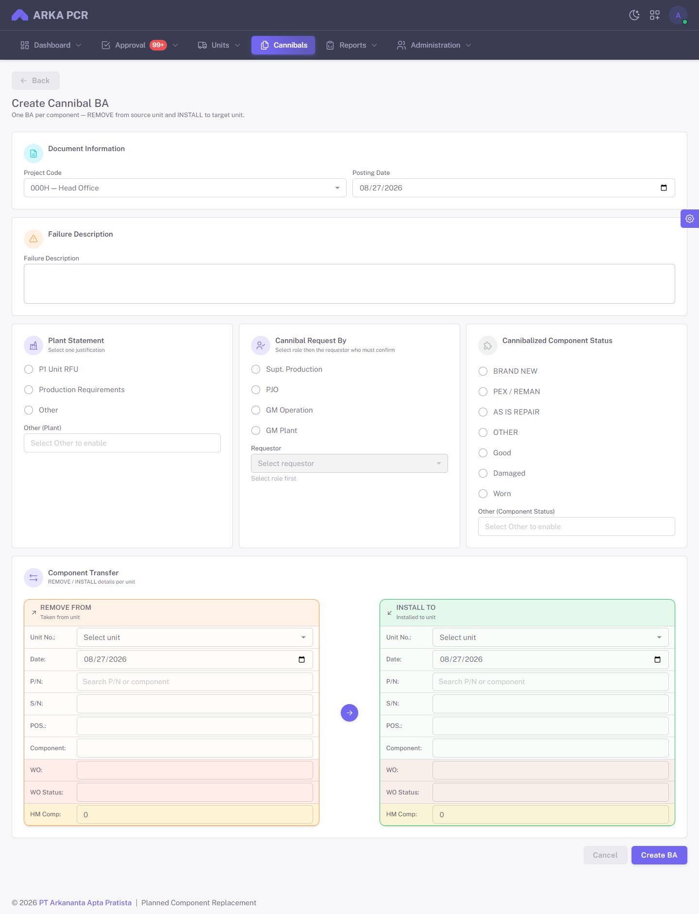

_Gambar 20 — Create Cannibal BA: Plant Statement, Request By, status komponen, REMOVE / INSTALL._

Lengkapi:

1. **Project Code** dan **Posting Date**.
2. **Failure Description**.
3. **Plant Statement** — pilih **satu**: P1 Unit RFU, Production Requirements, atau Other.
4. **Cannibal Request By** — pilih **satu jabatan** (Supt. Production / PJO / GM Operation / GM Plant), lalu pilih **Requestor** (user yang memegang jabatan itu).
5. **Component Status** — Brand New, PEX/Reman, As Is Repair, atau Other. (RESEAL ONLY disembunyikan di form baru.)
6. **Component Transfer** — pasangan **REMOVE FROM** (oranye) dan **INSTALL TO** (hijau): Unit, tanggal, P/N, S/N, komponen, WO, HM Comp.
7. Klik **Create BA**.

Creator BA (Plant) **bukan** otomatis Requestor.

### Langkah Plant setelah draft

1. **Send to Requestor** (dari detail atau Actions).
2. Requestor yang dipilih mendapat antrian **Confirm Request** / **Reject Request**.
3. Jika reject: BA kembali ke Plant (status **REJECTED**). Plant boleh edit lalu submit ulang — selalu masuk **PENDING_REQUESTOR** lagi.
4. Setelah requestor confirm → **Pending Logistics**.

### Langkah Logistics

1. Buka BA **Pending Logistics**.
2. Isi **Logistic Statement** (No Stock / Lead Time Part / Other) → Confirm.
3. BA pindah ke **Record & Documentation**.

### Record & Documentation

1. Isi **Planning** (action + **MR#** dan **PR#** wajib).
2. **Update Documentation** (WO + catatan + kelengkapan dokumen).
3. **Submit for Approval**.

### Detail BA & print


_Gambar 21 — Detail Cannibal: stepper 7 tahap, pair REMOVE/INSTALL, statement, rantai approval._

Stepper: **Plant Input → Request By → Logistics Statement → Record & Documentation → Approval → Ready to Close → Closed**.

Tombol di header menyesuaikan status (**Print**, **Edit**, **Planning**, **Edit Logistic**, **Init Approval Chain** untuk BA legacy yang belum punya rantai modern).

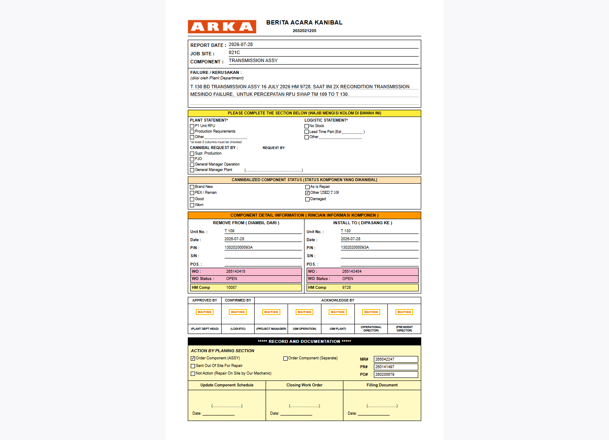

_Gambar 22 — Halaman print Cannibal BA (form Rev 5)._

### Setelah approved

- Status **Ready to Close**.
- Plant **Close BA** setelah proses selesai.

---

## 15. Approval Cannibal Request

**Tujuan:** menyetujui atau menolak Cannibal BA pada rantai PS → PD.

**Menu:** `Approval` → `Cannibal Request`


_Gambar 23 — Antrian Cannibal Request._

### Rantai approval (berurutan)

1. **PS** — Plant Superintendent (project-scoped)
2. **PM** — Project Manager / PJO (project-scoped)
3. **OGM** — Operational General Manager
4. **PGM** — Plant General Manager
5. **OD** — Operational Director
6. **PD** — President Director

Approver HO (OGM / PGM / OD / PD) memakai project **`000H`** agar melihat semua project.

### Cara review

1. Buka antrian **Cannibal Request**.
2. Buka **View Detail**.
3. Periksa pair REMOVE/INSTALL, Plant Statement, Request By, Logistic Statement, MR/PR.
4. **Approve** atau **Reject**.

Konfirmasi Request By **bukan** bagian rantai PS–PD; itu gerbang sebelum Logistics.

---

## 16. Reports

**Tujuan:** ringkasan data + export Excel (jika diizinkan).

**Menu:** `Reports`

| Report              | Path menu                            | Isi utama                                      |
| ------------------- | ------------------------------------ | ---------------------------------------------- |
| **Forecast**        | Reports → Replacements → Forecast    | Ringkasan Forecast; link matrix periode & harga |
| **Actual**          | Reports → Replacements → Actual      | Ringkasan PCR / WO                             |
| **SOS**             | Reports → SOS                        | Ringkasan sample oil                           |
| **Cannibal**        | Reports → Cannibal                   | Ringkasan Cannibal BA                          |
| **Inspection**      | Reports → Inspection                 | Ringkasan inspeksi                             |
| **Condition**       | Reports → Condition                  | Ringkasan kondisi komponen                     |


_Gambar 24 — Summary Forecast._


_Gambar 25 — Summary PCR / Actual (WO)._


_Gambar 26 — Summary SOS._


_Gambar 27 — Summary Cannibal._


_Gambar 28 — Summary Inspection._

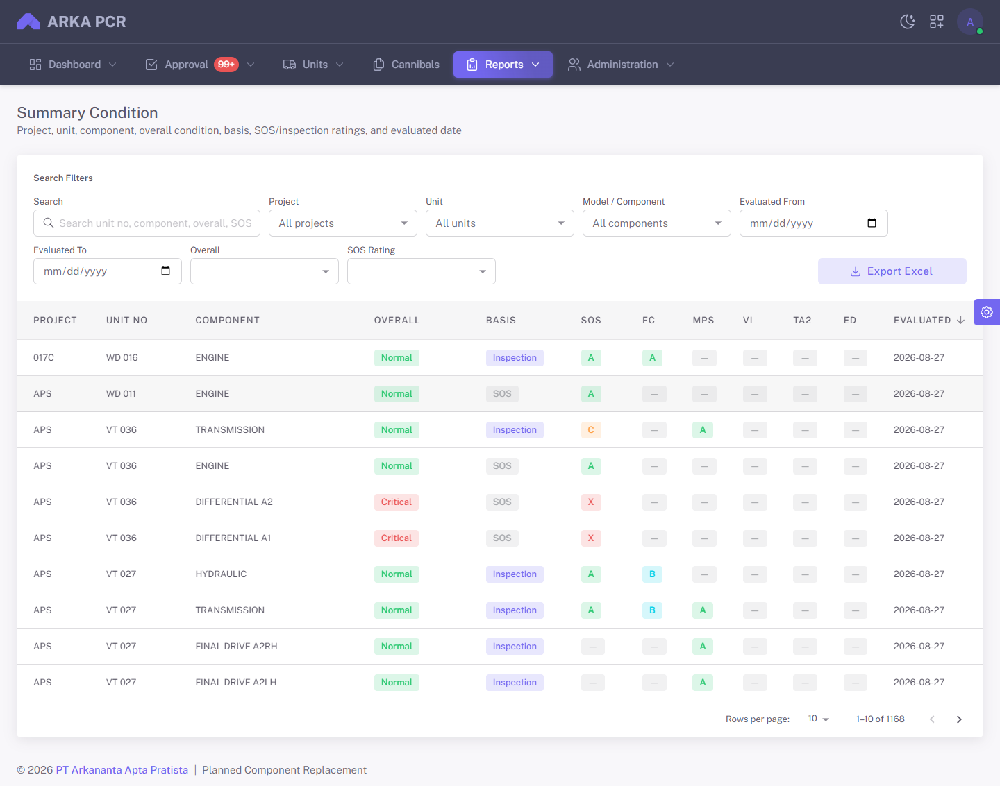

_Gambar 29 — Summary Condition._

### Matrix Forecast tambahan

Dari report Forecast, buka:

- **By Plan Periode** — matrix Model × Component × periode rencana

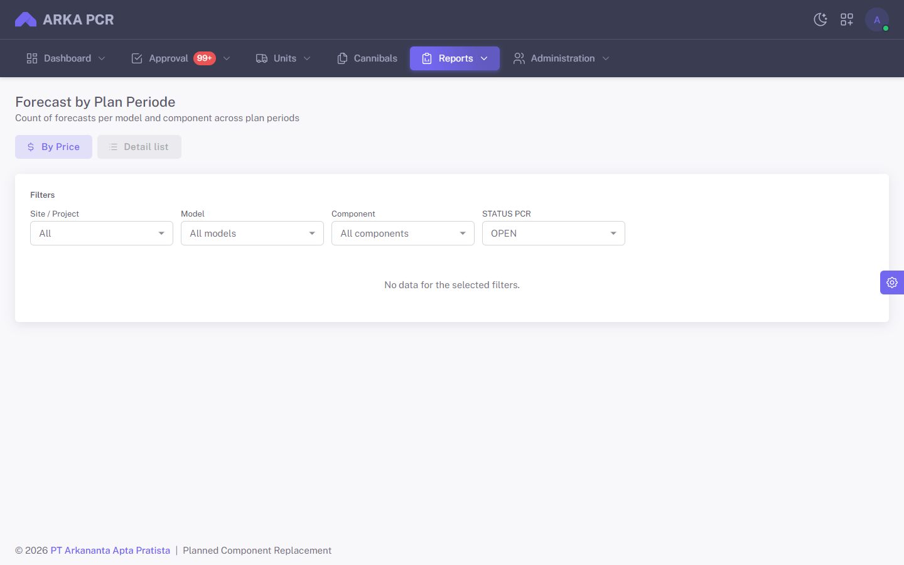

_Gambar 30 — Forecast by Plan Periode._

- **By Price** — matrix berbasis harga komponen

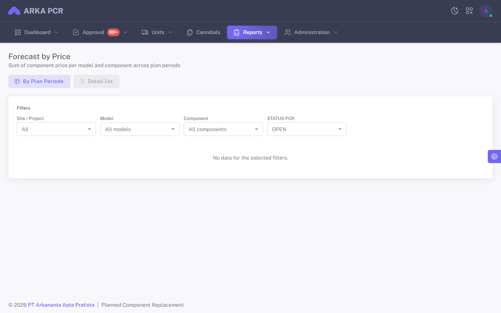

_Gambar 31 — Forecast by Price._

### Cara memakai report

1. Buka report yang diinginkan.
2. Set filter (Project, Unit, Component, tanggal, status).
3. Gunakan pencarian kolom jika tersedia.
4. Klik **Export** (permission `exports.*` terkait).

---

## 17. Alur Kerja Ringkas

### Alur PCR (Forecast → WO → Achievement)

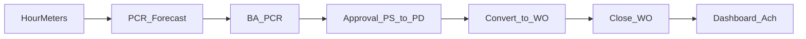

### Alur Cannibal BA (Rev 5)

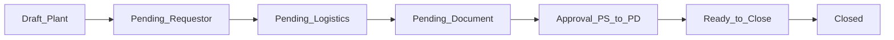

### Ringkasan yang sering dilupakan

1. HM rutin → Life % & Forecast lebih akurat.
2. Submit BA PCR ≠ Close Forecast.
3. Convert setelah BA approved → baru ada WO eksekusi.
4. Close WO (dengan PO jika disyaratkan) → Forecast bisa CLOSED.
5. Cannibal: Plant → **Request By** → Logistics → Documentation → Approval. Jangan lompat.
6. Creator BA ≠ Requestor.
7. BA PCR dan Cannibal BA **jangan dicampur**.

---

## 18. Tips & Troubleshooting

| Gejala                       | Kemungkinan penyebab                                         | Yang bisa dicoba                                         |
| ---------------------------- | ------------------------------------------------------------ | -------------------------------------------------------- |
| Menu tidak muncul            | Permission / Role kurang                                     | Minta Admin cek Role                                     |
| Data project kosong          | Belum di-assign Project                                      | Minta Admin isi **Projects** (atau `000H` untuk HO)      |
| Tidak bisa Submit BA PCR     | Tidak punya `forecasts.submit` atau Forecast bukan OPEN      | Cek Role & status Forecast                               |
| Forecast kosong              | Belum Auto Generate / Commod atau HM kurang                  | Isi HM, cek Models/Commod, lalu Auto Generate            |
| Tidak bisa Approve           | Bukan giliran level Anda / permission level salah            | Cek antrian & Role approve                               |
| Tidak bisa Confirm Request By| Akun Anda bukan `requested_by` pada BA itu                   | Plant pilih ulang requestor, atau login sebagai requestor |
| Life % tidak masuk akal      | HM belum diisi / policy Commod salah                         | Update HM & cek Models/Commod                            |
| Unit tidak lengkap           | Cache Fleet belum sync                                       | Minta Admin **Sync from ARKFleet**                       |
| Gagal login                  | Password salah / user inactive                               | Reset via Admin; pastikan user aktif                     |
| Export gagal                 | Tidak punya permission export                                | Minta permission `exports.*` terkait                     |
| Lookup WO/P/N SAP gagal      | Koneksi SAP B1 di server                                     | Hubungi Admin / IT                                       |

### Praktik baik harian (Plant)

1. Update **Hour Meters**.
2. Cek **Dashboard PCR** & komponen Critical.
3. Generate / tinjau **Forecast OPEN** dengan Life % tinggi.
4. Submit BA PCR yang siap.
5. Follow-up Approval, lalu **Convert to WO**.
6. Close WO + lengkapi dokumen SAP.
7. Lengkapi SOS/Inspection sesuai jadwal site.
8. Cannibal: lengkapi Request By + Logistics + MR/PR sebelum Submit for Approval.

---

## Lampiran: Matriks Role → Fitur Utama

| Fitur                       | Foreman  | Supt. Prod | Logistics | Plant Supt |  PM  | Plant Mgr | OGM  |  OD  |  FD  |  PD  |
| --------------------------- | :------: | :--------: | :-------: | :--------: | :--: | :-------: | :--: | :--: | :--: | :--: |
| Dashboard                   |    ✓     |     —      |     —     |     ✓      | ✓\*  |    ✓\*    | ✓\*  | ✓\*  | ✓\*  | ✓\*  |
| Units / Forecast ops        |    ✓     |     —      |     —     |     ✓      | view |   view    |  —   | view | view | view |
| Hour Meters / Components    | terbatas |     —      |     —     |     ✓      |  —   |     —     |  —   |  —   |  —   |  —   |
| Submit BA PCR               |    ✓     |     —      |     —     |     ✓      |  —   |     —     |  —   |  —   |  —   |  —   |
| Approve BA PCR              |    —     |     —      |     —     |     PS     |  PM  |    PLM    |  —   |  OD  |  FD  |  PD  |
| Replacement / Close WO      |    ✓     |     —      |     —     |     ✓      | view |   view    |  —   |  —   |  —   |  —   |
| SOS / Inspection            |    ✓     |     —      |     —     |     ✓      |  —   |     —     |  —   |  —   |  —   |  —   |
| Cannibal create/update      |    ✓     |     —      | logistic  |     ✓      | view |   view    | view | view |  —   |  —   |
| Cannibal Request By confirm |    —     |     ✓      |     —     |     —      |  ✓†  |    ✓†     |  ✓†  |  —   |  —   |  —   |
| Approve Cannibal            |    —     |     —      |     —     |     PS     |  PM  |    PGM    | OGM  |  OD  |  —   |  PD  |
| Reports / Export            |    ✓     |     —      |     —     |     ✓      |  —   |     —     |  —   |  —   |  —   |  —   |

\* Approver melihat data sesuai project assignment (`000H` untuk level HO).  
† Request By hanya jika user tersebut dipilih sebagai **requestor** pada BA (jabatan PJO = PM, GM Plant = Plant Manager, GM Operation = OGM).  
Tanda “view” = akses lihat tanpa aksi operasional penuh (sesuai template Role).

---

_© ARKA PCR — User Manual untuk pengguna aplikasi._
