# User Manual — ARKA PCR

**Planned Component Replacement Monitoring System**

Dokumen ini menjelaskan cara menggunakan aplikasi **ARKA PCR** untuk merencanakan, menyetujui, mengeksekusi, dan memonitor penggantian komponen alat berat secara terjadwal (Planned Component Replacement).

|             |                                                                   |
| ----------- | ----------------------------------------------------------------- |
| **Dokumen** | User Manual Aplikasi ARKA PCR                                     |
| **Versi**   | 1.0                                                               |
| **Tanggal** | 15 Juli 2026                                                      |
| **Bahasa**  | Bahasa Indonesia (istilah teknis tetap dalam bahasa Inggris)      |
| **Audiens** | Pengguna operasional site, approver, logistics, dan administrator |

---

## Daftar Isi

1. [Pengenalan Aplikasi](#1-pengenalan-aplikasi)
2. [Istilah Penting (Glossary)](#2-istilah-penting-glossary)
3. [Login & Akun Pengguna](#3-login--akun-pengguna)
4. [Navigasi & Tampilan Umum](#4-navigasi--tampilan-umum)
5. [Dashboard](#5-dashboard)
6. [Master Data & Units](#6-master-data--units)
   - [6.1 Units](#61-units)
   - [6.2 Models & Components](#62-models--components)
   - [6.3 Hour Meters](#63-hour-meters)
7. [PCR Forecast & BA PCR](#7-pcr-forecast--ba-pcr)
8. [Approval PCR Request](#8-approval-pcr-request)
9. [PCR Actual (Replacement / WO)](#9-pcr-actual-replacement--wo)
10. [SOS, Inspection & Condition](#10-sos-inspection--condition)
11. [Cannibal BA](#11-cannibal-ba)
12. [Approval Cannibal Request](#12-approval-cannibal-request)
13. [Reports](#13-reports)
14. [Administration](#14-administration)
15. [Alur Kerja Ringkas](#15-alur-kerja-ringkas)
16. [Tips & Troubleshooting](#16-tips--troubleshooting)
17. [Lampiran: Matriks Role → Fitur Utama](#lampiran-matriks-role--fitur-utama)

---

## 1. Pengenalan Aplikasi

**ARKA PCR** adalah sistem web untuk monitoring **Planned Component Replacement** pada alat berat operasional pertambangan. Aplikasi membantu tim plant merencanakan penggantian komponen berdasarkan umur pakai (**Life %**), mengajukan **BA PCR**, mendapatkan **Approval**, mengeksekusi **Work Order (WO)**, serta memonitor kondisi komponen melalui **SOS**, **Inspection**, dan **Condition**.

Selain itu, aplikasi mendukung proses **Cannibal BA** (transfer komponen antar unit), pencatatan **Hour Meter**, serta berbagai **Reports** untuk ringkasan operasional.

### Siapa yang memakai aplikasi ini?

| Role                               | Fokus penggunaan                                                              |
| ---------------------------------- | ----------------------------------------------------------------------------- |
| **Plant Foreman / Supervisor**     | Operasional harian: Forecast, Replacement, SOS, Inspection, Cannibal, Reports |
| **Logistics**                      | Mengisi **Logistic Statement** pada Cannibal BA                               |
| **Plant Superintendent**           | Operasional + master data + approve level **PS**                              |
| **Project Manager**                | Approve level **PM** (project-scoped)                                         |
| **Plant Manager**                  | Approve BA PCR **PLM**; Cannibal **PGM** (Plant General Manager, via `000H`)  |
| **Operational GM**                 | Approve Cannibal level **OGM**                                                |
| **Operational Director**           | Approve level **OD**                                                          |
| **Commercial & Treasury Director** | Approve BA PCR level **FD**                                                   |
| **President Director**             | Approve BA PCR & Cannibal level **PD**                                        |
| **Administrator**                  | Akses penuh, termasuk Users / Roles / Permissions                             |

Menu yang Anda lihat mengikuti **permission** dan **project** yang dilampirkan pada akun Anda.

---

## 2. Istilah Penting (Glossary)

| Istilah                           | Arti singkat                                              |
| --------------------------------- | --------------------------------------------------------- |
| **Unit**                          | Alat berat di site (data dari Fleet cache)                |
| **Project**                       | Kode lokasi/proyek operasi (`project_code`)               |
| **`000H`**                        | Kode Head Office — akses ke **semua** project             |
| **Model**                         | Tipe/model unit                                           |
| **Component**                     | Master kategori komponen                                  |
| **Commod**                        | Mapping Model ↔ Component + policy (umur) & harga         |
| **Policy**                        | Target umur komponen (jam)                                |
| **Hour Meter (HM)**               | Jam kerja unit                                            |
| **Life %**                        | Persentase umur komponen terhadap Policy                  |
| **PCR Forecast**                  | Rencana penggantian komponen                              |
| **BA PCR**                        | Berita Acara untuk approval rencana PCR                   |
| **Replacement / PCR Actual / WO** | Work Order aktual penggantian komponen                    |
| **Convert**                       | Mengubah Forecast yang sudah approved menjadi WO          |
| **Cannibal / Kanibal**            | Transfer komponen REMOVE ↔ INSTALL antar unit             |
| **BA (Cannibal)**                 | Berita Acara proses cannibal (terpisah dari BA PCR)       |
| **SOS**                           | Sample Oil System — hasil analisa oli                     |
| **Inspection**                    | Hasil inspeksi komponen (tipe FC, MPS, VI, TA2, ED, dll.) |
| **Condition**                     | Ringkasan kondisi komponen (CBM)                          |
| **Ach %**                         | Achievement PCR = Close / Total                           |
| **SAP B1**                        | Integrasi lookup material (P/N) dan dokumen WO/MR/PR/PO   |
| **Role / Permission**             | Jabatan dan izin akses modul                              |

**Rumus Life % (konsep):**

`Life % ≈ (HM sekarang − HM ganti terakhir + jam komponen terpasang) / Policy × 100`

---

## 3. Login & Akun Pengguna

### Cara membuka

Buka alamat aplikasi di browser, lalu Anda akan diarahkan ke halaman **Login** (`/login`).

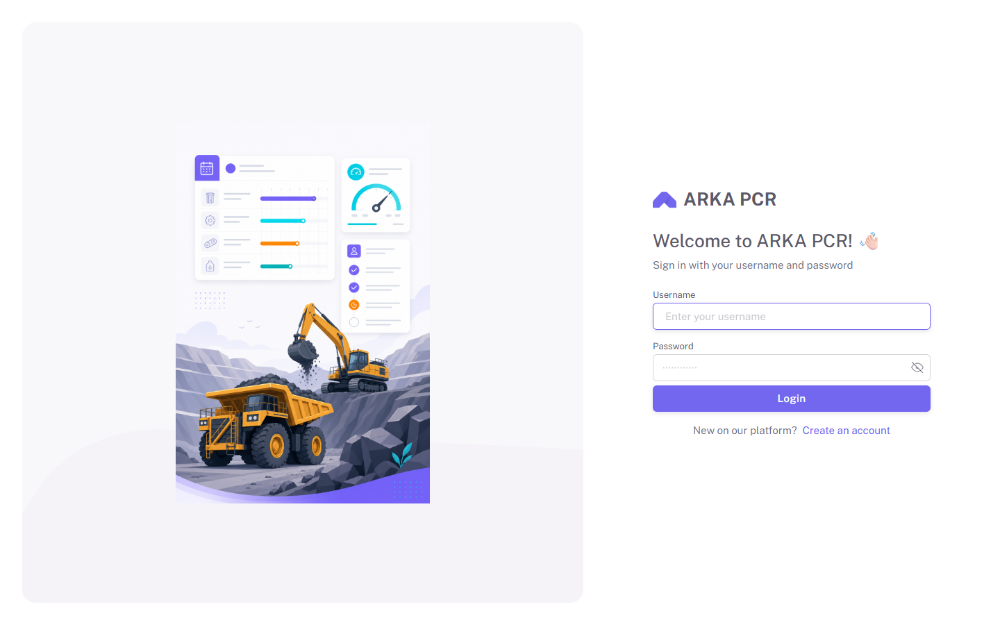

_Gambar 1 — Halaman Login: masukkan Username dan Password._

### Langkah login

1. Isi **Username**.
2. Isi **Password**.
3. (Opsional) centang **Remember Me**.
4. Klik **Login**.
5. Jika berhasil, Anda masuk ke **Dashboard**.

### Catatan akun

- Akun baru hasil **Register** biasanya **inactive** sampai diaktifkan Administrator.
- Jika Username/Password salah, akan muncul pesan error di form.
- Untuk keluar: buka menu user di pojok kanan atas → **Sign Out**.
- Untuk ganti password sendiri: menu user → **Change Password**.

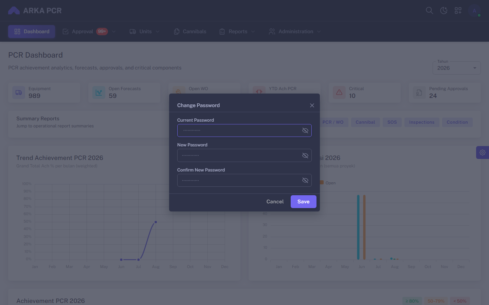

_Gambar 2 — Dialog Change Password dari menu user di header._

---

## 4. Navigasi & Tampilan Umum

Setelah login, Anda melihat layout dengan **menu horizontal** di bagian atas.

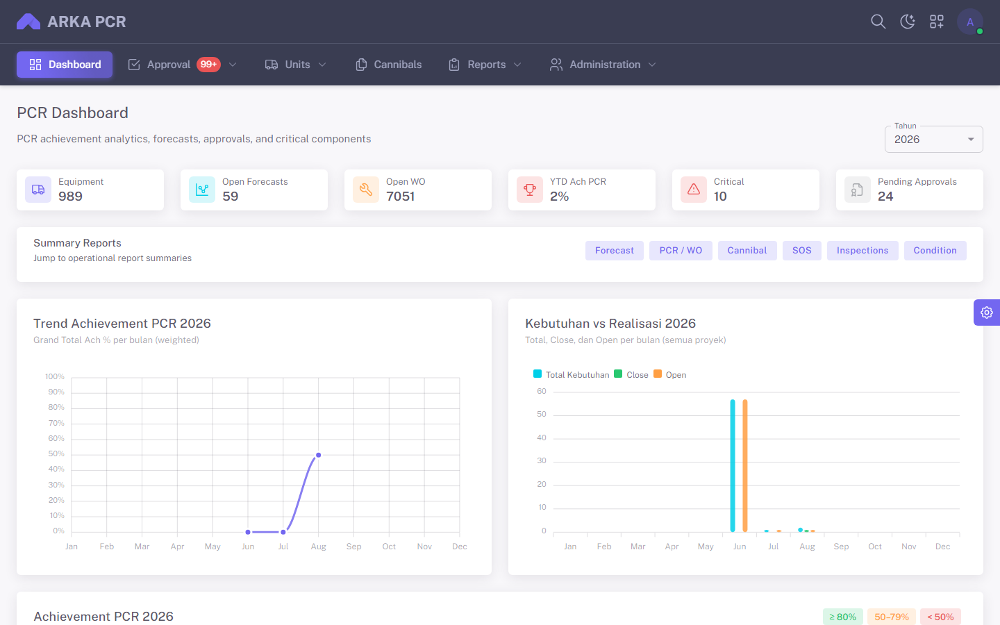

_Gambar 3 — Menu utama ARKA PCR._

### Struktur menu

```
ARKA PCR
├── Dashboard
├── Approval
│   ├── PCR Request
│   └── Cannibal Request
├── Units
│   ├── Units
│   ├── Forecast
│   ├── Models
│   ├── Components
│   └── Hour Meters
├── Cannibals
├── Reports
│   ├── Replacements → Forecast / Actual
│   ├── SOS
│   ├── Cannibal
│   ├── Inspection
│   └── Condition
└── Administration
    ├── Users
    ├── Roles
    └── Permissions
```

Item menu hanya muncul jika akun Anda punya **permission** terkait. Pada menu **Approval**, bisa muncul **badge** jumlah request yang menunggu.

---

## 5. Dashboard

**Tujuan:** melihat ringkasan kinerja PCR secara cepat (KPI, tren Achievement, dan panel operasional).

**Menu:** `Dashboard`

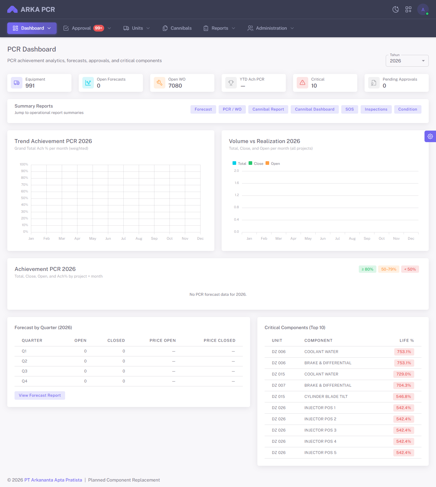

_Gambar 4 — Dashboard: KPI, grafik Ach %, dan tabel Achievement per project._

### Yang biasanya ditampilkan

- KPI seperti **YTD Ach %**, jumlah **Open WO**, dan indikator terkait
- Grafik tren **Achievement**
- Tabel **Achievement PCR** per project × bulan (filter **Year**)
- Panel operasional (mis. pending approval / komponen kritis — sesuai data tersedia)

### Cara memakai

1. Buka **Dashboard**.
2. Pilih **Year** jika ingin melihat data tahun tertentu.
3. Baca KPI dan grafik untuk status Achievement.
4. Gunakan informasi di panel untuk prioritas kerja harian.

---

## 6. Master Data & Units

### 6.1 Units

**Tujuan:** melihat daftar unit alat berat dan membuka hub operasional per unit.

**Menu:** `Units` → `Units`

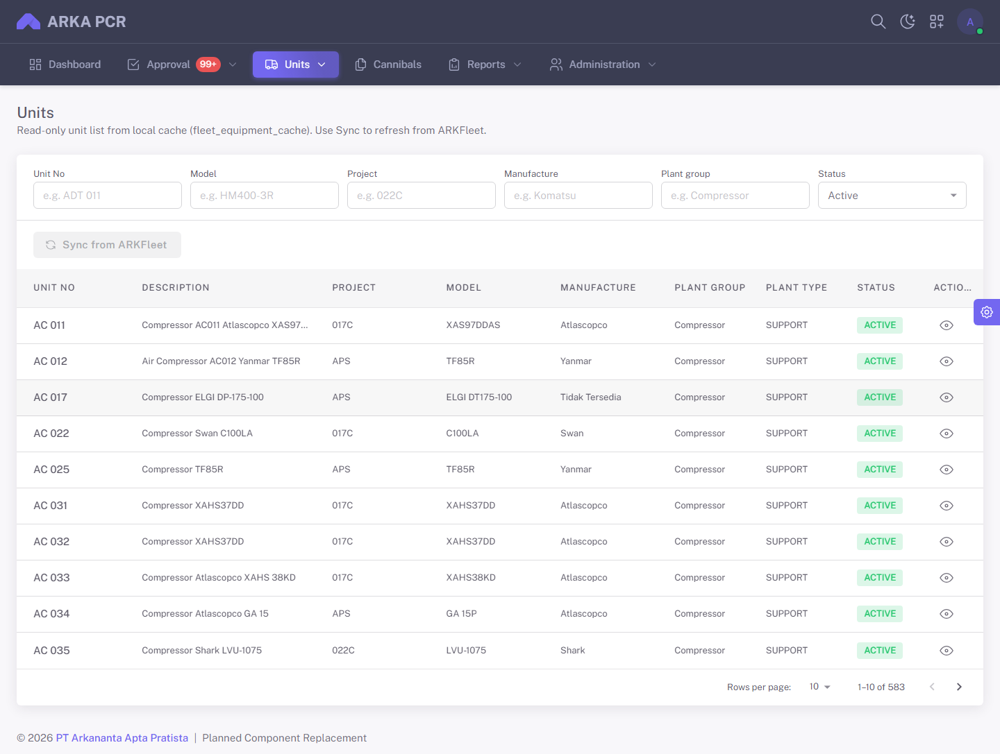

_Gambar 5 — Daftar Units dengan filter dan aksi Sync (admin)._

#### Langkah umum

1. Buka **Units**.
2. Gunakan filter (Project, Model, pencarian unit, dll.).
3. Klik unit untuk membuka **Unit Detail**.
4. Administrator dapat menjalankan **Sync** agar cache unit/model dari Fleet diperbarui.

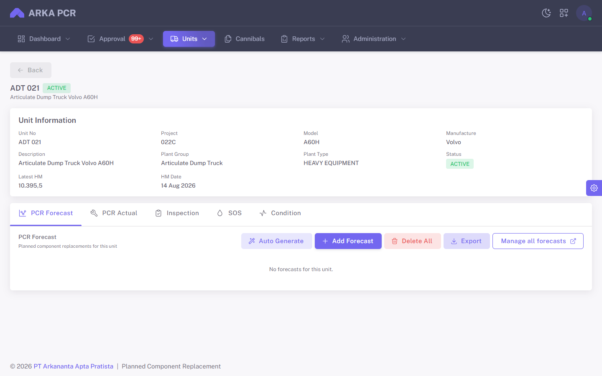

_Gambar 6 — Unit Detail: tab Forecast, Actual, Inspection, SOS, Condition._

#### Tab di Unit Detail

| Tab            | Fungsi                     |
| -------------- | -------------------------- |
| **Forecast**   | Rencana PCR untuk unit ini |
| **Actual**     | WO / Replacement aktual    |
| **Inspection** | Data inspeksi              |
| **SOS**        | Data sample oil            |
| **Condition**  | Ringkasan kondisi komponen |

**Catatan:** Unit berasal dari **Fleet cache**, bukan master lokal. Perubahan lokasi unit di masa depan tidak mengubah snapshot transaksi lama.

---

### 6.2 Models & Components

**Models** (`Units` → `Models`) menampilkan model unit dari Fleet dan panel mapping **Model–Component (Commod)** termasuk policy.

**Components** (`Units` → `Components`) adalah master komponen (tambah/ubah/hapus sesuai permission).

Mapping Model ↔ Component penting karena menjadi dasar kalkulasi **Life %** dan generate **Forecast**.

---

### 6.3 Hour Meters

**Tujuan:** mencatat jam kerja unit yang menjadi dasar perhitungan Life %.

**Menu:** `Units` → `Hour Meters`

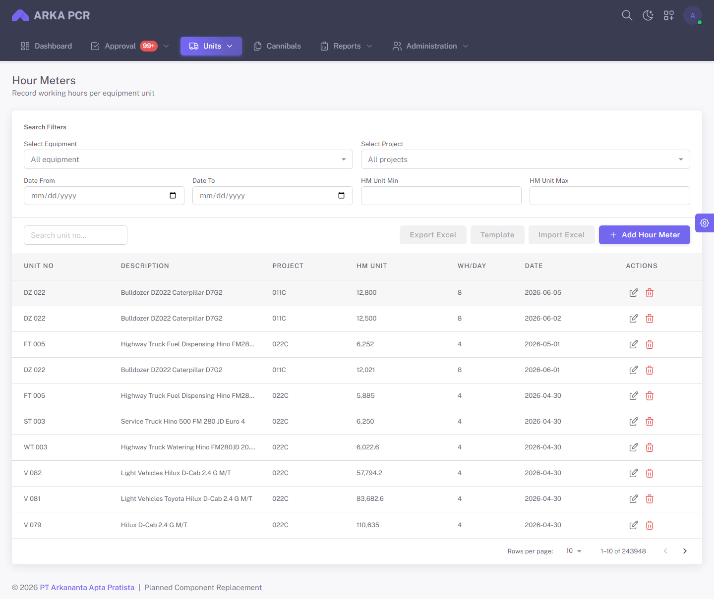

_Gambar 7 — Hour Meters: daftar HM, Import, dan Export Excel._

#### Langkah input manual

1. Buka **Hour Meters**.
2. Filter Project / Unit / tanggal jika perlu.
3. Klik **Add** (atau Edit pada baris yang ada).
4. Isi unit, tanggal, dan nilai HM.
5. Simpan.

#### Import / Export Excel

1. **Export** untuk mengunduh data sesuai filter aktif.
2. **Import / Template** untuk mengunggah file Excel sesuai format panduan di dialog.
3. Sistem melakukan upsert berdasarkan identitas baris (id HM atau kombinasi unit + tanggal, sesuai aturan import).

**Tips:** Pastikan HM diisi rutin agar Forecast dan Life % akurat.

---

## 7. PCR Forecast & BA PCR

**Tujuan:** merencanakan penggantian komponen, lalu mengajukan **BA PCR** untuk disetujui.

**Menu:** `Units` → `Forecast`  
(atau lewat tab **Forecast** di Unit Detail)

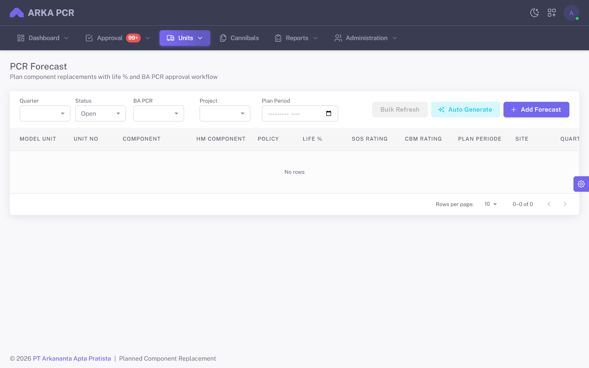

_Gambar 8 — Daftar Forecast: filter, Auto Generate, Submit BA, Convert._

### Status penting

- **OPEN** — masih aktif; biasanya bisa diedit.
- **CLOSED** — sudah ditutup (umumnya setelah WO terkait closed dengan PO).

### Membuat / generate Forecast

1. Buka **Forecast**.
2. Gunakan filter Project / Unit / Component / status.
3. Klik **Auto Generate** (atau **Add**) sesuai kebutuhan site.
4. Tinjau Life % dan periode rencana.
5. Edit Forecast yang **OPEN** jika perlu koreksi.

**Aturan:** umumnya hanya ada **satu Forecast OPEN** per pasangan Unit + Component.

### Submit BA PCR

1. Pilih Forecast yang siap diajukan.
2. Klik **Submit BA** (butuh permission `forecasts.submit`).
3. Sistem membuat/mengaktifkan dokumen **BA PCR** dan baris approval.
4. Status masuk antrian **Approval → PCR Request**.

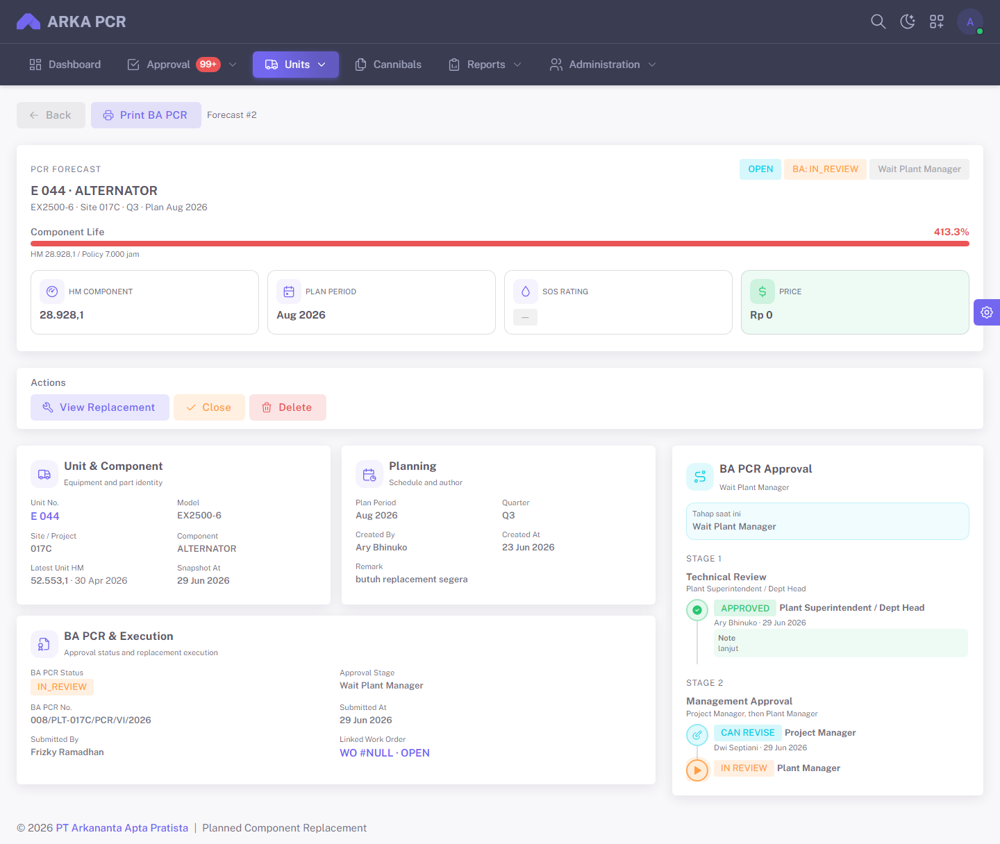

_Gambar 9 — Detail Forecast: ringkasan data dan Approval Timeline BA PCR._

### Setelah BA approved

- Anda dapat **Convert** Forecast menjadi **Replacement (WO)**.
- Menyetujui BA saja **tidak** otomatis menutup Forecast.
- Forecast biasanya **CLOSED** ketika WO terkait ditutup dan **PO No** terisi.

### Print BA PCR

Dari detail Forecast, buka halaman print (`/forecasts/[id]/print`) untuk mencetak dokumen BA.

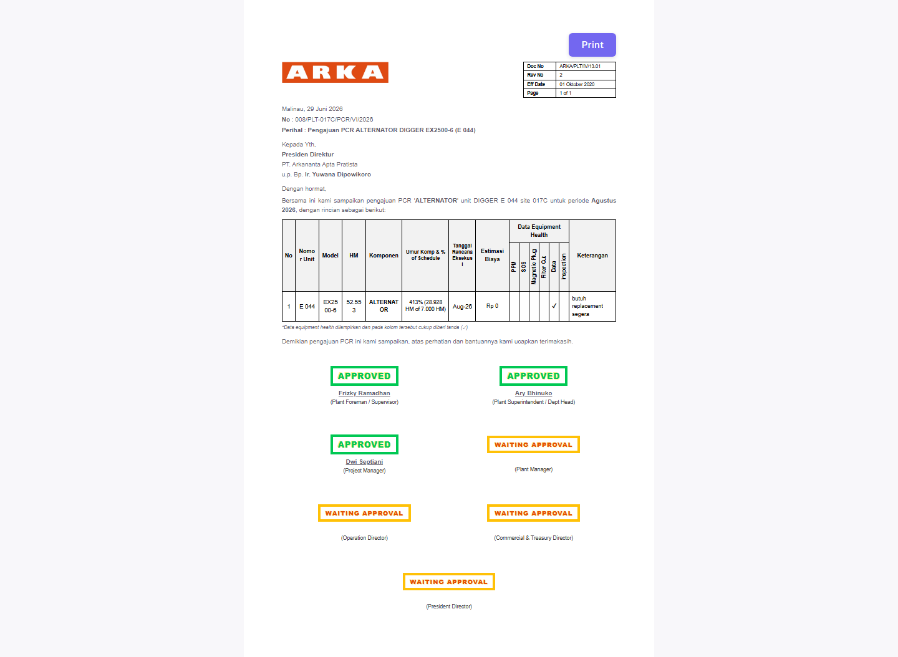

_Gambar 10 — Tampilan print BA PCR._

### Reject & Resubmit

Jika BA ditolak:

1. Riwayat reject tetap tersimpan.
2. Tim plant dapat memperbaiki data lalu **Resubmit**.
3. Resubmit membuat **BA PCR baru** (nomor baru); BA lama tetap ada sebagai sejarah.

---

## 8. Approval PCR Request

**Tujuan:** approver meninjau dan menyetujui/menolak **BA PCR**.

**Menu:** `Approval` → `PCR Request`

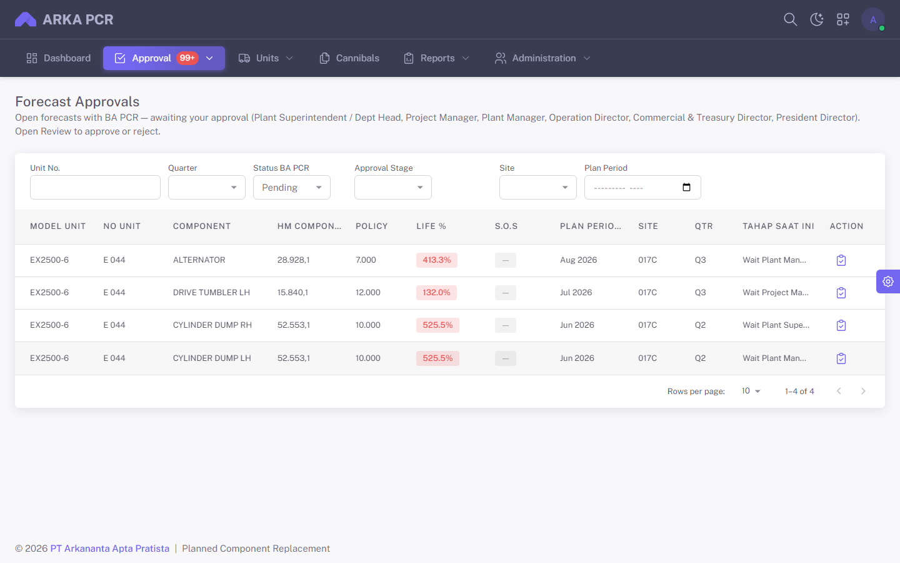

_Gambar 11 — Antrian PCR Request yang menunggu approval._

### Rantai approval BA PCR

Urutan tahap:

1. **PS** — Plant Superintendent / Dept Head
2. **PM** dan **PLM** (sejajar / parallel)
3. **OD**, **FD**, dan **PD** (sejajar / parallel)

| Kode | Jabatan                          |
| ---- | -------------------------------- |
| PS   | Plant Superintendent / Dept Head |
| PM   | Project Manager                  |
| PLM  | Plant Manager                    |
| OD   | Operation Director               |
| FD   | Commercial & Treasury Director   |
| PD   | President Director               |

### Cara approve / reject

1. Buka **Approval → PCR Request**.
2. Filter dan cari dokumen yang menjadi tanggung jawab level Anda.
3. Klik **Review** untuk membuka detail.
4. Baca ringkasan Forecast / BA.
5. Klik **Approve** atau **Reject** (sertakan catatan jika diminta).

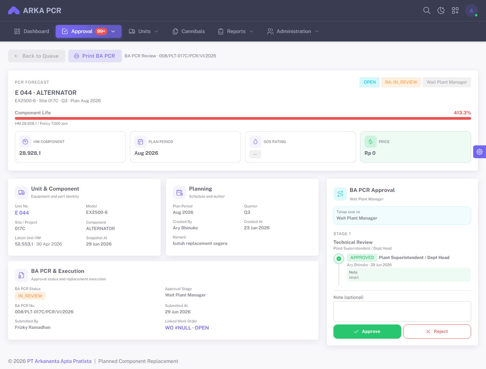

_Gambar 12 — Halaman detail Approval BA PCR._

**Catatan:** Anda hanya bisa bertindak pada level yang sesuai permission akun (`forecasts.approve.PS`, `.PM`, `.PLM`, `.OD`, `.FD`, `.PD`).

---

## 9. PCR Actual (Replacement / WO)

**Tujuan:** mencatat eksekusi penggantian komponen di lapangan (Work Order).

**Cara buka:**

- Tab **Actual** di Unit Detail, atau
- Dari Forecast yang sudah **Convert**, atau
- Lewat daftar Replacement per komponen unit

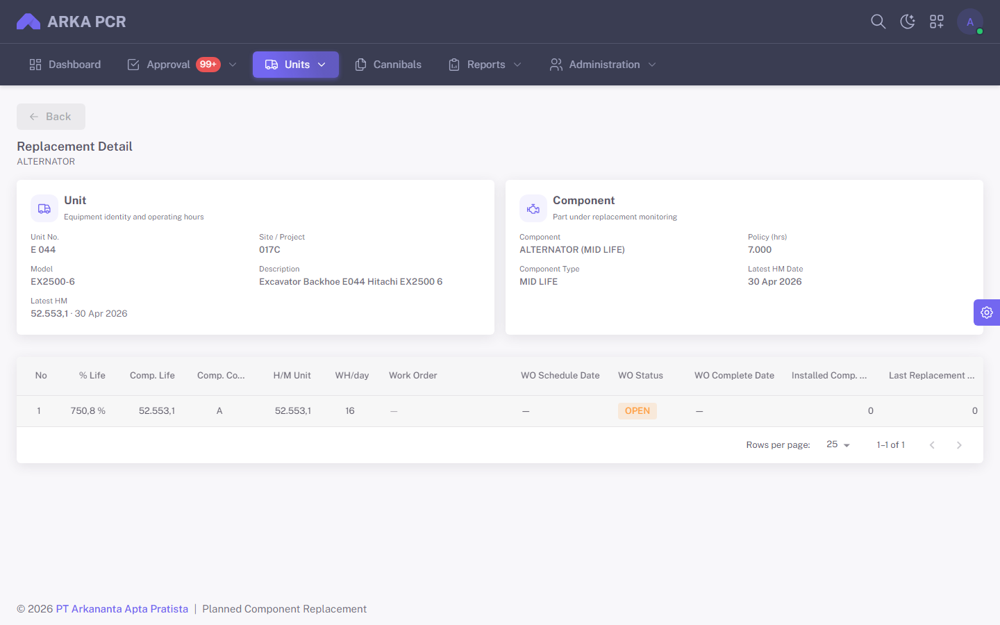

_Gambar 13 — Detail Replacement: status WO, Life %, dokumen SAP, Close/Reopen._

### Alur umum

1. Buat WO dari **Convert Forecast** atau tambah dari tab Actual.
2. Lengkapi data eksekusi (tanggal, HM, komponen, catatan).
3. Hubungkan dokumen pengadaan bila tersedia (**WO / MR / PR / PO** via SAP B1 lookup).
4. Unggah report instalasi jika komponen mewajibkannya.
5. **Close** WO setelah pekerjaan selesai.
6. Jika perlu koreksi setelah close, gunakan **Reopen / Edit Closed** (perlu permission khusus).

### Aturan penting

- Biasanya hanya ada **satu WO OPEN** per Unit–Component pada satu waktu.
- Menutup WO yang terkait Forecast sering mensyaratkan **PO No** terisi.
- Close WO dengan PO dapat ikut menutup Forecast terkait.

---

## 10. SOS, Inspection & Condition

Ketiga modul ini mendukung **condition-based monitoring** sebagai pelengkap perencanaan PCR.

### SOS (Sample Oil System)

- Dicatat per unit (tab **SOS** atau lewat laporan).
- Berisi data sample date, lab no, evaluation/rating.
- Membantu menilai kondisi pelumasan/komponen.

### Inspection

- Dicatat per tipe inspeksi (mis. **FC**, **MPS**, **VI**, **TA2**, **ED**).
- Isi tanggal inspeksi, HM, komponen, dan rating.
- Buka dari tab **Inspection** di Unit Detail.

### Condition

- Ringkasan kondisi keseluruhan komponen (agregat dari data terkait).
- Tampil sebagai chip/rating di grid Forecast/Actual dan di report Condition.

**Praktik baik:** lengkapi SOS & Inspection secara berkala agar keputusan Forecast lebih akurat.

---

## 11. Cannibal BA

**Tujuan:** mendokumentasikan transfer komponen antar unit (REMOVE dari unit sumber, INSTALL ke unit tujuan) melalui **Berita Acara Cannibal**.

**Menu:** `Cannibals`

> **Penting:** **BA Cannibal ≠ BA PCR**. Keduanya dokumen, menu, dan rantai approval yang berbeda.

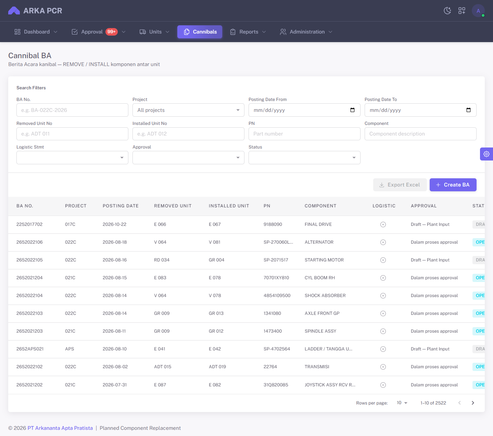

_Gambar 14 — Daftar Cannibal BA._

### Tahapan status (ringkas)

```
DRAFT / REJECTED
    → PENDING_LOGISTICS
    → PENDING_DOCUMENT (Record & Documentation: MR/PR + WO)
    → Approval (PS → PM → OGM → PGM → OD → PD)
    → APPROVED (Ready to Close)
    → CLOSED
```

### Langkah Plant

1. Buka **Cannibals** → buat BA baru.
2. Isi pasangan **REMOVE** dan **INSTALL** (pair).
3. Lengkapi **Plant Statement / justification**.
4. Simpan sebagai Draft, lalu submit ke Logistics (**Pending Logistics**).
5. Setelah Logistics confirm: isi **Planning** (action + **MR#** / **PR#** wajib), **Update Record** (WO + catatan + dokumentasi lengkap), lalu **Submit for Approval**.

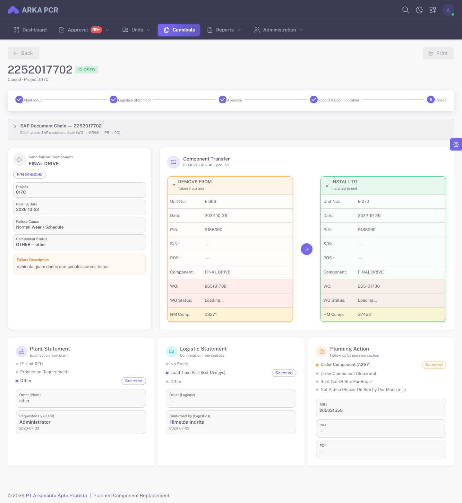

_Gambar 15 — Detail Cannibal: stepper workflow, pair komponen, statement._

### Langkah Logistics

1. Buka BA yang berstatus menunggu Logistics.
2. Isi **Logistic Statement**.
3. Confirm — BA pindah ke **Pending Documentation** (belum masuk approval).

### Setelah approved

- BA berstatus **Ready to Close**.
- **Close** BA setelah proses selesai.
- Cetak BA melalui halaman print.

---

## 12. Approval Cannibal Request

**Tujuan:** menyetujui atau menolak Cannibal BA.

**Menu:** `Approval` → `Cannibal Request`

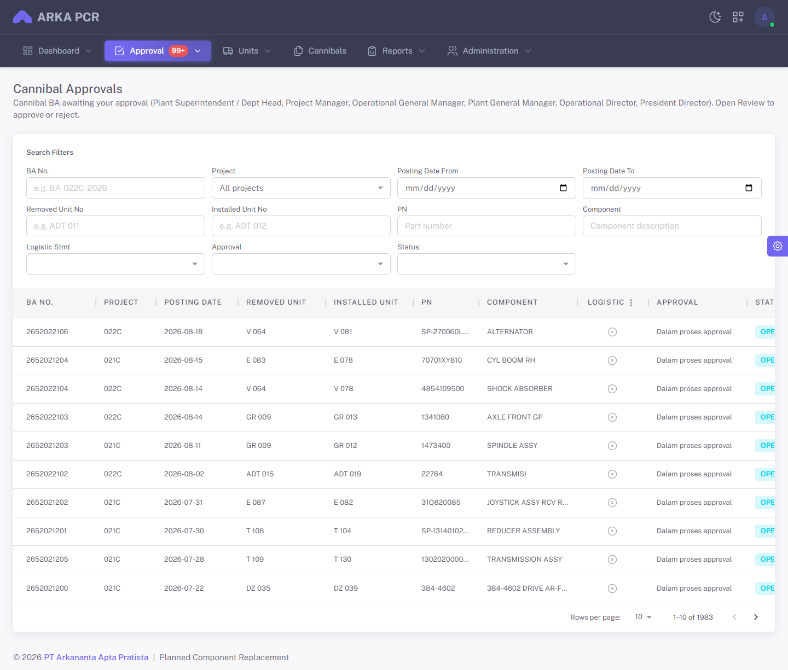

_Gambar 16 — Antrian Cannibal Request._

### Rantai approval (berurutan)

1. **PS** — Plant Superintendent (project-scoped)
2. **PM** — Project Manager (project-scoped)
3. **OGM** — Operational General Manager
4. **PGM** — Plant General Manager
5. **OD** — Operational Director
6. **PD** — President Director

Approver HO (OGM / PGM / OD / PD) biasanya memakai project code **`000H`** agar melihat semua project.

### Cara review

1. Buka antrian **Cannibal Request**.
2. Buka detail BA.
3. Periksa pair REMOVE/INSTALL, justification Plant & Logistics.
4. **Approve** atau **Reject**.

---

## 13. Reports

**Tujuan:** melihat ringkasan data dan mengekspor Excel (jika diizinkan).

**Menu:** `Reports`

| Report         | Path menu                         | Isi utama                                       |
| -------------- | --------------------------------- | ----------------------------------------------- |
| **Forecast**   | Reports → Replacements → Forecast | Ringkasan Forecast; link matrix periode & harga |
| **Actual**     | Reports → Replacements → Actual   | Ringkasan PCR / WO aktual                       |
| **SOS**        | Reports → SOS                     | Ringkasan sample oil                            |
| **Cannibal**   | Reports → Cannibal                | Ringkasan Cannibal BA                           |
| **Inspection** | Reports → Inspection              | Ringkasan inspeksi                              |
| **Condition**  | Reports → Condition               | Ringkasan kondisi komponen                      |

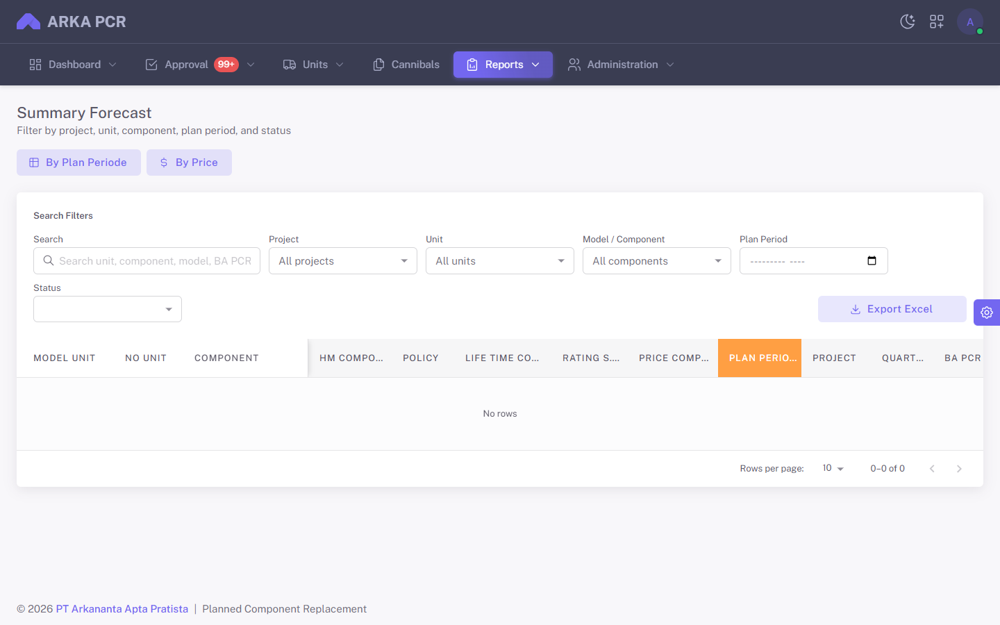

_Gambar 17 — Summary Forecast._

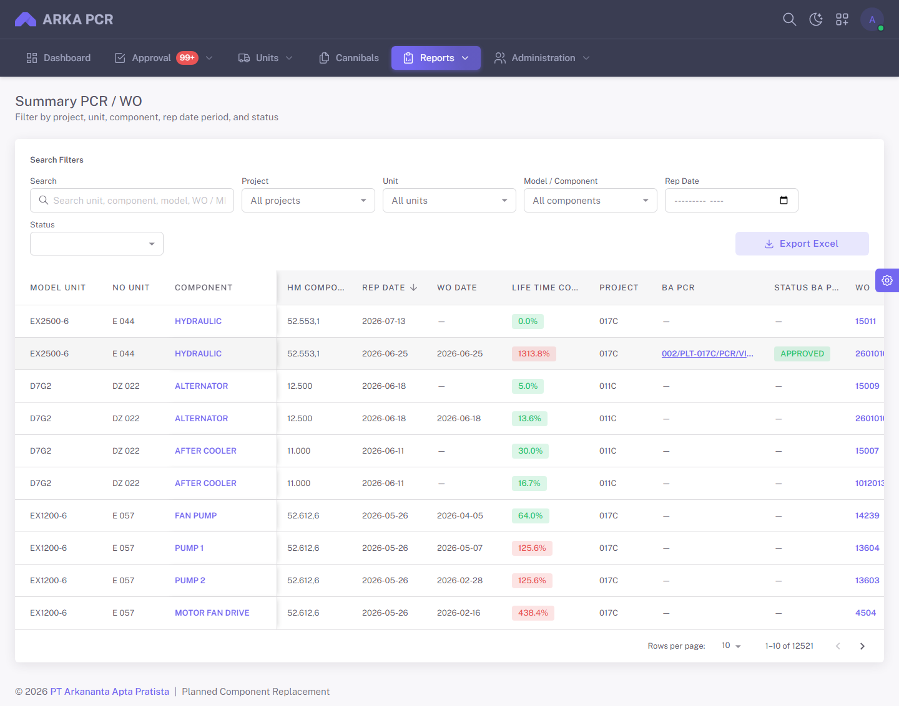

_Gambar 18 — Summary PCR / Actual._

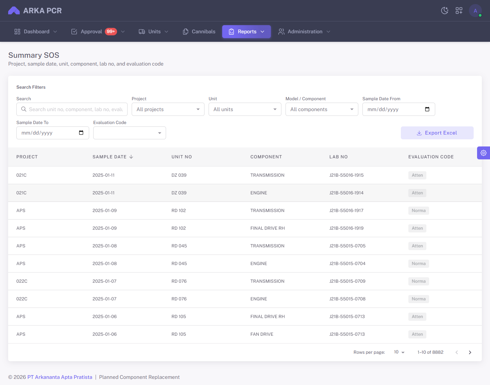

_Gambar 19 — Summary SOS._

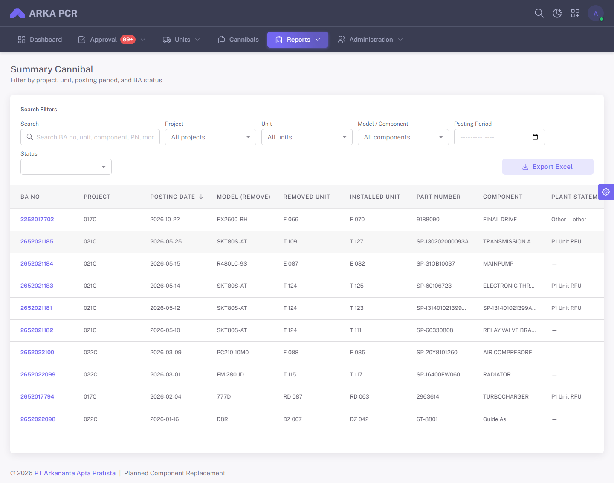

_Gambar 20 — Summary Cannibal._

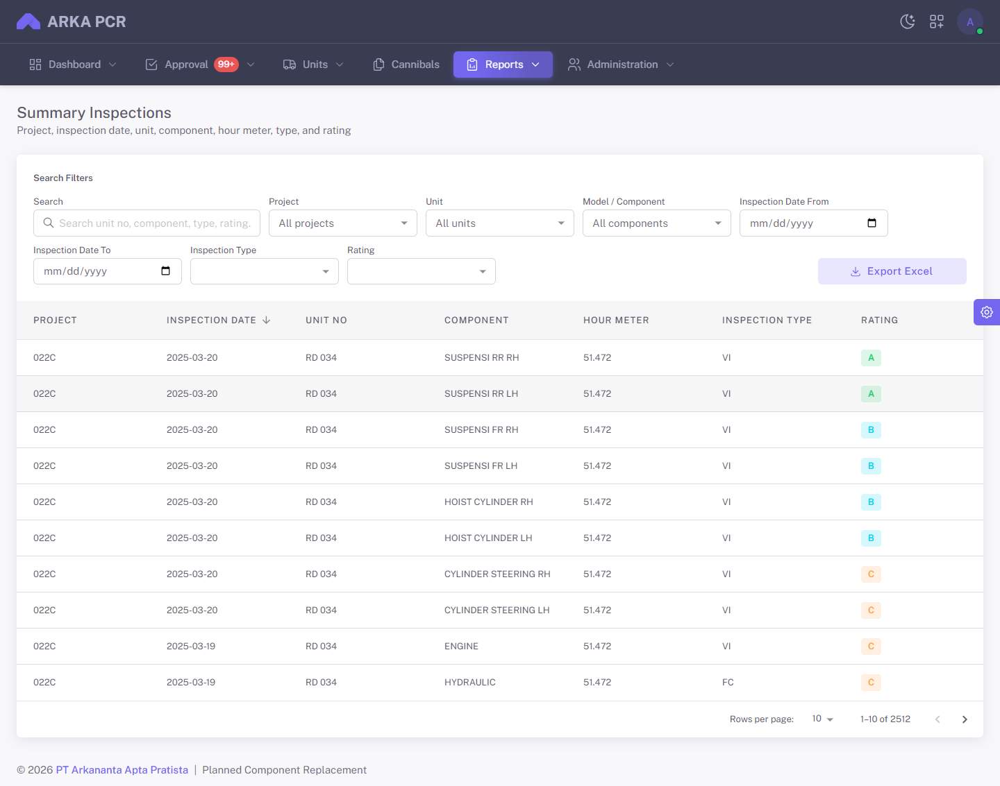

_Gambar 21 — Summary Inspection / Condition (contoh halaman report monitoring)._

### Cara memakai report

1. Buka report yang diinginkan.
2. Set filter (Project, Unit, Component, tanggal, status, dll.).
3. Gunakan pencarian kolom jika tersedia.
4. Klik **Export** untuk mengunduh Excel (butuh permission export terkait).

**Matrix tambahan Forecast:**

- **By Plan Periode** — matrix Model × Component × periode rencana
- **By Price** — matrix berbasis harga

---

## 14. Administration

**Tujuan:** mengelola akses pengguna. Biasanya hanya **Administrator**.

**Menu:** `Administration`

### Users

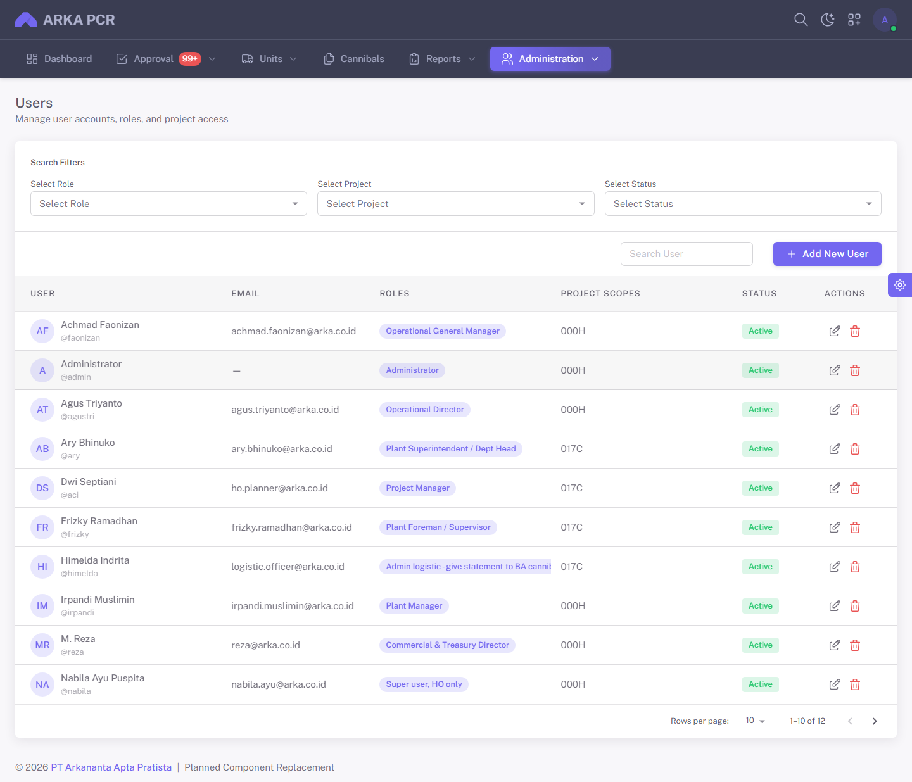

_Gambar 22 — Halaman Users: kelola akun, Role, dan Project._

1. Buka **Users**.
2. Tambah atau edit user.
3. Tetapkan:
   - **Roles** (boleh lebih dari satu; permission digabung)
   - **Projects** (project yang boleh diakses; kosong = tidak melihat data site)
   - Status aktif/nonaktif
4. Simpan.

### Roles

- Membuat/mengubah bundel **permission** per jabatan.
- Template seed mencakup role seperti `plant_foreman`, `logistics`, `plant_superintendent`, dst.

### Permissions

- Katalog izin berbentuk `modul.aksi` (contoh: `forecasts.submit`, `cannibals.approve.PS`).
- Role `administrator` memakai `system.admin` (bypass semua cek permission).

### Project scope vs permission

| Konsep         | Arti                                                    |
| -------------- | ------------------------------------------------------- |
| **Permission** | _Apa_ yang boleh dilakukan (submit, approve, export, …) |
| **Project**    | _Data project mana_ yang boleh dilihat/diubah           |
| **`000H`**     | Semua project (Head Office)                             |

Keduanya harus tepat. User dengan permission approve tetapi tanpa project yang sesuai tidak akan melihat dokumen site yang relevan.

---

## 15. Alur Kerja Ringkas

### Alur PCR (Forecast → WO → Achievement)

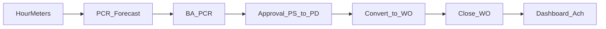
```mermaid
flowchart LR
  HM[HourMeters] --> Forecast[PCR_Forecast]
  Forecast --> BaPcr[BA_PCR]
  BaPcr --> Approve[Approval_PS_to_PD]
  Approve --> Convert[Convert_to_WO]
  Convert --> Close[Close_WO]
  Close --> Ach[Dashboard_Ach]
```

### Alur Cannibal BA

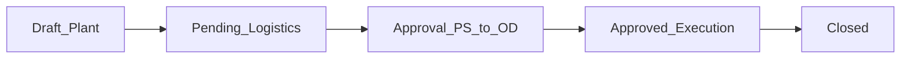
```mermaid
flowchart LR
  Draft[Draft_Plant] --> Logistics[Pending_Logistics]
  Logistics --> Appr[Approval_PS_to_OD]
  Appr --> Exec[Approved_Execution]
  Exec --> Closed[Closed]
```

### Ringkasan bisnis yang sering dilupakan

1. HM rutin → Life % & Forecast lebih akurat.
2. Submit BA PCR ≠ Close Forecast.
3. Convert setelah BA approved → baru ada WO eksekusi.
4. Close WO (dengan PO jika disyaratkan) → Forecast bisa CLOSED.
5. Cannibal punya jalur Logistics + approval sendiri.
6. BA PCR dan Cannibal BA **jangan dicampur**.

---

## 16. Tips & Troubleshooting

| Gejala                  | Kemungkinan penyebab                                    | Yang bisa dicoba                                    |
| ----------------------- | ------------------------------------------------------- | --------------------------------------------------- |
| Menu tidak muncul       | Permission / Role kurang                                | Minta Admin cek Role                                |
| Data project kosong     | Belum di-assign Project                                 | Minta Admin isi **Projects** (atau `000H` untuk HO) |
| Tidak bisa Submit BA    | Tidak punya `forecasts.submit` atau Forecast bukan OPEN | Cek Role & status Forecast                          |
| Tidak bisa Approve      | Bukan giliran level Anda / permission level salah       | Cek antrian & Role approve                          |
| Life % tidak masuk akal | HM belum diisi / policy Commod salah                    | Update HM & cek Models/Commod                       |
| Unit tidak lengkap      | Cache Fleet belum sync                                  | Minta Admin **Sync Units/Models**                   |
| Gagal login             | Password salah / user inactive                          | Reset via Admin; pastikan user aktif                |
| Export gagal            | Tidak punya permission export                           | Minta permission `exports.*` terkait                |

### Praktik baik harian (Plant)

1. Update **Hour Meters**.
2. Cek **Dashboard** & Forecast OPEN dengan Life % tinggi.
3. Submit BA untuk yang siap.
4. Follow-up Approval.
5. Convert & eksekusi WO.
6. Close WO + lengkapi dokumen.
7. Lengkapi SOS/Inspection sesuai jadwal site.

---

## Lampiran: Matriks Role → Fitur Utama

| Fitur                       | Foreman  | Logistics | Plant Supt |  PM  | Plant Mgr | OGM  |  OD  |  FD  |  PD  | Admin |
| --------------------------- | :------: | :-------: | :--------: | :--: | :-------: | :--: | :--: | :--: | :--: | :---: |
| Dashboard                   |    ✓     |     —     |     ✓      | ✓\*  |    ✓\*    | ✓\*  | ✓\*  | ✓\*  | ✓\*  |   ✓   |
| Units / Forecast ops        |    ✓     |     —     |     ✓      | view |   view    |  —   | view | view | view |   ✓   |
| Hour Meters / Components    | terbatas |     —     |     ✓      |  —   |     —     |  —   |  —   |  —   |  —   |   ✓   |
| Submit BA PCR               |    ✓     |     —     |     ✓      |  —   |     —     |  —   |  —   |  —   |  —   |   ✓   |
| Approve BA PCR              |    —     |     —     |     PS     |  PM  |    PLM    |  —   |  OD  |  FD  |  PD  |   ✓   |
| Replacement / Close WO      |    ✓     |     —     |     ✓      | view |   view    |  —   |  —   |  —   |  —   |   ✓   |
| SOS / Inspection            |    ✓     |     —     |     ✓      |  —   |     —     |  —   |  —   |  —   |  —   |   ✓   |
| Cannibal create/update      |    ✓     | logistic  |     ✓      | view |   view    | view | view |  —   |  —   |   ✓   |
| Approve Cannibal            |    —     |     —     |     PS     |  PM  |    PGM    | OGM  |  OD  |  —   |  PD  |   ✓   |
| Reports / Export            |    ✓     |     —     |     ✓      |  —   |     —     |  —   |  —   |  —   |  —   |   ✓   |
| Users / Roles / Permissions |    —     |     —     |     —      |  —   |     —     |  —   |  —   |  —   |  —   |   ✓   |

\* Approver biasanya melihat data sesuai project assignment (`000H` untuk level HO).  
Tanda “view” = akses lihat tanpa aksi operasional penuh (sesuai template Role).  
Administrator dengan `system.admin` dapat semua fitur.

---

## Informasi dokumen

| Item          | Nilai                                      |
| ------------- | ------------------------------------------ |
| Lokasi file   | `docs/user-manual/ARKA-PCR-User-Manual.md` |
| Folder gambar | `docs/user-manual/images/`                 |
| Aplikasi      | ARKA PCR (Next.js)                         |
| Versi manual  | 1.0 — 15 Juli 2026                         |

Jika tampilan UI berubah setelah update aplikasi, sesuaikan screenshot di folder `images/` dan perbarui langkah yang terdampak pada bab terkait.

---

_© ARKA PCR — User Manual untuk pengguna aplikasi._
