# User Manual — Fundamental Maintenance

Panduan memakai modul **Maintenance** di ARKA PCR: program (**Type**), jadwal (**Plan**), pelaksanaan (**Actual**), temuan (**Failure**), dan **Maintenance Control** dashboard.

|             |                                                         |
| ----------- | ------------------------------------------------------- |
| **Dokumen** | User Manual Fundamental Maintenance                     |
| **Tanggal** | 8 Oktober 2026                                          |
| **Bahasa**  | Bahasa Indonesia (istilah di layar tetap bahasa Inggris) |
| **Audiens** | Plant site dan pembaca dashboard                        |

Screenshot diambil dari aplikasi yang sedang berjalan. Tombol yang tidak muncul berarti akun Anda tidak punya izin untuk aksi itu.

---

## Daftar Isi

1. [Ringkasan](#1-ringkasan)
2. [Cara membuka menu](#2-cara-membuka-menu)
3. [Type](#3-type)
4. [Plan](#4-plan)
5. [Actual](#5-actual)
6. [Failure](#6-failure)
7. [Dashboard](#7-dashboard)
8. [Alur kerja](#8-alur-kerja)

---

## 1. Ringkasan

Fundamental Maintenance mencatat perawatan rutin unit (bukan penggantian komponen PCR).

| Istilah | Arti |
| --- | --- |
| **Type / Program** | Jenis perawatan: Greasing, Inspection, PPU/CTS, Track Cleaning, Washing |
| **Plan** | Jadwal satu site, satu tahun, satu bulan, satu program. Satu centang = satu tanggal untuk satu unit |
| **Plan date** | Tanggal yang dijadwalkan |
| **Actual** | Pelaksanaan terhadap satu plan date. Satu plan date hanya boleh punya satu actual |
| **Register no** | Nomor actual, misalnya `PM-022C.2612-0027` |
| **QC** | Hasil quality check: Pass atau Fail |
| **Failure / Finding** | Temuan pada unit. Satu defect tetap satu baris sampai ditutup |
| **Frequency** | 1 + jumlah actual berikutnya yang masih mencatat temuan yang sama |
| **PM Compliance** | Actual ÷ plan date yang jatuh tempo |
| **On-Time** | Actual yang tanggalnya sama dengan atau sebelum plan date |

---

## 2. Cara membuka menu

**Type, Plan, Actual, Failure** ada di menu **Maintenance**.

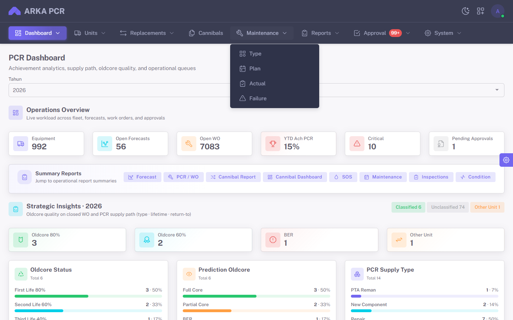

_Gambar 1 — Menu Maintenance: Type, Plan, Actual, Failure._

**Dashboard** maintenance ada di menu **Dashboard → Maintenance Control**. Itu terpisah dari PCR Dashboard.

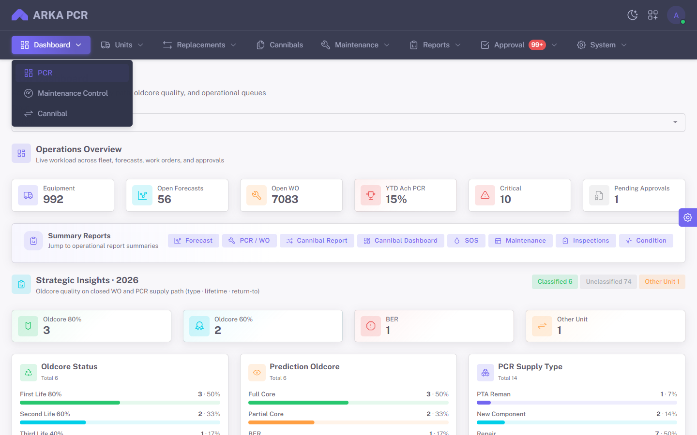

_Gambar 2 — Dashboard → Maintenance Control._

---

## 3. Type

**Tujuan:** melihat program yang dipakai saat menjadwalkan dan mencatat actual.

**Menu:** `Maintenance` → `Type`

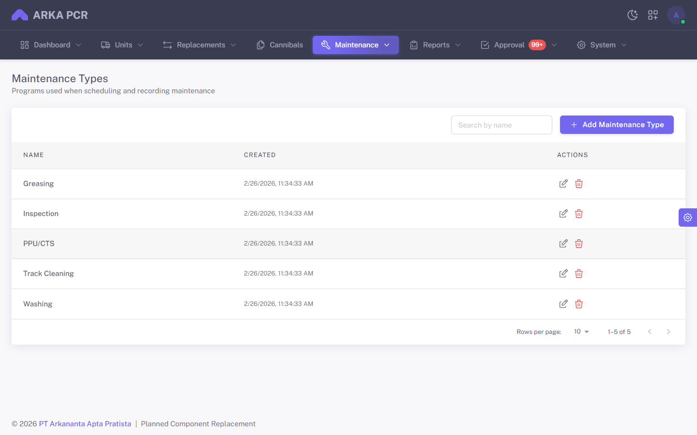

_Gambar 3 — Lima program: Greasing, Inspection, PPU/CTS, Track Cleaning, Washing._

### Menambah program

1. Klik **Add Maintenance Type**.
2. Isi **Name** (contoh di layar: Inspection, Greasing).
3. Klik **Save**.

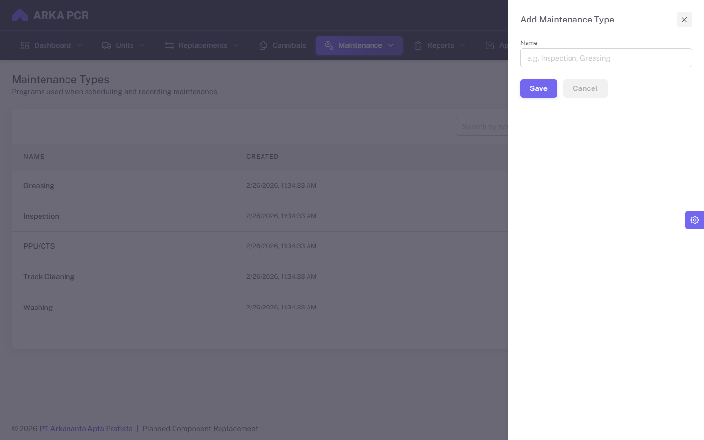

_Gambar 4 — Drawer Add Maintenance Type._

Ikon pensil mengubah nama. Ikon tempat sampah menghapus program yang belum dipakai transaksi. Nama program ini yang muncul di filter Plan, Actual, dan Dashboard.

---

## 4. Plan

**Tujuan:** menjadwalkan tanggal perawatan per unit.

**Menu:** `Maintenance` → `Plan`

Satu baris di daftar = **satu site + tahun + bulan + program**. **Total Plan** adalah jumlah tanggal yang dicentang.

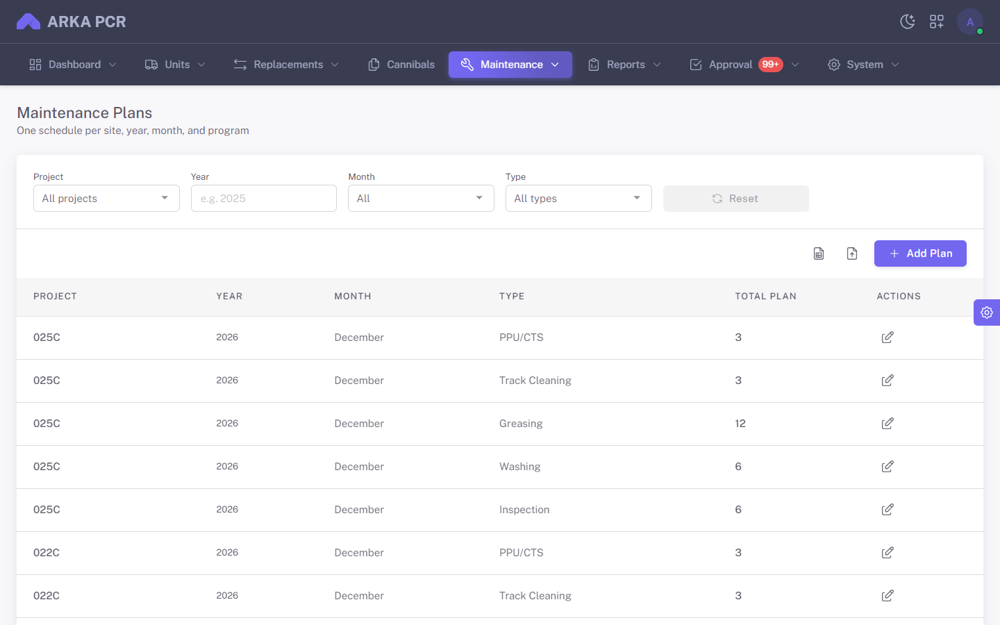

_Gambar 5 — Filter Project, Year, Month, Type. Tombol di kanan: Export, Import, Add Plan._

### Membuat atau mengubah jadwal

1. Klik **Add Plan**, atau ikon pensil pada baris yang sudah ada.
2. Pilih **Project**, **Year**, **Month**, dan **Maintenance Type**.
3. Klik **Generate**.
4. Centang tanggal pada baris unit. Kosongkan centang untuk membatalkan tanggal yang belum punya actual.
5. Klik **Save**.

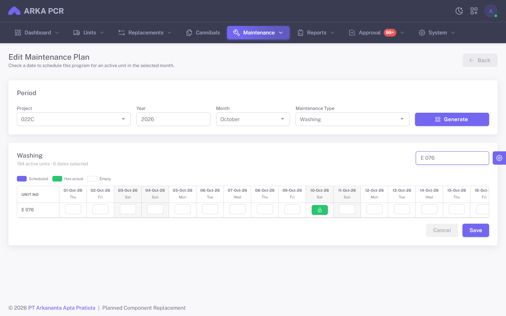

_Gambar 6 — Edit plan 022C, Oktober 2026, Washing. Unit E 076 punya tanggal 10 Oktober yang sudah ber-actual (hijau, terkunci)._

Warna kotak:

| Warna | Arti |
| --- | --- |
| Ungu | Terjadwal, belum ada actual |
| Hijau + gembok | Sudah ada actual. Tanggal ini tidak bisa dihapus dari grid |
| Putih | Belum dijadwalkan |

**Search unit** menyaring baris. Hanya unit **ACTIVE** di site itu yang muncul.

### Export dan import

- **Export** mengunduh baris yang sedang terfilter. Satu baris Excel = satu tanggal unit.
- Kolom file: **Project, Year, Month, Unit, Plan Date, Maintenance Type**.
- **Import** memakai file dengan kolom yang sama. Site, tahun, dan bulan diisi ulang dari unit dan plan date.

---

## 5. Actual

**Tujuan:** mencatat pelaksanaan terhadap satu plan date.

**Menu:** `Maintenance` → `Actual`

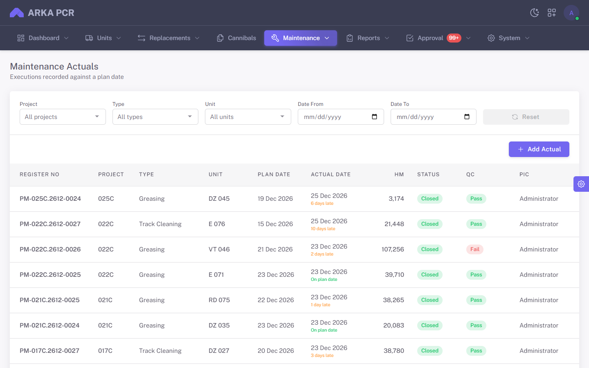

_Gambar 7 — Register no, plan date, actual date (on plan date / late), HM, Status, QC, PIC._

Filter: Project, Type, Unit, Date From, Date To.

### Mencatat actual baru

1. Klik **Add Actual**.
2. Pilih **Project**, **Year**, **Month**, **Maintenance Type**.
3. Klik **Search Plan**, lalu pilih satu plan date (unit + program + tanggal).
4. Isi tanggal pelaksanaan, HM, mekanik, PIC, QC, status, dan catatan.
5. Unggah foto bila ada.
6. Simpan.

Actual hanya bisa disimpan pada plan date yang **belum** punya actual. Tanggal pelaksanaan boleh berbeda dari plan date. Selisih itu yang membuat daftar menampilkan **On plan date** atau **N days late**.

### Membaca actual yang sudah ada

Klik ikon mata pada baris.

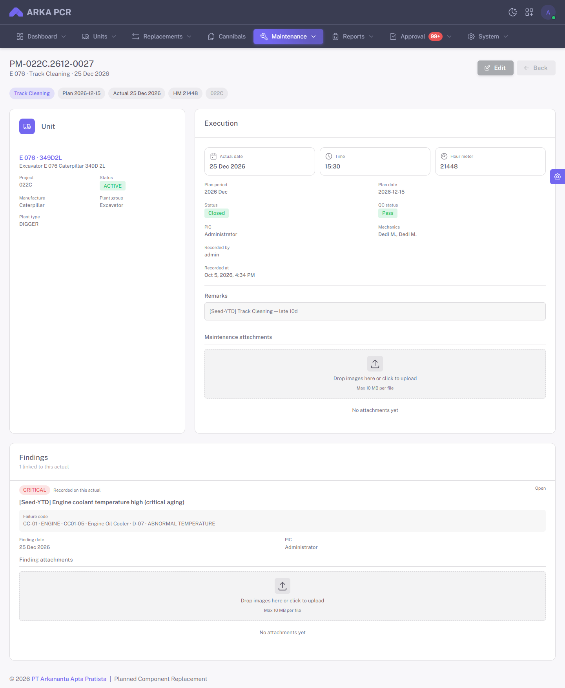

_Gambar 8 — PM-022C.2612-0027: unit E 076, Track Cleaning, plan 15 Des, actual 25 Des, status Closed, QC Pass, plus temuan di bawah._

Kartu **Unit** memuat site dan status unit. Kartu **Execution** memuat tanggal, jam, HM, periode plan, status, QC, PIC, dan mekanik. **Findings** di bawah menampilkan temuan yang tercatat pada actual ini.

### Mengubah actual

Klik **Edit** di halaman detail, atau ikon pensil di daftar.

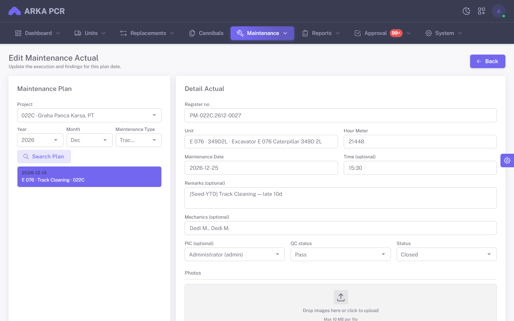

_Gambar 9 — Plan date yang dipilih (kiri) dan isian pelaksanaan (kanan), termasuk Register no._

**Register no** terisi otomatis. Jangan membuat actual kedua untuk plan date yang sama.

---

## 6. Failure

Temuan **tidak** dibuat dari menu Failure. Temuan dicatat di bagian **Failures** pada form Actual, lalu dibaca dari daftar Failure.

### Mencatat temuan

Di form Actual, gulir ke kartu **Failures**, lalu **Add Finding**.

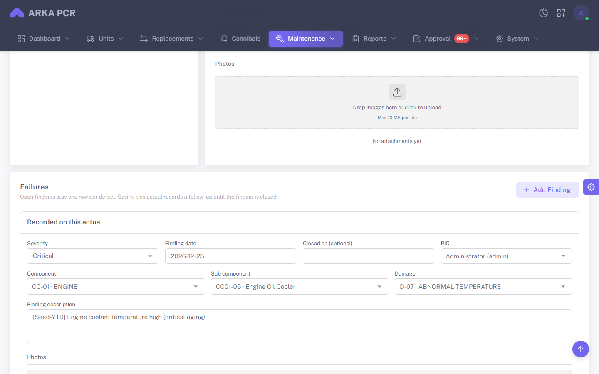

_Gambar 10 — Temuan Critical pada actual E 076: tanggal, PIC, component, sub component, damage, dan deskripsi._

Isi:

| Field | Isi |
| --- | --- |
| **Severity** | Critical, Major, atau Minor |
| **Finding date** | Tanggal temuan ditemukan |
| **Closed on** | Kosongkan jika masih terbuka. Isi tanggal bila temuan sudah selesai |
| **PIC** | Penanggung jawab |
| **Component / Sub component / Damage** | Kode dari SAP |
| **Finding description** | Uraian temuan |
| **Photos** | Foto temuan, bila ada |

Satu defect tetap **satu baris**. Actual berikutnya pada unit yang sama tidak membuat temuan baru untuk defect yang masih terbuka; sistem mencatat follow-up dan **Frequency** naik. Menutup temuan (**Closed on**) menghentikan kenaikan itu.

### Daftar temuan

**Menu:** `Maintenance` → `Failure`

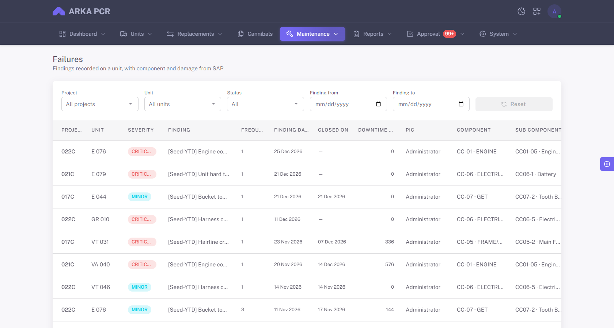

_Gambar 11 — Filter project, unit, status, dan rentang finding date. Geser tabel ke kanan untuk kolom Damage._

| Kolom | Arti |
| --- | --- |
| **Severity** | Critical (merah), Major, Minor (biru) |
| **Frequency** | Berapa kali temuan ini masih muncul, termasuk catatan pertama |
| **Finding date** | Tanggal temuan |
| **Closed on** | Tanggal tutup. Kosong = masih terbuka |
| **Downtime Hours** | Jam dari finding date sampai tanggal tutup, atau sampai hari ini bila masih terbuka |
| **Component / Sub component / Damage** | Kode SAP yang disimpan saat input |

Ikon pada baris membuka actual tempat temuan itu tercatat. Filter **Status = Open** untuk temuan yang belum ditutup.

---

## 7. Dashboard

**Tujuan:** membaca kinerja perawatan satu site pada periode yang dipilih.

**Menu:** `Dashboard` → `Maintenance Control`

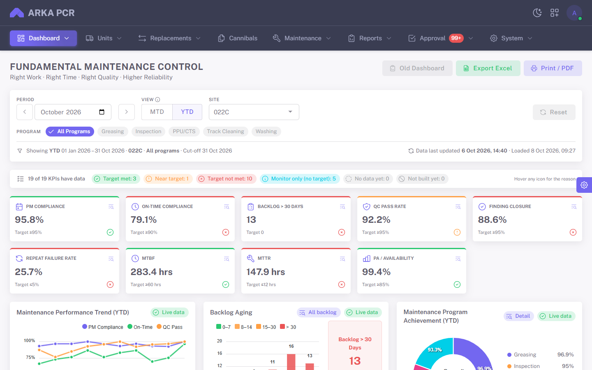

_Gambar 12 — Filter Oktober 2026, YTD, site 022C, semua program. Sembilan kartu KPI dan grafik di bawahnya._

### Filter

| Filter | Fungsi |
| --- | --- |
| **Period** | Bulan acuan. Panah kiri/kanan pindah bulan |
| **MTD** | Hanya bulan yang dipilih |
| **YTD** | 1 Januari sampai akhir bulan yang dipilih |
| **Site** | Satu project, atau semua site yang boleh Anda lihat |
| **Program** | Semua program, atau satu type (Greasing, Inspection, dan seterusnya) |

Baris di bawah filter menulis rentang tanggal yang benar-benar dihitung, misalnya `YTD 01 Jan 2026 – 31 Oct 2026`. **Reset** mengembalikan filter bawaan.

Angka di kartu dibanding **target**. Tanda hijau = target tercapai, oranye = mendekati, merah = belum tercapai. Arahkan kursor ke ikon info untuk alasan angkanya.

| Kartu | Arti singkat |
| --- | --- |
| **PM Compliance** | Actual dibanding plan date yang jatuh tempo |
| **On-Time Compliance** | Actual yang tidak telat dari plan date |
| **Backlog > 30 Days** | Plan date yang belum punya actual lebih dari 30 hari |
| **QC Pass Rate** | Actual ber-QC Pass dibanding yang sudah di-QC |
| **Finding Closure** | Temuan yang sudah ditutup |
| **Repeat Failure Rate** | Temuan dengan frequency lebih dari 1 |
| **MTBF** | Jam operasi antar failure |
| **MTTR** | Rata-rata jam dari finding date sampai tanggal tutup |
| **PA / Availability** | Ketersediaan unit setelah downtime temuan |

### Grafik dan tabel

Gulir ke bawah untuk tren, umur backlog, donut program, tabel KPI per kategori, 10 isu terbanyak, dan rincian per program.

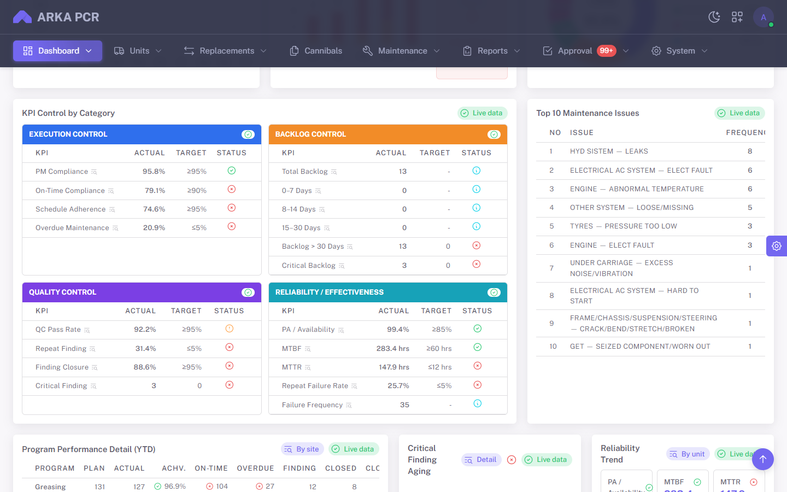

_Gambar 13 — Execution, Backlog, Quality, Reliability, dan Top 10 Maintenance Issues._

Label **Live data** berarti panel itu dihitung dari Plan, Actual, dan Failure. Klik nama program di donut atau di tabel untuk menyaring dashboard ke program itu. Klik lagi untuk kembali ke semua program.

### Melihat baris di balik angka

Klik kartu KPI (atau baris di tabel KPI). Dialog menampilkan daftar plan date, actual, atau temuan yang membentuk angka itu.

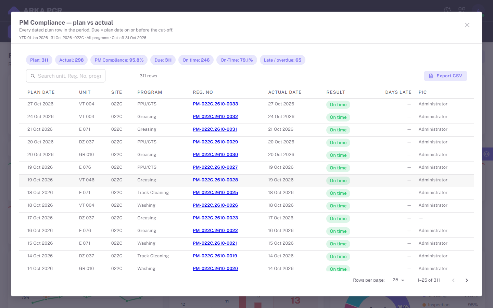

_Gambar 14 — PM Compliance site 022C: tiap plan date, register no, hasil On time / late, dan PIC._

**Reg. No** membuka halaman actual di tab baru. **Export CSV** mengunduh daftar di dialog.

**Export Excel** dan **Print / PDF** di kanan atas mengunduh atau mencetak dashboard sesuai filter yang sedang aktif. **Old Dashboard** membuka tampilan achievement lama; tombol Back di sana kembali ke Maintenance Control.

---

## 8. Alur kerja

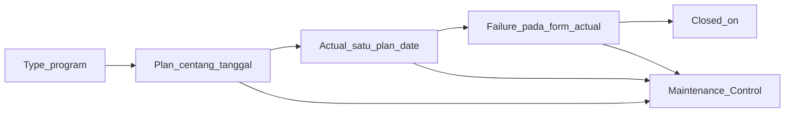

1. Pastikan **Type** yang dipakai site sudah ada.
2. Buat **Plan**: Generate, centang tanggal unit, Save.
3. Pada hari pelaksanaan, **Add Actual** pada plan date itu. Isi HM, PIC, mekanik, QC, dan status.
4. Jika ada defect, **Add Finding** di form yang sama. Tutup temuan dengan **Closed on** setelah selesai.
5. Baca hasil di **Maintenance Control**. Klik kartu untuk melihat unit mana yang telat, gagal QC, atau temuannya masih terbuka.

### Jika sesuatu tidak bisa dilakukan

| Gejala | Yang dicek |
| --- | --- |
| Menu Maintenance atau Dashboard tidak ada | Izin akun. Minta administrator |
| Generate tidak memunculkan unit | Unit di site itu bukan ACTIVE, atau project salah |
| Plan date tidak muncul di Search Plan | Belum dicentang di Plan, atau actual untuk tanggal itu sudah ada |
| Centang hijau tidak bisa dilepas | Actual untuk tanggal itu sudah tersimpan |
| Kode component / damage kosong | Koneksi SAP di server. Hubungi administrator |
| Angka dashboard kosong | Ubah Period, Site, atau Program. Pastikan plan dan actual ada di rentang itu |

---

_© ARKA PCR — User Manual Fundamental Maintenance._
